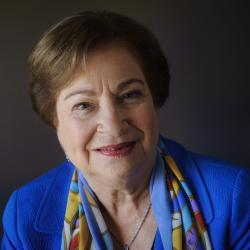

## Claim
Claim: "U.S. Vice President Kamala Harris once said, 'Ukraine is a country in Europe. It exists next to another country called Russia. Russia is a bigger country. Russia is a powerful country. Russia decided to invade a smaller country called Ukraine. So basically that's wrong.'"

## Actions
```
web_search("Kamala Harris Ukraine Russia quote")
```

## Evidence
### Evidence from `web_search`
IMDb.com ([Source](https://www.imdb.com/name/nm3668431/quotes/)) contains a quote by Kamala Harris: "Ukraine is a country in Europe. Russia decided to invade a smaller country called Ukraine. It exists next to another country called Russia. Russia is a bigger country. Russia is a powerful country."  PBS News ([Source](https://www.pbs.org/newshour/world/watch-harris-meets-with-ukraines-zelenskyy-as-russia-makes-nuclear-warning)) reported on Kamala Harris's meeting with Ukrainian President Volodymyr Zelenskyy, where she criticized suggestions that Ukraine should cede territory for peace with Moscow. The Brookings article ([Source](https://www.brookings.edu/articles/how-would-trump-and-harris-handle-the-russia-ukraine-war/)) discusses how Harris would handle the Russia-Ukraine war, mentioning her commitment to supporting Ukraine militarily, economically, and politically, and maintaining sanctions on Russia. 


## Elaboration
The evidence confirms that Kamala Harris made a statement about Ukraine and Russia. The IMDb.com source ([Source](https://www.imdb.com/name/nm3668431/quotes/)) provides a quote attributed to her that includes the following: "Ukraine is a country in Europe. Russia decided to invade a smaller country called Ukraine. It exists next to another country called Russia. Russia is a bigger country. Russia is a powerful country."

The claim includes the same quote, but it also adds the phrase "So basically that's wrong." The evidence does not contain this additional phrase.

Therefore, the claim is partially accurate.


## Final Judgement
The evidence confirms that Kamala Harris made a statement about Ukraine and Russia, which is included in the claim. However, the claim includes an additional phrase, "So basically that's wrong," which is not present in the provided evidence.

`false`


### Verdict: FALSE

### Justification
The claim is partially accurate. Kamala Harris did make a statement about Ukraine and Russia, as evidenced by the quote found on IMDb.com ([Source](https://www.imdb.com/name/nm3668431/quotes/)). However, the claim includes an additional phrase, "So basically that's wrong," which is not present in the provided evidence.
