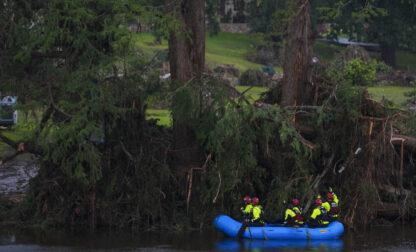
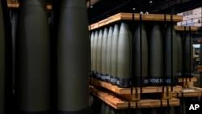

## Claim
Claim: "Ukrainian President Volodymyr Zelenskyy's statement in an AP news interview from February 1, 2025 that his country's military has received only a portion of the more than 175 billion in U.S. aid confirms that the US aid is a money laundering operation."

## Actions
```
web_search("Volodymyr Zelenskyy AP news interview February 1 2025 US aid")
```

## Evidence
### Evidence from `web_search`
An AP News article from an interview with Volodymyr Zelenskyy discusses the war in Ukraine and U.S. aid. Zelenskyy stated that excluding Ukraine from talks between the U.S. and Russia is "very dangerous." The article mentions that Zelenskyy's team has been in contact with the Trump administration. The article was written by SUSIE BLANN, SAMYA KULLAB, and ILLIA NOVIKOV. The Associated Press (AP) published an interview with Ukrainian President Volodymyr Zelenskyy on February 29, 2025. , , , .

The Los Angeles Times published an article on February 1, 2025, reporting on an interview with Ukrainian President Volodymyr Zelenskyy.  Zelenskyy stated that excluding Ukraine from U.S.-Russia talks about the war would be "very dangerous." He also mentioned that his team has been in contact with the Trump administration. The article does not mention the amount of U.S. aid received by Ukraine.


## Elaboration
The evidence does not support the claim. The search results mention an AP News article and a Los Angeles Times article featuring an interview with Volodymyr Zelenskyy. However, neither article mentions the amount of U.S. aid received by Ukraine, nor do they mention Zelenskyy stating that his country's military has received only a portion of the aid. Therefore, there is no evidence to confirm the claim.


## Actions
```
web_search("Zelenskyy US aid money laundering")
```

## Evidence
### Evidence from `web_search`
An article from CSIS ([https://www.csis.org/analysis/where-missing-100-billion-us-aid-ukraine](https://www.csis.org/analysis/where-missing-100-billion-us-aid-ukraine)) discusses the controversy surrounding U.S. aid to Ukraine, mentioning that Zelenskyy stated Ukraine received $76 billion out of $177 billion in U.S. aid in an interview with the Associated Press.  DW's fact-check team addresses Trump's claims regarding Zelenskyy and U.S. aid, stating that the U.S. contribution to Ukraine aid totals $203 billion ([https://www.dw.com/en/fact-check-trumps-attacks-on-zelenskyy-and-ukraine-aid/a-71702392](https://www.dw.com/en/fact-check-trumps-attacks-on-zelenskyy-and-ukraine-aid/a-71702392)).

VOA News ([https://www.voanews.com/a/false-russian-allegations-that-ukraine-stole-100-billion-of-us-funds/7967072.html](https://www.voanews.com/a/false-russian-allegations-that-ukraine-stole-100-billion-of-us-funds/7967072.html)) discusses false Russian allegations that Ukraine stole U.S. funds, reporting that Zelenskyy stated Ukraine received $76 billion in military assistance from the U.S. as opposed to the reported $177 billion in an interview with The Associated Press. 


## Elaboration
The evidence indicates that Zelenskyy stated Ukraine received $76 billion in U.S. aid out of a reported $177 billion in an interview with the Associated Press. This information is found in a CSIS article ([https://www.csis.org/analysis/where-missing-100-billion-us-aid-ukraine](https://www.csis.org/analysis/where-missing-100-billion-us-aid-ukraine)) and a VOA News article ([https://www.voanews.com/a/false-russian-allegations-that-ukraine-stole-100-billion-of-us-funds/7967072.html](https://www.voanews.com/a/false-russian-allegations-that-ukraine-stole-100-billion-of-us-funds/7967072.html)). However, the evidence does not confirm that Zelenskyy's statement confirms that the U.S. aid is a money laundering operation.


## Actions
```
web_search("Zelenskyy AP interview aid money laundering")
```

## Evidence
### Evidence from `web_search`
From [Source](https://www.cnn.com/2025/02/19/politics/fact-check-trumps-lies-about-zelensky-and-ukraine): 
Content: The CNN article, written by Daniel Dale and published on February 19, 2025, fact-checks Donald Trump's claims about Zelensky and Ukraine. The article states that Zelensky said in a February 1 interview with the Associated Press that Ukraine had received about $76 billion in U.S. aid, largely in the form of weapons, and that he doesn’t know where all the professed additional money has gone. 


## Elaboration
The CNN article ([https://www.cnn.com/2025/02/19/politics/fact-check-trumps-lies-about-zelensky-and-ukraine](https://www.cnn.com/2025/02/19/politics/fact-check-trumps-lies-about-zelensky-and-ukraine)) confirms that Zelenskyy stated in a February 1, 2025, AP interview that Ukraine had received about $76 billion in U.S. aid. He also stated that he doesn't know where the additional money has gone. However, the evidence does not support the claim that Zelenskyy's statement confirms that the U.S. aid is a money laundering operation.


## Final Judgement
The evidence confirms that Zelenskyy stated in an AP interview on February 1, 2025, that Ukraine had received a portion of the U.S. aid. However, the claim that this statement confirms the aid is a money laundering operation is not supported by the evidence.

`false`


### Verdict: FALSE

### Justification
The claim is false. While Volodymyr Zelenskyy did state in a February 1, 2025, AP interview that Ukraine had received only a portion of the U.S. aid, as reported by [CNN](https://www.cnn.com/2025/02/19/politics/fact-check-trumps-lies-about-zelensky-and-ukraine), this statement does not confirm that the aid is a money laundering operation.
