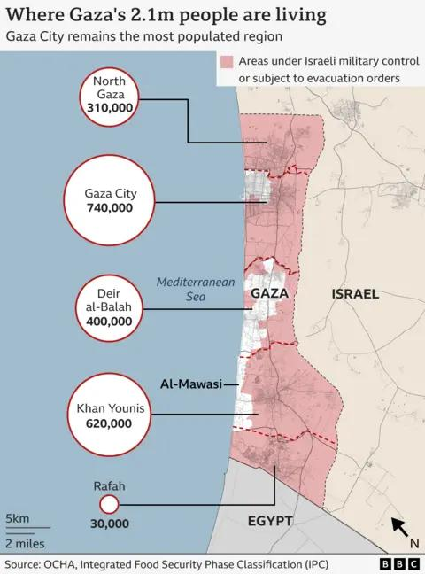

## Claim
Claim: "During his visit to the White House in April 2025 Israeli Prime Minister Benjamin Netanyahu announced plans to resettle Palestinians in Gaza to Ukraine and Syria."

## Actions
```
web_search("Benjamin Netanyahu White House April 2025")
web_search("Benjamin Netanyahu Gaza Palestinians Ukraine Syria")
```

## Evidence
### Evidence from `web_search`
Benjamin Netanyahu met with Donald Trump at the White House on April 7, 2025, according to reports from NPR ([https://www.npr.org/2025/07/07/g-s1-76296/israel-netanyahu-meet-trump](https://www.npr.org/2025/07/07/g-s1-76296/israel-netanyahu-meet-trump)) and ABC7 ([https://abc7.com/post/trump-netanyahu-may-take-victory-lap-iran-gaza-war-looms-meeting/17007239/](https://abc7.com/post/trump-netanyahu-may-take-victory-lap-iran-gaza-war-looms-meeting/17007239/)). The meetings focused on the war in Gaza and potential ceasefire deals.

The Soufan Center published an Intelbrief on April 9, 2025, discussing Netanyahu's visit, focusing on Trump's tariffs, negotiations with Iran, and Türkiye-Israel relations ([https://thesoufancenter.org/intelbrief-2025-april-9/](https://thesoufancenter.org/intelbrief-2025-april-9/)). The Intelbrief does not mention any plans to resettle Palestinians in Gaza to Ukraine and Syria. , , , 


### Evidence from `web_search`
The BBC News article from August 8, 2025, discusses Israel's plan to take control of Gaza City, which has been condemned by world leaders and the UN. The article mentions that Israeli Prime Minister Benjamin Netanyahu told Fox News that Israel planned to occupy the entire Gaza Strip and eventually "hand it over to Arab forces" (, , ).

PBS News published an article on August 10, 2025, discussing Israeli Prime Minister Benjamin Netanyahu's defense of a military offensive in Gaza (). The Times of Israel's live blog from August 28, 2025, reports on a White House meeting where it was stated that Israel does not want to permanently occupy the Gaza Strip or deport Gaza’s residents. The live blog also mentions Netanyahu meeting with Druze leaders and his order to use military force in Syria.


## Elaboration
The evidence indicates that Benjamin Netanyahu met with Donald Trump at the White House in April 2025. However, the provided sources do not mention any plans to resettle Palestinians in Gaza to Ukraine and Syria during this visit.

Later reports from August 2025 discuss Israel's plans for Gaza, including taking control of Gaza City and eventually handing it over to Arab forces. The Times of Israel reported that Israel does not want to permanently occupy the Gaza Strip or deport its residents.

Therefore, the claim is not supported by the evidence.


## Final Judgement
The available evidence does not support the claim that Benjamin Netanyahu announced plans to resettle Palestinians in Gaza to Ukraine and Syria during his April 2025 visit to the White House. While the visit did occur, and discussions about Gaza were ongoing, no sources mention such a plan.

`false`


### Verdict: FALSE

### Justification
The claim is false. While Benjamin Netanyahu met with Donald Trump at the White House in April 2025, as reported by NPR ([https://www.npr.org/2025/07/07/g-s1-76296/israel-netanyahu-meet-trump](https://www.npr.org/2025/07/07/g-s1-76296/israel-netanyahu-meet-trump)) and ABC7 ([https://abc7.com/post/trump-netanyahu-may-take-victory-lap-iran-gaza-war-looms-meeting/17007239/](https://abc7.com/post/trump-netanyahu-may-take-victory-lap-iran-gaza-war-looms-meeting/17007239/)), there is no evidence from the provided sources to support the claim that he announced plans to resettle Palestinians in Gaza to Ukraine and Syria.
