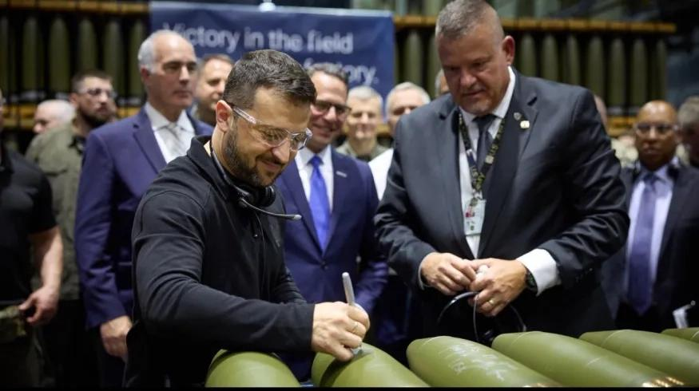

## Claim
Claim: " This image shows Ukrainian President Volodymyr Zelenskyy signing Israeli bombs intended for use against Palestinians in Gaza."

## Actions
```
reverse_search()
```

## Evidence
### Evidence from `reverse_search`
The image shows Ukrainian President Volodymyr Zelensky signing ammunition at the Scranton Army Ammunition Plant (SCAAP) in Scranton, Pennsylvania, USA, on September 23, 2024 (, , , ). The BBC published articles on September 26, 2024, about the event, and the New York Post published an article on September 25, 2024, discussing the political implications of the visit.

None of the sources mention that the ammunition was Israeli bombs intended for use against Palestinians in Gaza.


## Elaboration
The claim is false. The image shows Volodymyr Zelenskyy signing ammunition at the Scranton Army Ammunition Plant (SCAAP) in Scranton, Pennsylvania, USA, on September 23, 2024. The evidence does not support the claim that the ammunition was Israeli bombs intended for use against Palestinians in Gaza.


## Final Judgement
The image shows Volodymyr Zelenskyy signing ammunition at a US plant, not Israeli bombs. The claim misrepresents the context of the image.

`false`

### Verdict: FALSE

### Justification
The image depicts Ukrainian President Volodymyr Zelenskyy signing ammunition at the Scranton Army Ammunition Plant in the USA, not Israeli bombs. The claim that the ammunition was Israeli bombs intended for use against Palestinians in Gaza is not supported by the evidence, as confirmed by reverse image searches and news reports about the event ([BBC](https://www.bbc.com/), [New York Post](https://nypost.com/)).
