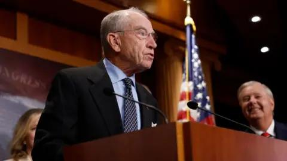

## Claim
Claim: " This image shows an authentic list realeased by Ukraine showing US politicians taking bribes from Ukraine. The highest bribe was 92 Million US-$ for Joe Biden."

## Actions
```
web_search("Joe Biden Ukraine bribe list")
web_search("US politicians Ukraine bribes")
reverse_search()
```

## Evidence
### Evidence from `web_search`
The BBC News article from July 21, 2023, discusses allegations that Joe Biden and his son accepted bribes from a Ukrainian firm, but there is no evidence to support this claim. The Wikipedia article discusses the Biden–Ukraine conspiracy theory, which alleges that Joe Biden took a bribe. A joint investigation found no evidence of wrongdoing by Joe Biden. The Al Jazeera article from December 16, 2024, reports that a former FBI informant pleaded guilty to lying about a bribery scheme involving Joe Biden and his son Hunter. The FBI found no evidence of corruption or bribes. 
, 
, 
, 


### Evidence from `web_search`
From [Source](https://www.euronews.com/my-europe/2025/01/15/old-false-claims-resurface-about-ukrainian-kickbacks-to-us-politicians): 
Content: Euronews published an article on January 15, 2025, discussing the resurfacing of false claims about Ukrainian kickbacks to US politicians. The article states that an image circulating on social media lists US politicians, including Joe Biden, and alleges they received bribes from Ukraine. The article debunks these claims, stating there is no evidence to support them and that the claims have been debunked by other fact-checkers. The article mentions that the image has been circulating since at least 2023.


## Elaboration
The evidence indicates that the claim is false. Multiple sources, including a Euronews article, debunk the allegations of US politicians receiving bribes from Ukraine, including the specific claim about Joe Biden. The image in the claim has been circulating since at least 2023, and there is no evidence to support the claims made in the image.


## Final Judgement
The claim is demonstrably false. There is no evidence to support the claim that the image is an authentic list released by Ukraine showing US politicians taking bribes. Multiple sources debunk the allegations, and the image has been circulating since at least 2023. `false`

### Verdict: FALSE

### Justification
The claim that the image shows an authentic list of US politicians taking bribes from Ukraine is false. Multiple sources, including a [Euronews article](https://www.euronews.com/my-europe/2025/01/15/old-false-claims-resurface-about-ukrainian-kickbacks-to-us-politicians), debunk the allegations, and there is no evidence to support the claims made in the image.
