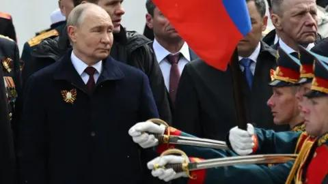
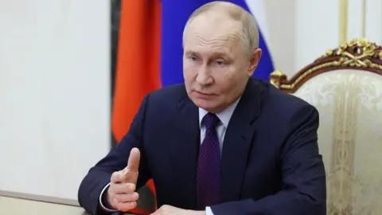

## Claim
Claim: "Russian President Vladimir Putin has declared war on the United States."

## Actions
```
web_search("Vladimir Putin declares war on United States")
```

## Evidence
### Evidence from `web_search`
Fact Crescendo states that there has been no official declaration of war by Russia against the USA, and the claim is unfounded. The BBC article discusses the war in Ukraine and Putin's goals, including "demilitarise and denazify" Ukraine, and mentions that Putin has not agreed to peace talks with Zelensky. , , , , .

The Journal of Democracy published an article stating that Vladimir Putin has pivoted to more hostile policies toward the United States, discussing Putin's actions and justifications, including the NATO threat. .


## Elaboration
The evidence indicates that there has been no official declaration of war by Russia against the USA. While there are reports of hostile policies and actions by Putin towards the United States, there is no evidence to support the claim that Putin has declared war.


## Final Judgement
The search results confirm that there has been no official declaration of war by Russia against the United States. While there are discussions about Putin's hostile policies, the claim of a war declaration is unfounded.

The claim is demonstrably false as it is disproven by evidence from multiple and reliable sources. `false`


### Verdict: FALSE

### Justification
The claim that Vladimir Putin declared war on the United States is false. Fact Crescendo states that there has been no official declaration of war by Russia against the USA. While there are discussions about Putin's hostile policies, the claim of a war declaration is unfounded.
