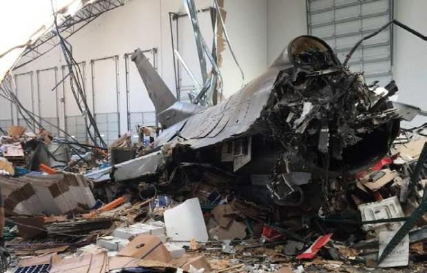
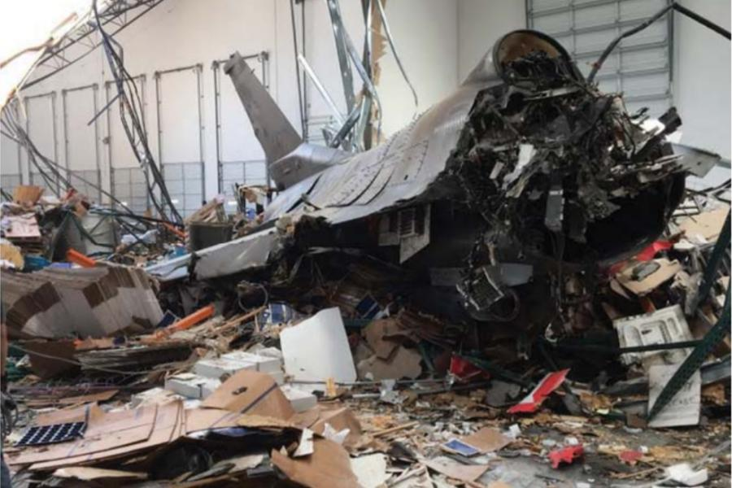
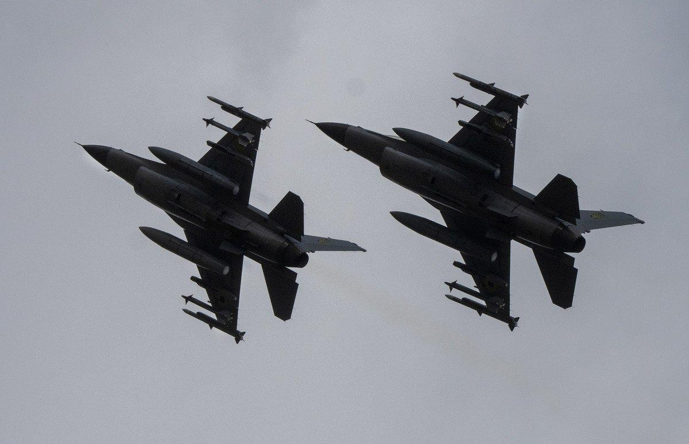

## Claim
Claim: " This image shows a Ukrainian F-16 fighter jet which was shot down by Russia as part of the large-scale Russian invasion in Ukraine."

## Actions
```
reverse_search()
web_search("Ukrainian F-16 shot down Russia")
```

## Evidence
### Evidence from `reverse_search`
The image in the claim () is of an F-16 fighter jet that crashed near March Air Reserve Base in May 2019. The crash was caused by a hydraulic failure due to improperly installed parts. The pilot ejected and survived. The image appears in articles from The Press-Enterprise ([https://www.pressenterprise.com/2020/05/01/heres-why-the-missiles-on-the-crashed-f-16-near-march-air-reserve-base-did-not-explode/](https://www.pressenterprise.com/2020/05/01/heres-why-the-missiles-on-the-crashed-f-16-near-march-air-reserve-base-did-not-explode/)), Air & Space Forces Magazine ([https://www.airandspaceforces.com/improperly-installed-parts-caused-f-16-to-crash-into-warehouse-in-may-2019/](https://www.airandspaceforces.com/improperly-installed-parts-caused-f-16-to-crash-into-warehouse-in-may-2019/)), and The Sun ([https://www.sbsun.com/2020/04/23/hydraulic-failure-caused-f-16-to-crash-near-march-base-last-year-air-force-says/](https://www.sbsun.com/2020/04/23/hydraulic-failure-caused-f-16-to-crash-near-march-base-last-year-air-force-says/)). The image in the articles is the same as the image in the claim (, ).


### Evidence from `web_search`
Newsweek reports that a third Ukrainian F-16 fighter pilot has been killed in action, and that Russia launched a "massive strike" on Ukraine. ([https://www.newsweek.com/ukraine-f16-pilot-killed-russia-2092478](https://www.newsweek.com/ukraine-f16-pilot-killed-russia-2092478)) Reuters reports that a Ukrainian F-16 fighter pilot died in a crash while repelling a Russian air attack, and that Ukraine has lost three F-16s since it began operating the jets last year. ([https://www.reuters.com/business/aerospace-defense/least-six-wounded-large-scale-russian-air-attack-ukraine-ukrainian-authorities-2025-06-29/](https://www.reuters.com/business/aerospace-defense/least-six-wounded-large-scale-russian-air-attack-ukraine-ukrainian-authorities-2025-06-29/))

CNN reports that a Ukrainian F-16 pilot was killed after Russia launched a large aerial assault, and that this was the fourth F-16 lost by Ukraine since they began flying the jets. ([https://www.cnn.com/2025/06/29/europe/ukraine-f-16-pilot-killed-russia](https://www.cnn.com/2025/06/29/europe/ukraine-f-16-pilot-killed-russia)) The articles include images of F-16s , and a Russian drone strike .


## Elaboration
The image in the claim (

## Final Judgement
The image in the claim is of an F-16 fighter jet that crashed near March Air Reserve Base in May 2019 due to a hydraulic failure. The image is being misrepresented in a new context.

`false`

### Verdict: FALSE

### Justification
The image in the claim is of an F-16 fighter jet that crashed in 2019 due to a hydraulic failure, as confirmed by reverse image search and articles from The Press-Enterprise, Air & Space Forces Magazine, and The Sun ([https://www.pressenterprise.com/2020/05/01/heres-why-the-missiles-on-the-crashed-f-16-near-march-air-reserve-base-did-not-explode/](https://www.pressenterprise.com/2020/05/01/heres-why-the-missiles-on-the-crashed-f-16-near-march-air-reserve-base-did-not-explode/)). The claim misrepresents the image's origin and context.
