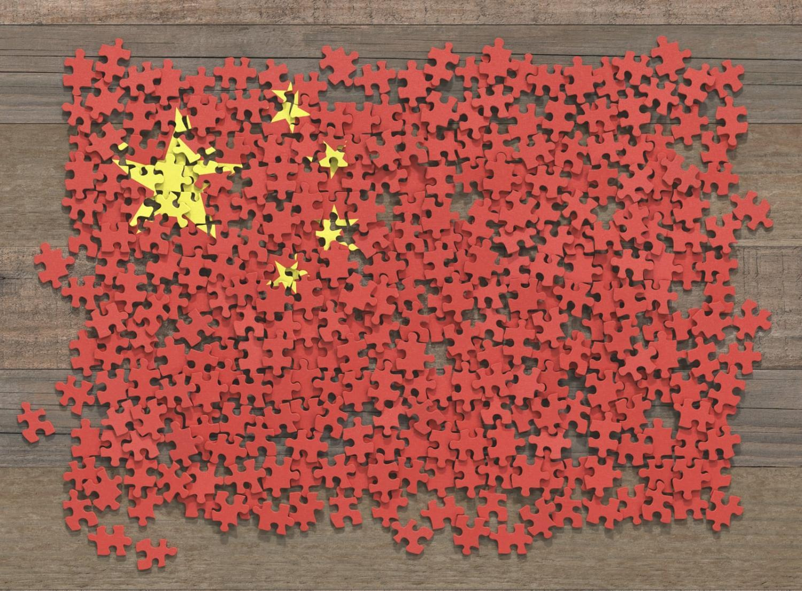
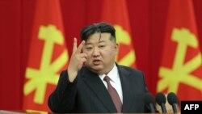

## Claim
Claim: "While serving as US President in 2024, Joe Biden ordered the US forces to prepare for possible nuclear confrontations with Russia, China, and North Korea."

## Actions
```
web_search("Joe Biden nuclear confrontation Russia China North Korea")
```

## Evidence
### Evidence from `web_search`
In 2024, President Joe Biden approved a US nuclear strategy to prepare for possible coordinated nuclear confrontations with Russia, China, and North Korea. This plan, approved earlier in the year, reorients America's deterrent strategy to focus on China's growing nuclear arsenal. The White House stated that the plan was not a response to a single country or threat.

The Guardian ([https://www.theguardian.com/us-news/article/2024/aug/20/biden-nuclear-strategy-china-threat](https://www.theguardian.com/us-news/article/2024/aug/20/biden-nuclear-strategy-china-threat)) and the Lowy Institute ([https://www.lowyinstitute.org/the-interpreter/us-shifts-nuclear-focus-counter-china-s-growing-arsenal](https://www.lowyinstitute.org/the-interpreter/us-shifts-nuclear-focus-counter-china-s-growing-arsenal)) reported on the plan. Voice of America ([https://www.voanews.com/a/north-korea-condemns-new-us-nuclear-strategic-plan-report/7755256.html](https://www.voanews.com/a/north-korea-condemns-new-us-nuclear-strategic-plan-report/7755256.html)) also reported on the plan, noting North Korea's condemnation. , , , 


## Elaboration
The evidence confirms that in 2024, President Joe Biden approved a US nuclear strategy to prepare for possible nuclear confrontations with Russia, China, and North Korea. The plan reorients the US deterrent strategy to focus on China's growing nuclear arsenal.

The Guardian ([https://www.theguardian.com/us-news/article/2024/aug/20/biden-nuclear-strategy-china-threat](https://www.theguardian.com/us-news/article/2024/aug/20/biden-nuclear-strategy-china-threat)) and the Lowy Institute ([https://www.lowyinstitute.org/the-interpreter/us-shifts-nuclear-focus-counter-china-s-growing-arsenal](https://www.lowyinstitute.org/the-interpreter/us-shifts-nuclear-focus-counter-china-s-growing-arsenal)) reported on the plan. Voice of America ([https://www.voanews.com/a/north-korea-condemns-new-us-nuclear-strategic-plan-report/7755256.html](https://www.voanews.com/a/north-korea-condemns-new-us-nuclear-strategic-plan-report/7755256.html)) also reported on the plan, noting North Korea's condemnation.


## Final Judgement
The evidence indicates that in 2024, President Biden approved a US nuclear strategy to prepare for potential nuclear confrontations with Russia, China, and North Korea. This plan focuses on China's growing nuclear arsenal. Multiple reliable sources, including The Guardian, the Lowy Institute, and Voice of America, confirm this information.

The claim is supported by evidence from multiple reliable sources. Therefore, the claim is factually accurate. `true`


### Verdict: TRUE

### Justification
In 2024, President Joe Biden approved a US nuclear strategy to prepare for possible nuclear confrontations with Russia, China, and North Korea, as reported by sources such as The Guardian ([https://www.theguardian.com/us-news/article/2024/aug/20/biden-nuclear-strategy-china-threat](https://www.theguardian.com/us-news/article/2024/aug/20/biden-nuclear-strategy-china-threat)) and the Lowy Institute ([https://www.lowyinstitute.org/the-interpreter/us-shifts-nuclear-focus-counter-china-s-growing-arsenal](https://www.lowyinstitute.org/the-interpreter/us-shifts-nuclear-focus-counter-china-s-growing-arsenal)). The plan reorients the US deterrent strategy to focus on China's growing nuclear arsenal.
