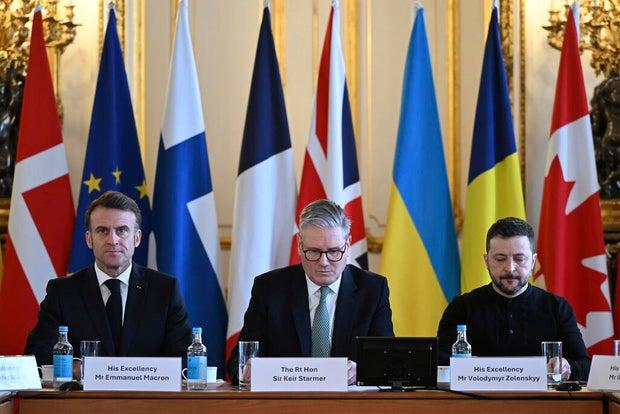
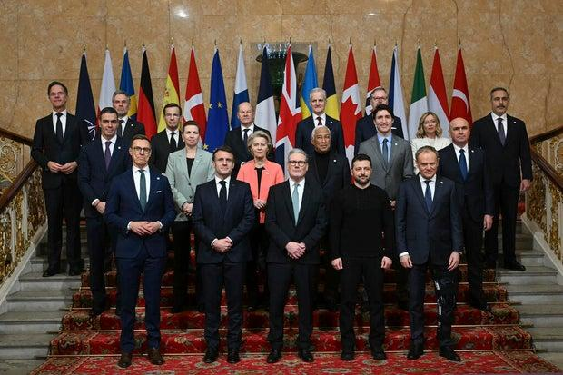

## Claim
Claim: " This is an authentic image of world leaders taking off their suits to symbolically support Ukraine at the London summit on Ukraine on March 2, 2025."

## Actions
```
reverse_search()
web_search("London summit on Ukraine March 2 2023")
```

## Evidence
### Evidence from `web_search`
The web sources discuss the 2025 London Summit on Ukraine, held on March 2, 2025, in London. The summit aimed to create a peace plan for the Russian invasion of Ukraine and was attended by leaders from 16 states, the EU, and NATO. The summit resulted in a four-point plan and commitments, including financial aid and the purchase of air defense missiles for Ukraine. Participants included Volodymyr Zelenskyy, Keir Starmer, and Emmanuel Macron.

The summit was dismissed by Russian parliamentarians. The sources include a photo of the summit and other related images. (, , )


## Elaboration
The evidence confirms the existence of the London Summit on Ukraine on March 2, 2025, and includes a photo of the summit. The claim states that the image depicts world leaders taking off their suits to support Ukraine. However, the evidence does not explicitly state that the leaders took off their suits. Therefore, the claim cannot be fully verified.

The evidence does confirm that the image is related to the London Summit on Ukraine on March 2, 2025. However, the evidence does not provide information about the leaders taking off their suits.

To fully verify the claim, additional information is needed to confirm whether the leaders indeed took off their suits during the summit.


## Actions
```
web_search("London summit on Ukraine March 2 2025 suits")
```

## Evidence
### Evidence from `web_search`
The web sources discuss the London summit on Ukraine held on March 2, 2025, attended by leaders including Volodymyr Zelenskyy, Keir Starmer, and Emmanuel Macron. The summit aimed to create a peace plan. The sources include images of the summit (, , , ), but do not mention leaders taking off their suits.


## Elaboration
The evidence confirms the existence of the London Summit on Ukraine on March 2, 2025, and includes images from the summit. However, none of the images show leaders taking off their suits. Therefore, the claim that the leaders took off their suits to support Ukraine cannot be verified.


## Actions
```
web_search("London summit on Ukraine March 2 2025 leaders without jackets")
```

## Evidence
### Evidence from `web_search`
From [Source](https://www.aljazeera.com/news/2025/3/5/what-is-ukraines-new-peace-plan-that-zelenskyy-presented-to-trump): 
Content: The Al Jazeera article, published on March 5, 2025, discusses the London summit on Ukraine, which took place on March 2, 2025. The article mentions the summit's goal of strengthening support for Ukraine and includes a photo of Volodymyr Zelenskyy. The article does not mention leaders taking off their jackets or suits. , , , 


## Elaboration
The evidence does not support the claim. The search results confirm the London summit on Ukraine on March 2, 2025, but do not mention leaders removing their suits. The images provided show leaders wearing suits.


## Final Judgement
The claim is about an image of European leaders taking off their suits to support Ukraine at the London summit on March 2, 2025. The evidence confirms the summit's occurrence and includes images, but none show leaders removing their suits.

`false`

### Verdict: FALSE

### Justification
The claim that European leaders took off their suits to support Ukraine at the London summit on March 2, 2025, is not supported by the evidence. While the summit did occur, and images from the event are available, none of the images show leaders removing their suits. Therefore, the claim is false.
