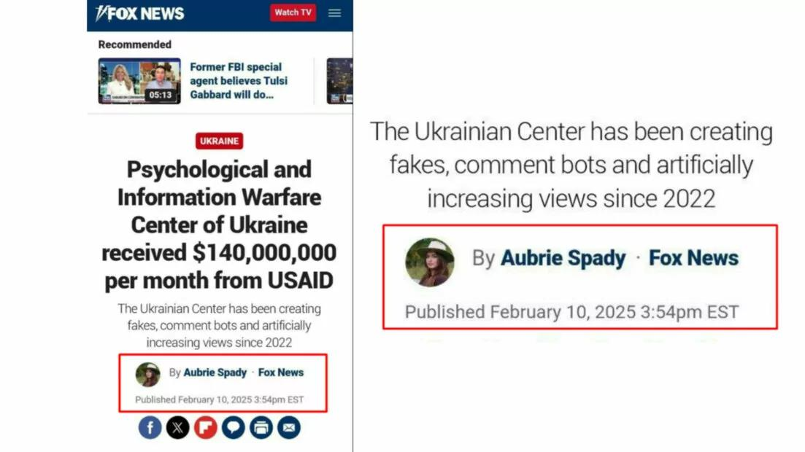

## Claim
Claim: " This image shows a screenshot of an authentic Fox News article with the title 'Psychological and Information Warfare Center of Ukraine received $140,000,000 per month from USAID'."

## Actions
```
web_search("Aubrie Spady Fox News")
web_search("Psychological and Information Warfare Center of Ukraine USAID")
```

## Evidence
### Evidence from `web_search`
The search results include a Fox News article written by Aubrie Spady, discussing the "Psychological and Information Warfare Center of Ukraine" and its alleged receipt of $140,000,000 per month from USAID.  The article claims the center has been creating fakes, comment bots, and artificially increasing views since 2022. The search results also provide a profile of Aubrie Spady, a writer for Fox News Digital.

The search results also mention Aubrie Spady's work at Fox News and her father's conservative connections. 


### Evidence from `web_search`
The article from gwaramedia.com debunks a claim that Fox News published an article stating that the "Psychological and Information Warfare Center of Ukraine" received $140,000,000 per month from USAID. The article states that the article was not published by Fox News and that the author, Aubrie Spady, did not publish any articles on February 10, 2025, mentioning the Ukrainian center. The DW article fact-checks a claim that Fox News reported USAID pays $140 million per month to Ukraine's Psychological and Information Warfare Center. The article states that a manipulated screenshot of a Fox News article is circulating on social media. The search result is a Wikipedia article about the 72nd Psychological and Information Warfare Center of Ukraine. It was established in 2003 and is a unit of the Ukrainian Special Operations Forces. The center is involved in psychological and informational warfare.

The article from gwaramedia.com can be found here: [https://gwaramedia.com/en/debunking-russian-fakes-no-fox-news-didnt-write-about-ukraines-center-for-information-operations-receiving-140m-per-month-from-the-usaid/](https://gwaramedia.com/en/debunking-russian-fakes-no-fox-news-didnt-write-about-ukraines-center-for-information-operations-receiving-140m-per-month-from-the-usaid/). The DW article can be found here: [https://www.dw.com/en/fact-check-disinformation-spikes-after-trump-zelenskyy-row/a-71832118](https://www.dw.com/en/fact-check-disinformation-spikes-after-trump-zelenskyy-row/a-71832118). The Wikipedia article can be found here: [https://en.wikipedia.org/wiki/72nd_Psychological_and_Information_Warfare_Center_(Ukraine)](https://en.wikipedia.org/wiki/72nd_Psychological_and_Information_Warfare_Center_(Ukraine)).    


## Elaboration
The claim is false. The evidence indicates that the Fox News article in the image is a manipulated screenshot. Fact-check articles from gwaramedia.com ([https://gwaramedia.com/en/debunking-russian-fakes-no-fox-news-didnt-write-about-ukraines-center-for-information-operations-receiving-140m-per-month-from-the-usaid/](https://gwaramedia.com/en/debunking-russian-fakes-no-fox-news-didnt-write-about-ukraines-center-for-information-operations-receiving-140m-per-month-from-the-usaid/)) and DW ([https://www.dw.com/en/fact-check-disinformation-spikes-after-trump-zelenskyy-row/a-71832118](https://www.dw.com/en/fact-check-disinformation-spikes-after-trump-zelenskyy-row/a-71832118)) debunk the claim. The article was not published by Fox News, and the author, Aubrie Spady, did not publish any articles on February 10, 2025, mentioning the Ukrainian center.


## Final Judgement
The claim is demonstrably false as the image is a manipulated screenshot of a Fox News article. The article was not published by Fox News, and the author did not publish any articles on the date mentioned. `false`

### Verdict: FALSE

### Justification
The claim is false. The image is a manipulated screenshot of a Fox News article. Fact-check articles from gwaramedia.com ([https://gwaramedia.com/en/debunking-russian-fakes-no-fox-news-didnt-write-about-ukraines-center-for-information-operations-receiving-140m-per-month-from-the-usaid/](https://gwaramedia.com/en/debunking-russian-fakes-no-fox-news-didnt-write-about-ukraines-center-for-information-operations-receiving-140m-per-month-from-the-usaid/)) and DW ([https://www.dw.com/en/fact-check-disinformation-spikes-after-trump-zelenskyy-row/a-71832118](https://www.dw.com/en/fact-check-disinformation-spikes-after-trump-zelenskyy-row/a-71832118)) debunk the claim. The article was not published by Fox News, and the author did not publish any articles on the date mentioned.
