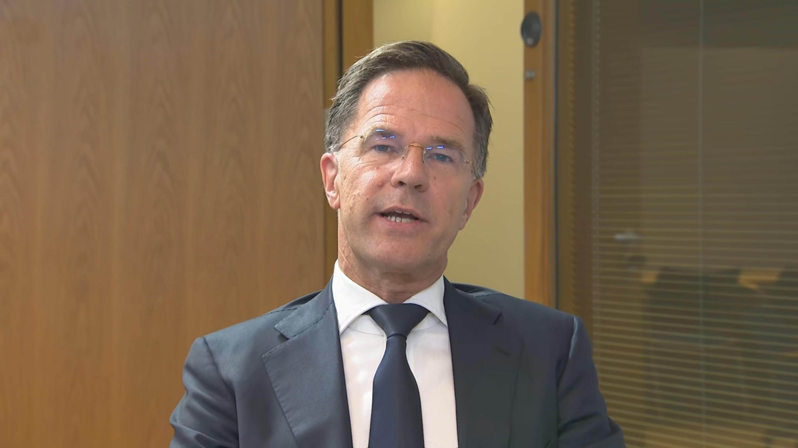

## Claim
Claim: "After Donald Trump won the US presidential election in 2024, NATO Secretary General Mark Rutte said that ‘If Trump surrenders Ukraine to Putin, he will personally expel the United States from the alliance’."

## Actions
```
web_search("Mark Rutte Trump Ukraine NATO")
```

## Evidence
### Evidence from `web_search`
NATO Secretary General Mark Rutte met with Donald Trump at the White House on July 14, 2025, to discuss support for Ukraine, as reported by [NATO](https://www.nato.int/cps/en/natohq/news_237031.htm). ABC News reported on August 10, 2025, on Rutte's comments regarding a summit between Trump and Putin, stating that the summit would be an important test in ending the war in Ukraine .

Reuters reported on August 19, 2025, that Rutte said NATO membership for Ukraine was not under discussion and mentioned discussions about "Article 5" type security guarantees for Ukraine .


## Elaboration
The evidence indicates that Mark Rutte, as NATO Secretary General, met with Donald Trump in July 2025 to discuss support for Ukraine. ABC News reported on Rutte's comments regarding a summit between Trump and Putin, viewing it as a test for ending the war. Reuters reported Rutte's statements on security guarantees for Ukraine.

The provided evidence does not contain any statement from Mark Rutte saying that he would expel the United States from the alliance if Trump surrendered Ukraine to Putin.

Therefore, the claim cannot be verified based on the provided evidence.


## Actions
```
web_search("Mark Rutte statement on Trump and Ukraine NATO")
```

## Evidence
### Evidence from `web_search`
From [Source](https://www.nato.int/cps/en/natohq/opinions_237212.htm): 
Content: On August 18, 2025, NATO Secretary General Mark Rutte made remarks at a meeting hosted by Donald J. Trump with Volodymyr Zelenskyy and other European leaders in Washington, D.C. Rutte thanked Trump for starting a dialogue with Putin and expressed excitement about ending the war in Ukraine. He also thanked Trump for his leadership and willingness to participate in security guarantees.


## Elaboration
The new evidence indicates that Mark Rutte thanked Donald Trump for starting a dialogue with Putin and expressed excitement about ending the war in Ukraine. He also thanked Trump for his leadership and willingness to participate in security guarantees.

The provided evidence does not contain any statement from Mark Rutte saying that he would expel the United States from the alliance if Trump surrendered Ukraine to Putin.

Therefore, the claim cannot be verified based on the provided evidence.


## Final Judgement
The fact-check reveals that Mark Rutte, as NATO Secretary General, met with Donald Trump to discuss support for Ukraine and expressed optimism about ending the war. However, there is no evidence to support the claim that Rutte stated he would expel the United States from NATO if Trump surrendered Ukraine to Putin.

`false`


### Verdict: FALSE

### Justification
The claim is false. While Mark Rutte, as NATO Secretary General, discussed Ukraine with Donald Trump, there is no evidence from sources like [NATO](https://www.nato.int/cps/en/natohq/news_237031.htm) and news reports to support the statement that Rutte would expel the United States from the alliance if Trump surrendered Ukraine to Putin.
