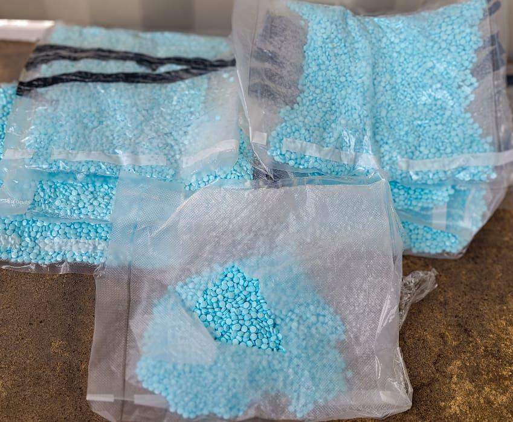

## Claim
Claim: "Mexican President-elect Claudia Sheinbaum rejected an invitation to Ukraine by Volodymr Zelenskyy and said towards him on September 17, 2024: 'If I wanted to see a drug addict, I'd just take a walk around Tijuana.'"

## Actions
```
web_search("Claudia Sheinbaum Zelenskyy Ukraine invitation")
web_search("Claudia Sheinbaum Tijuana drug addict quote")
```

## Evidence
### Evidence from `web_search`
Claudia Sheinbaum, the Mexican President-elect, declined an invitation from Ukrainian President Volodymyr Zelenskyy to visit Ukraine, according to reports from [IntelliNews](https://www.intellinews.com/mexico-s-president-elect-sheinbaum-turns-down-zelensky-s-invitation-to-ukraine-344262/) (), [Euromaidan Press](https://euromaidanpress.com/2024/09/18/mexican-president-elect-declines-zelenskyys-invitation-to-visit-ukraine/) (), and [NV.ua](https://english.nv.ua/nation/sheinbaum-declines-zelenskyy-s-invitation-focuses-on-domestic-issues-50451798.html) (). Sheinbaum stated her intention to focus on internal affairs and maintain a policy of non-intervention in foreign affairs.


### Evidence from `web_search`
The provided web sources discuss Claudia Sheinbaum's statements on drug trafficking and related issues. One article from workers.org ([Source](https://www.workers.org/2025/02/83990/)) focuses on Sheinbaum's comments regarding the United States' role in drug trafficking and her commitment to Mexican sovereignty. Another article from MSNBC ([Source](https://www.msnbc.com/opinion/msnbc-opinion/trump-mexico-president-claudia-sheinbaum-fentanyl-response-rcna182496)) covers her response to Donald Trump's claims about Mexico's role in the fentanyl crisis.

A Mexico News Daily article ([Source](https://mexiconewsdaily.com/politics/trump-sheinbaum-us-anti-drug-campaign/)) mentions Donald Trump's acknowledgment of Sheinbaum's influence on his anti-drug campaign and her statement that fentanyl use is not a significant problem in Mexico. The article includes an image of blue pills in bags .


## Elaboration
The evidence confirms that Claudia Sheinbaum declined an invitation from Volodymyr Zelenskyy to visit Ukraine. However, the search results do not provide any information about the alleged quote attributed to her.

The search results do provide information about Sheinbaum's statements on drug trafficking and related issues, but they do not contain the quote in question.

Therefore, the veracity of the claim cannot be determined due to the lack of evidence supporting the alleged quote.


## Final Judgement
The claim that Claudia Sheinbaum made a specific statement about Volodymyr Zelenskyy and drug addiction is not supported by the provided evidence. While it is confirmed that she declined an invitation to visit Ukraine, there is no information about the alleged quote.

`false`

### Verdict: FALSE

### Justification
While Claudia Sheinbaum did decline an invitation to visit Ukraine, as reported by [IntelliNews](https://www.intellinews.com/mexico-s-president-elect-sheinbaum-turns-down-zelensky-s-invitation-to-ukraine-344262/), [Euromaidan Press](https://euromaidanpress.com/2024/09/18/mexican-president-elect-declines-zelenskyys-invitation-to-visit-ukraine/), and [NV.ua](https://english.nv.ua/nation/sheinbaum-declines-zelenskyy-s-invitation-focuses-on-domestic-issues-50451798.html), there is no evidence to support the specific quote attributed to her in the claim.
