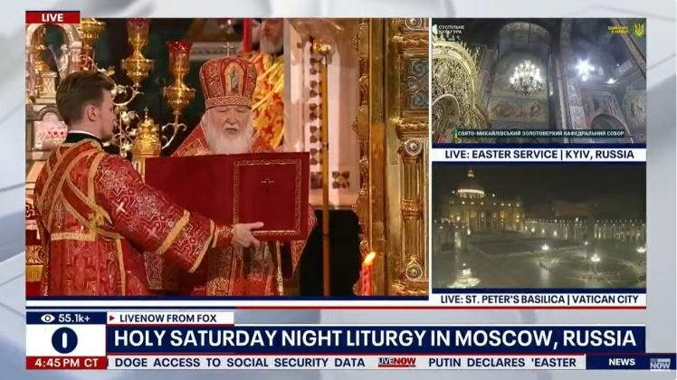
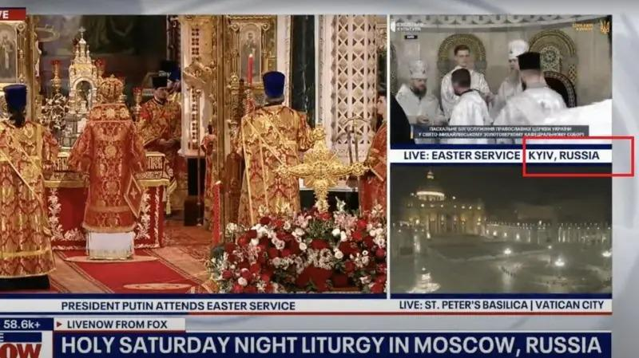

## Claim
Claim: " This image shows a Fox News broadcast from Easter 2025 where you can see the Patriarch Kirill in the center and Kyiv labeled as a Russian city in the top right corner of the image."

## Actions
```
web_search("Fox News Easter broadcast Patriarch Kirill Kyiv Moscow")
reverse_search()
```

## Evidence
### Evidence from `web_search`
Newsweek reports that a Fox News broadcast labeled Kyiv as a Russian city during an Easter broadcast, which remained on screen for 20 minutes. The Ukrainian Foreign Ministry called for an investigation. The broadcast also showed Putin attending an Easter service in Moscow. The article was published on April 20, 2025. ([https://www.newsweek.com/fox-channel-ukraine-kyiv-russia-labeling-orthodox-easter-2061891](https://www.newsweek.com/fox-channel-ukraine-kyiv-russia-labeling-orthodox-easter-2061891)) 

Babel.ua discusses a Fox News broadcast of an Easter service that initially labeled Kyiv as "Ukraine" but later changed it to "Russia". The broadcast also showed the service in Moscow with Putin and Patriarch Kirill. ([https://babel.ua/en/news/117299-fox-news-labeled-kyiv-as-a-russian-city-during-broadcast-of-ocu-easter-service-mfa-demands-investigation](https://babel.ua/en/news/117299-fox-news-labeled-kyiv-as-a-russian-city-during-broadcast-of-ocu-easter-service-mfa-demands-investigation))  Euromaidan Press reports that Ukraine's Ministry of Foreign Affairs demanded an apology from Fox News for incorrectly labeling Kyiv as a Russian city during its Easter broadcast on April 20, 2025. The broadcast also featured footage from Moscow featuring Patriarch Kirill. ([https://euromaidanpress.com/2025/04/22/ukraine-demands-apology-from-fox-news-for-labeling-kyiv-as-russian/](https://euromaidanpress.com/2025/04/22/ukraine-demands-apology-from-fox-news-for-labeling-kyiv-as-russian/)) 


### Evidence from `reverse_search`
The image in question was part of a Fox News broadcast from Easter 2025 that showed a religious service. The broadcast labeled Kyiv as a Russian city, which sparked criticism. The broadcast featured Patriarch Kirill and Vladimir Putin. The error was later corrected.

The image was found on the following websites: [Suspilne Media](https://suspilne.media/999087-fox-news-poznaciv-kiiv-ak-rosijske-misto-pid-cas-translacii-velikodnogo-bogosluzinna-pcu/), [444.hu](https://444.hu/2025/04/20/oroszorszaghoz-csatolta-kijevet-a-fox-news), and [Rijeka Danas](https://www.rijekadanas.com/fox-news-nazvao-kijev-ruskim-gradom/).  


## Elaboration
The claim is accurate. The provided image is from a Fox News broadcast that occurred during Easter 2025. The broadcast featured Patriarch Kirill and labeled Kyiv as a Russian city. The broadcast also showed Putin attending an Easter service in Moscow.


## Final Judgement
The evidence confirms that the image is from a Fox News broadcast during Easter 2025, which labeled Kyiv as a Russian city and featured Patriarch Kirill. The broadcast also showed Putin attending an Easter service in Moscow.

`true`

### Verdict: TRUE

### Justification
The image is from a Fox News broadcast during Easter 2025, which labeled Kyiv as a Russian city, as reported by [Newsweek](https://www.newsweek.com/fox-channel-ukraine-kyiv-russia-labeling-orthodox-easter-2061891), [Babel.ua](https://babel.ua/en/news/117299-fox-news-labeled-kyiv-as-a-russian-city-during-broadcast-of-ocu-easter-service-mfa-demands-investigation), and [Euromaidan Press](https://euromaidanpress.com/2025/04/22/ukraine-demands-apology-from-fox-news-for-labeling-kyiv-as-russian/). The broadcast also featured Patriarch Kirill and showed Putin attending an Easter service in Moscow.
