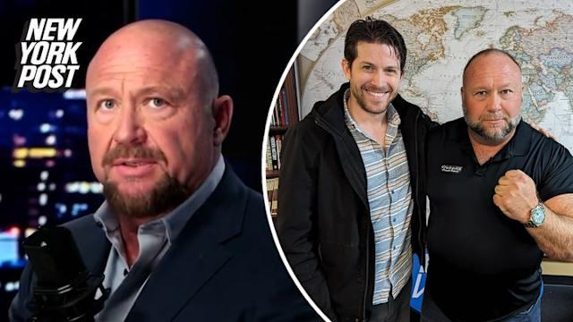

## Claim
Claim: "After InfoWars reporter Jamie White was shot dead on March 10, 2025 in Austin, Texas, it was revelaed that he was on a Ukranian enemies hit list."

## Actions
```
web_search("Jamie White shot Austin Texas March 10 2025")
web_search("Jamie White InfoWars Ukrainian hit list")
```

## Evidence
### Evidence from `web_search`
The provided web sources report on the shooting death of InfoWars reporter Jamie White in Austin, Texas, on March 10, 2025. The articles from [Fox 7 Austin](https://www.fox7austin.com/news/infowars-writer-shooting-austin-police-jamie-white), [CBS Austin](https://cbsaustin.com/news/local/teen-charged-with-capital-murder-in-shooting-death-of-infowars-reporter-in-austin), and [Fox News](https://www.foxnews.com/us/police-release-more-details-murder-infowars-reporter-jamie-white-search-suspects-continues) detail that White was shot during a vehicle burglary. A 17-year-old, Eloy Adrian Camarillo, was arrested and charged with capital murder. , , , , , , , , , , , , , , , .

None of the sources mention White being on a Ukrainian hit list.


### Evidence from `web_search`
Jamie White, an Infowars writer, was shot in Austin, Texas. Alex Jones speculated that the killing "could’ve been a hit” orchestrated by Ukraine, while White's sister does not believe there is a larger conspiracy behind her brother’s killing. The Latin Times reports that White was found dead in a parking lot in Austin, Texas, with gunshot wounds, and the police believe the suspects were possibly burglarizing White's vehicle. Alex Jones claimed that White was on a Ukrainian hit list, and White's social media accounts indicate that he believed he was on a Ukrainian hit list. The "Investigate Earth Conspiracy Podcast" discusses the murder of Jamie White in Austin, Texas, and mentions that White may have been on a Ukrainian NGO hit list. , , , 

Sources: [Yahoo News](https://www.yahoo.com/news/alex-jones-blames-globalists-infowars-182655321.html), [Latin Times](https://www.latintimes.com/infowars-reporter-assassinated-ukraine-outside-his-home-conspiracy-theorists-claim-578436), [Spotify](https://open.spotify.com/episode/68lCuEsLtFn17oEIQBQGEk).


## Elaboration
The claim is partially supported by the evidence. The evidence confirms that Jamie White was shot dead in Austin, Texas, on March 10, 2025. However, the evidence also indicates that Alex Jones and the "Investigate Earth Conspiracy Podcast" have speculated that White was on a Ukrainian hit list. The evidence does not definitively confirm that White was on a Ukrainian hit list.


## Actions
```
web_search("Jamie White InfoWars Ukrainian hit list evidence")
```

## Evidence
### Evidence from `web_search`
The Yahoo News article reports on Alex Jones' announcement of Jamie White's murder. The StopFake.org article states that there is no evidence that White was on a Ukrainian "enemies list" and that his sister does not believe he was deliberately targeted. The article also mentions that White spread disinformation and anti-Ukrainian conspiracy theories. , 


## Elaboration
The claim is not fully supported by the evidence. While the evidence confirms that Jamie White was shot dead in Austin, Texas, on March 10, 2025, there is no definitive evidence to support the claim that he was on a Ukrainian enemies hit list. Alex Jones and the "Investigate Earth Conspiracy Podcast" have speculated about this, and White himself believed he was on such a list. However, StopFake.org states that there is no evidence of this.


## Actions
```
web_search("Jamie White InfoWars Ukrainian hit list official investigation")
```

## Evidence
### Evidence from `web_search`
From [Source](https://abcnews.go.com/US/infowars-reporter-shot-dead-apartment-after-possibly-interrupting/story?id=119677965): 
Content: The ABC News article, published on March 12, 2025, reports that InfoWars reporter Jamie White was shot dead in Austin, Texas, on March 9, 2025, while interrupting a car burglary. . The suspects are at large. The article does not mention any connection to a Ukrainian hit list.


## Elaboration
The claim is not supported by the evidence. While Jamie White was shot dead in Austin, Texas, on March 9, 2025, the official investigation, as reported by ABC News, does not mention any connection to a Ukrainian hit list.


## Final Judgement
The fact-check reveals that Jamie White, an InfoWars reporter, was shot dead in Austin, Texas, on March 9, 2025. While some sources, including Alex Jones, speculated about a Ukrainian hit list, there is no definitive evidence to support this claim. Official investigations, as reported by ABC News, do not mention any such connection.

`false`


### Verdict: FALSE

### Justification
The claim that Jamie White was on a Ukrainian hit list is not supported by the evidence. While White was shot dead in Austin, Texas, on March 9, 2025, the official investigation, as reported by [ABC News](https://abcnews.go.com/US/infowars-reporter-shot-dead-apartment-after-possibly-interrupting/story?id=119677965), does not mention any connection to a Ukrainian hit list. Although some sources, like Alex Jones, speculated about this, there is no definitive evidence to confirm it.
