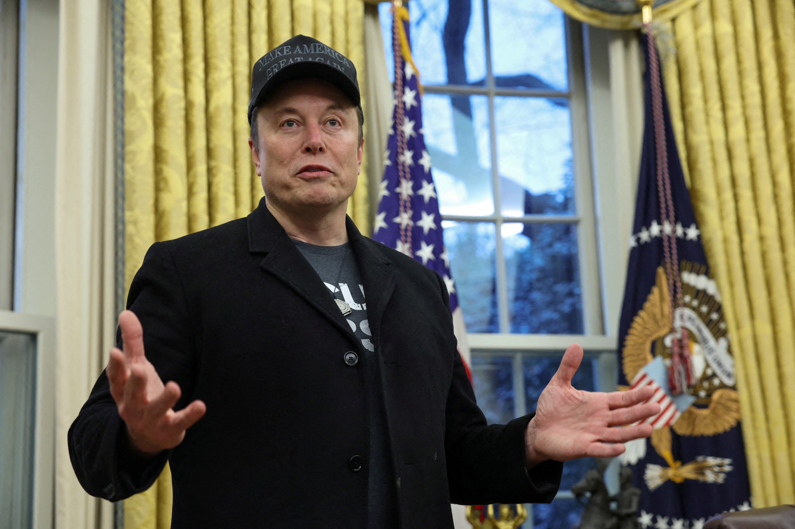

## Claim
Claim: "In February 2025 Elon Musk posted on X that he is planning to suspend Ukraine President Volodymyr Zelenskyy’s X account."

## Actions
```
web_search("Elon Musk X post Zelenskyy account February 2025")
```

## Evidence
### Evidence from `web_search`
Al Jazeera published an article on February 21, 2025, discussing Elon Musk's criticism of Volodymyr Zelenskyy and his claims about the Ukrainian leader's popularity. The article mentions Musk's comments on X, but it does not mention any plans to suspend Zelenskyy's account. ([https://www.aljazeera.com/economy/2025/2/21/musk-vows-to-fix-x-after-polls-show-high-support-for-ukraines-zelenskyy](https://www.aljazeera.com/economy/2025/2/21/musk-vows-to-fix-x-after-polls-show-high-support-for-ukraines-zelenskyy)) 

The Independent published an article discussing Elon Musk's accusations against Volodymyr Zelenskyy, including a claim that Zelenskyy is "despised by the people of Ukraine." The article also mentions that Musk vowed to "fix" X's Community Notes feature. The article was published on February 20, 2025. ([https://www.independent.co.uk/news/world/americas/us-politics/elon-musk-x-ukraine-trump-zelensky-b2702216.html](https://www.independent.co.uk/news/world/americas/us-politics/elon-musk-x-ukraine-trump-zelensky-b2702216.html))  Anadolu Agency reported that Elon Musk claimed Ukrainian President Volodymyr Zelenskyy "killed an American journalist" on his X account on February 20, 2025. ([https://www.aa.com.tr/en/americas/elon-musk-claims-ukrainian-president-killed-an-american-journalist/3487351](https://www.aa.com.tr/en/americas/elon-musk-claims-ukrainian-president-killed-an-american-journalist/3487351)) <image:k>


## Elaboration
The evidence indicates that Elon Musk was actively posting on X about Volodymyr Zelenskyy in February 2025. However, the provided articles do not mention any plans by Musk to suspend Zelenskyy's X account. One article from Anadolu Agency reports that Musk accused Zelenskyy of killing an American journalist. Other articles discuss Musk's criticism of Zelenskyy and his claims about the Ukrainian leader's popularity.

Based on the available evidence, the claim cannot be verified. The search results do not provide any information about Musk planning to suspend Zelenskyy's account.

To verify the claim, information about Musk's specific posts regarding the suspension of Zelenskyy's account is needed.


## Actions
```
web_search("Elon Musk X account suspension Zelenskyy February 2025")
```

## Evidence
### Evidence from `web_search`
From [Source](https://en.wikipedia.org/wiki/Twitter_under_Elon_Musk): 
Content: The search result is from Wikipedia and discusses changes and controversies on X (formerly Twitter) under Elon Musk's ownership. It mentions Musk's statements about fixing the Community Notes feature in February 2025, and his criticism of Zelenskyy. The article also covers account suspensions and reinstatements, including those of far-right figures and journalists. It also mentions the introduction of an "X Money Account" in January 2025. The article does not mention any plans to suspend Zelenskyy's account.


## Elaboration
The new evidence, a Wikipedia article about Twitter under Elon Musk, does not mention any plans to suspend Zelenskyy's account. The article discusses Musk's criticism of Zelenskyy and account suspensions in general, but it does not provide any information to support the claim.

The claim remains unverified.


## Final Judgement
The search results show that Elon Musk was critical of Volodymyr Zelenskyy on X in February 2025. However, there is no evidence in the provided sources to support the claim that Musk planned to suspend Zelenskyy's X account.

`false`

### Verdict: FALSE

### Justification
The fact-check reveals that while Elon Musk was actively posting about Volodymyr Zelenskyy on X in February 2025, there is no evidence from sources like Al Jazeera, The Independent, Anadolu Agency, or Wikipedia to support the claim that Musk planned to suspend Zelenskyy's X account.
