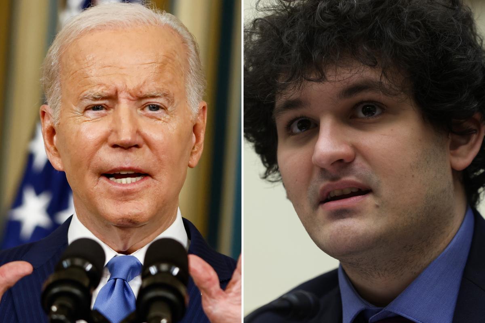

## Claim
Claim: "Half of all US aid to Ukraine was laundered and sent back to Democrat candidates for re-election."

## Actions
```
web_search("US aid to Ukraine laundered Democrat candidates")
```

## Evidence
### Evidence from `web_search`
The search results discuss the claim that US aid to Ukraine was laundered and sent to Democrat candidates. One source, from Wikipedia, discusses the 2019 Trump–Ukraine scandal, but does not mention the claim. Another source, from Newsweek, states that the claim originated from social media and right-leaning commentators, and that there is no evidence to support it. The article also mentions the Ukrainian government launched a crypto donations website, Aid for Ukraine, with the backing of FTX.  The Associated Press published a fact check on the claim, stating that Russian influencers promoted this narrative and that the claim is false.

*   [https://en.wikipedia.org/wiki/2019\_Trump%E2%80%93Ukraine\_scandal](https://en.wikipedia.org/wiki/2019_Trump%E2%80%93Ukraine_scandal)
*   [https://www.newsweek.com/what-behind-claim-joe-biden-laundered-billions-ukraine-aid-via-ftx-1759774](https://www.newsweek.com/what-behind-claim-joe-biden-laundered-billions-ukraine-aid-via-ftx-1759774)
*   [https://apnews.com/article/fact-check-ftx-ukraine-democrats-laundering-996663874380](https://apnews.com/article/fact-check-ftx-ukraine-democrats-laundering-996663874380)


## Elaboration
The evidence indicates that the claim is false. Newsweek states that there is no evidence to support the claim, and the Associated Press fact-checked the claim and found it to be false. The claim originated from social media and right-leaning commentators.


## Final Judgement
The fact-check reveals that the claim originated from social media and right-leaning commentators. Newsweek and the Associated Press both state that there is no evidence to support the claim, and the AP fact-checked the claim and found it to be false.

`false`

### Verdict: FALSE

### Justification
The claim that half of US aid to Ukraine was laundered and sent to Democrat candidates is false. According to a Newsweek article, the claim originated from social media and right-leaning commentators, and there is no evidence to support it. The Associated Press also fact-checked the claim and found it to be false.
