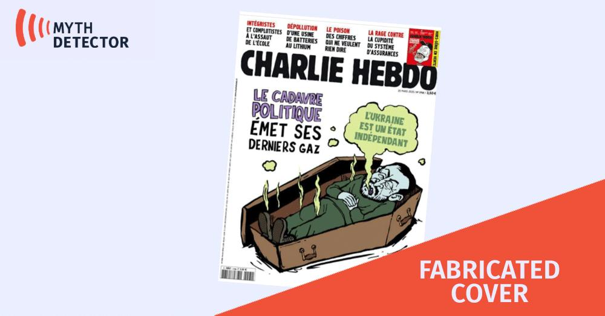

## Claim
Claim: " This image shows a screenshot of an authentic Charlie Hebdo magazine cover from March 20, 2025 illustrating Ukrainian President Volodoymr Zelenskyy lying in a coffin and saying 'Ukraine is an independet state' in French."

## Actions
```
web_search("Charlie Hebdo March 20 2025 cover")
```

## Evidence
### Evidence from `web_search`
The Charlie Hebdo cover featuring Volodymyr Zelenskyy in a coffin is fake, according to [without-lie.info](https://without-lie.info/en/fake-with-another-fictional-cover-of-charlie-hebdo-magazine-with-a-caricature-of-the-president-of-ukraine/) and [Myth Detector](https://mythdetector.com/en/coffin-was-not-published-by-charlie-hebdo/). The fake cover was dated March 20, 2025, with issue number 1705, but the real cover was published on March 19, 2025. Myth Detector also notes that the issue number 1705 matches the one published on March 26. [Africanews](https://www.africanews.com/2025/05/06/fake-charlie-hebdo-cover-shows-zelenskyy-exploiting-popes-death-for-cash//) also reports on a fake Charlie Hebdo cover.   


## Elaboration
The evidence indicates that the Charlie Hebdo cover featuring Zelenskyy in a coffin is fake. Multiple sources, including [without-lie.info](https://without-lie.info/en/fake-with-another-fictional-cover-of-charlie-hebdo-magazine-with-a-caricature-of-the-president-of-ukraine/) and [Myth Detector](https://mythdetector.com/en/coffin-was-not-published-by-charlie-hebdo/), confirm this. The date and issue number on the cover do not align with the actual Charlie Hebdo publications.


## Final Judgement
The claim is demonstrably false. Multiple sources confirm that the Charlie Hebdo cover depicting Zelenskyy in a coffin is fake. The date and issue number on the cover do not match the actual publications.

`false`

### Verdict: FALSE

### Justification
The image is a fabricated Charlie Hebdo cover. Multiple sources, including [without-lie.info](https://without-lie.info/en/fake-with-another-fictional-cover-of-charlie-hebdo-magazine-with-a-caricature-of-the-president-of-ukraine/) and [Myth Detector](https://mythdetector.com/en/coffin-was-not-published-by-charlie-hebdo/), confirm that the cover is not authentic, and the date and issue number do not correspond to actual publications.
