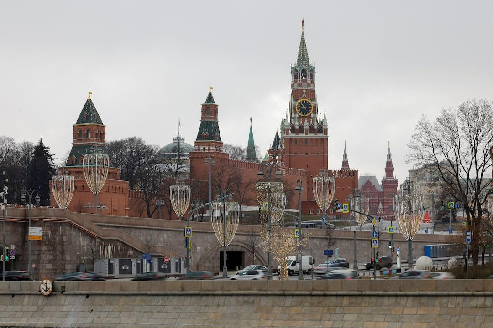

## Claim
Claim: "After a call with Russia's President Vladimir Putin on February 12, 2025, US President Donald Trump announced that he had reached an agreement to end the war in Ukraine."

## Actions
```
web_search("Donald Trump Vladimir Putin call February 12 2025 Ukraine war")
```

## Evidence
### Evidence from `web_search`
Following a phone call on February 12, 2025, between Donald Trump and Vladimir Putin, Trump announced that negotiations to end the war in Ukraine would start immediately, according to a CNN article ([https://www.cnn.com/2025/02/12/politics/putin-trump-phone-call](https://www.cnn.com/2025/02/12/politics/putin-trump-phone-call)). Reuters reported that Trump said both Putin and Volodymyr Zelenskiy expressed a desire for peace, and Trump ordered U.S. officials to begin talks ([https://www.reuters.com/world/trump-says-he-discussed-ending-ukraine-war-with-russias-putin-2025-02-12/](https://www.reuters.com/world/trump-says-he-discussed-ending-ukraine-war-with-russias-putin-2025-02-12/)). The Wikipedia entry on the phone call mentions that Trump shared details of his conversation with Putin and agreed to begin peace talks ([https://en.wikipedia.org/wiki/February_2025_Putin%E2%80%93Trump_phone_call](https://en.wikipedia.org/wiki/February_2025_Putin%E2%80%93Trump_phone_call)). The call was followed by a meeting at NATO headquarters in Brussels. , , 


## Elaboration
The evidence indicates that after the phone call on February 12, 2025, Trump announced the start of negotiations to end the war in Ukraine. Reuters reported that Trump said both Putin and Zelenskiy wanted peace, and he ordered U.S. officials to begin talks ([https://www.reuters.com/world/trump-says-he-discussed-ending-ukraine-war-with-russias-putin-2025-02-12/](https://www.reuters.com/world/trump-says-he-discussed-ending-ukraine-war-with-russias-putin-2025-02-12/)). CNN also reported on the announcement ([https://www.cnn.com/2025/02/12/politics/putin-trump-phone-call](https://www.cnn.com/2025/02/12/politics/putin-trump-phone-call)).

The evidence does not state that an agreement was reached, only that negotiations would begin. The Wikipedia entry mentions that Trump shared details of his conversation with Putin and agreed to begin peace talks ([https://en.wikipedia.org/wiki/February_2025_Putin%E2%80%93Trump_phone_call](https://en.wikipedia.org/wiki/February_2025_Putin%E2%80%93Trump_phone_call)).

Therefore, the claim is partially inaccurate. While Trump did announce action following the call, he did not announce that an agreement had been reached.


## Final Judgement
The claim is partially accurate. After the call, Trump announced the start of negotiations to end the war in Ukraine, but the evidence does not support the claim that an agreement was reached.

`false`


### Verdict: FALSE

### Justification
Following a phone call on February 12, 2025, between Donald Trump and Vladimir Putin, Trump announced that negotiations to end the war in Ukraine would start immediately, as reported by CNN ([https://www.cnn.com/2025/02/12/politics/putin-trump-phone-call](https://www.cnn.com/2025/02/12/politics/putin-trump-phone-call)) and Reuters ([https://www.reuters.com/world/trump-says-he-discussed-ending-ukraine-war-with-russias-putin-2025-02-12/](https://www.reuters.com/world/trump-says-he-discussed-ending-ukraine-war-with-russias-putin-2025-02-12/)). However, the evidence does not support the claim that an agreement was reached.
