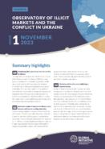

## Claim
Claim: "Ukraine is selling half of the armaments it receives from the United States"

## Actions
```
web_search("Ukraine US arms sales corruption")
web_search("Ukraine arms sales audit")
```

## Evidence
### Evidence from `web_search`
Several sources discuss corruption within Ukraine's defense sector. Al Jazeera reports that Ukrainian authorities detained officials over a "large-scale corruption scheme" involving military drones and signal jamming systems, with kickbacks up to 30 percent of contract amounts (<image:k> - [https://www.aljazeera.com/news/2025/8/2/ukraine-says-defence-sector-corruption-scheme-uncovered]). Politico.eu also highlights a corruption scheme involving inflated prices for military equipment, with a 30 percent kickback, which President Zelenskyy called "absolutely immoral" - [https://www.politico.eu/article/ukraine-uncovers-major-corruption-scheme-defense-procurment-days-after-restoring-anticorruption/].

PBS.org discusses illicit weapons, high-level corruption, and organized crime in Ukraine, noting that Ukraine lost $32 billion in military assets between 1992 and 1998 due to theft, discount arms sales, and lack of oversight - [https://www.pbs.org/frontlineworld/stories/sierraleone/context.html].


### Evidence from `web_search`
The Associated Press reported that the U.S. cannot track over $1 billion in weapons and military equipment provided to Ukraine, with 59% of $1.7 billion in defense gear remaining "delinquent" according to the Pentagon's inspector general. Reasons for the monitoring shortfall include limited staffing, movement restrictions, and a lack of internal inventory controls. The Department of Defense Office of Inspector General (DoD OIG) also found insufficient documentation for $1.1 billion in funds, considering these as questioned costs. <image:k>

VoxUkraine fact-checked claims that the Pentagon is demanding an audit of weapons supplied to Ukraine, stating that the supply and end-use of weapons are already monitored by partners. The article also references a report stating that Ukraine has implemented strict arms control measures.
*   [https://apnews.com/article/ukraine-weapons-audit-watchdog-us-congress-biden-9abecd14528b9551ff4ddb6786ad7fda](https://apnews.com/article/ukraine-weapons-audit-watchdog-us-congress-biden-9abecd14528b9551ff4ddb6786ad7fda)
*   [https://www.dodig.mil/In-the-Spotlight/Article/3940692/press-release-audit-of-the-dods-execution-of-funds-to-assist-ukraine-report-no/](https://www.dodig.mil/In-the-Spotlight/Article/3940692/press-release-audit-of-the-dods-execution-of-funds-to-assist-ukraine-report-no/)
*   [https://voxukraine.org/en/fake-the-pentagon-demands-an-audit-of-all-weapons-supplied-to-ukraine-before-trump-s-return-wsj](https://voxukraine.org/en/fake-the-pentagon-demands-an-audit-of-all-weapons-supplied-to-ukraine-before-trump-s-return-wsj)


## Elaboration
The evidence reveals instances of corruption and a lack of complete oversight regarding the use of military aid provided to Ukraine. Reports from Al Jazeera and Politico.eu detail corruption schemes within Ukraine's defense sector, including inflated prices and kickbacks. The Associated Press indicates that the U.S. has difficulty tracking over $1 billion in weapons and equipment, with a significant portion of defense gear unaccounted for.

While there is evidence of corruption and monitoring challenges, the provided sources do not support the claim that Ukraine is selling half of the armaments it receives from the United States. The evidence highlights issues with tracking and accountability, but it does not quantify the extent of any potential arms sales.

To verify the claim, information is needed on the volume of arms sales, the specific armaments involved, and the recipients of these sales.


## Actions
```
web_search("Ukraine US arms sales percentage")
web_search("Ukraine arms sales investigation")
```

## Evidence
### Evidence from `web_search`
Reuters reports a 29% surge in U.S. military equipment sales to foreign governments in 2024, reaching a record $318.7 billion, with demand driven by countries replenishing stocks sent to Ukraine ( - [https://www.reuters.com/business/aerospace-defense/ukraine-related-demand-sends-us-arms-exports-record-2024-2025-01-24/]). SIPRI indicates that Ukraine became the world's largest arms importer in 2020–24, with the U.S. supplying 45% of its major arms imports - [https://www.sipri.org/media/press-release/2025/ukraine-worlds-biggest-arms-importer-united-states-dominance-global-arms-exports-grows-russian]. The Washington Post also notes that U.S. arms exports increased to 43% of the worldwide total between 2020 and 2024 - [https://www.washingtonpost.com/world/2025/03/09/us-arms-sales-ukraine-israel/].


### Evidence from `web_search`
The Trump administration approved an $825 million arms sale to Ukraine, including extended-range missiles, as reported by CNN and the Associated Press (<image:k>, <image:k> - [https://www.cnn.com/2025/08/28/politics/trump-missile-sale-ukraine](https://www.cnn.com/2025/08/28/politics/trump-missile-sale-ukraine), [https://apnews.com/article/ukraine-us-weapons-sale-trump-russia-74e01123c0067d5fc160141e0cabf207]). The OCCRP reports that Bulgarian authorities searched arms dealers' homes and offices due to a Ukrainian investigation into alleged overpricing in arms sales to Kyiv (<image:k> - [https://www.occrp.org/en/news/bulgaria-raids-arms-dealers-in-ukraine-led-corruption-probe]).


## Elaboration
The evidence does not support the claim that Ukraine is selling half of the armaments it receives from the United States. While there is evidence of corruption and a lack of complete oversight, the provided sources do not quantify the extent of any potential arms sales. Reuters reports a surge in U.S. military equipment sales to foreign governments, with demand driven by countries replenishing stocks sent to Ukraine. SIPRI indicates that Ukraine became the world's largest arms importer in 2020–24, with the U.S. supplying 45% of its major arms imports. The OCCRP reports that Bulgarian authorities searched arms dealers' homes and offices due to a Ukrainian investigation into alleged overpricing in arms sales to Kyiv.


## Actions
```
web_search("Ukraine arms sales black market")
```

## Evidence
### Evidence from `web_search`
The Harvard International Review discusses the illicit arms trade in Ukraine, highlighting concerns about weapons theft and circulation on the black market, referencing a history of a large black market for arms. The Global Initiative Against Transnational Organized Crime (GI-TOC) discusses the rise of arms trafficking in Ukraine, mentioning the sale of US-made M240 machine guns and Soviet-type AGS-17 automatic grenade launchers, and referencing seizures of weapons (, , ).
*   [https://hir.harvard.edu/facts-or-false-alarms-the-state-of-illicit-arms-in-ukraine/](https://hir.harvard.edu/facts-or-false-alarms-the-state-of-illicit-arms-in-ukraine/)
*   [https://globalinitiative.net/analysis/a-new-phase-of-arms-trafficking-in-ukraine/](https://globalinitiative.net/analysis/a-new-phase-of-arms-trafficking-in-ukraine/)

## Elaboration
The evidence indicates that there is an illicit arms trade in Ukraine, with concerns about weapons theft and circulation on the black market. The Global Initiative Against Transnational Organized Crime (GI-TOC) discusses the rise of arms trafficking in Ukraine, mentioning the sale of US-made machine guns and Soviet-type grenade launchers. However, the evidence does not provide any data to support the claim that Ukraine is selling half of the armaments it receives from the United States.


## Final Judgement
The investigation reveals evidence of corruption, lack of oversight, and illicit arms trade in Ukraine. However, the provided sources do not support the claim that Ukraine is selling half of the armaments it receives from the United States. While there are concerns about weapons theft and black market activity, there is no data to quantify the extent of any potential arms sales.

`false`

### Verdict: FALSE

### Justification
The investigation found evidence of corruption and a black market for arms in Ukraine, but no evidence to support the claim that Ukraine is selling half of the armaments it receives from the United States. Sources like the [Harvard International Review](https://hir.harvard.edu/facts-or-false-alarms-the-state-of-illicit-arms-in-ukraine/) and the [Global Initiative Against Transnational Organized Crime](https://globalinitiative.net/analysis/a-new-phase-of-arms-trafficking-in-ukraine/) highlight illicit arms trade, but do not provide data on the volume of sales.
