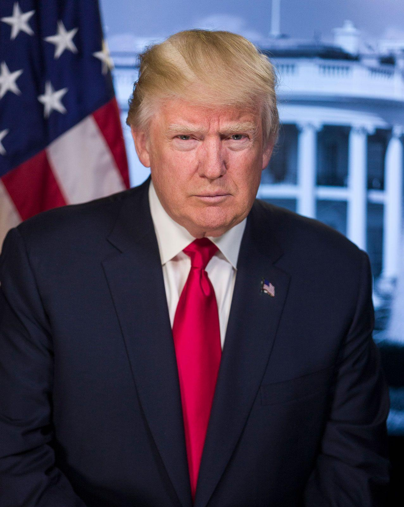
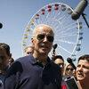

## Claim
Claim: " This image shows an authentic list realeased by Ukraine showing US politicians taking bribes from Ukraine. The highest bribe was 92 Million US-$ for Joe Biden."

## Actions
```
web_search("Joe Biden Mitch McConnell Nancy Pelosi corruption Ukraine")
```

## Evidence
### Evidence from `web_search`
Britannica discusses the Ukraine scandal, mentioning Joe Biden and Nancy Pelosi, and alleged wrongdoing in connection with a Ukrainian energy company. [, , , ] The mynbc15.com article discusses concerns about corruption related to Ukraine aid. [] NPR published an article discussing the political conflict between Trump and his opponents regarding Ukraine, mentioning allegations of corruption involving Joe Biden. []

*   [https://www.britannica.com/event/Ukraine-scandal](https://www.britannica.com/event/Ukraine-scandal)
*   [https://mynbc15.com/news/nation-world/corruption-concerns-cloud-ukraine-aid-commitments-congress-democrat-republican-democracy-authoritarian-mccarthy-mcconnell-putin-zelensky-oversight-graft](https://mynbc15.com/news/nation-world/corruption-concerns-cloud-ukraine-aid-commitments-congress-democrat-republican-democracy-authoritarian-mccarthy-mcconnell-putin-zelensky-oversight-graft)
*   [https://www.npr.org/2019/09/23/763443697/whats-the-ukraine-story-about-trump-says-it-s-biden-democrats-say-it-s-trump](https://www.npr.org/2019/09/23/763443697/whats-the-ukraine-story-about-trump-says-it-s-biden-democrats-say-it-s-trump)


## Elaboration
The evidence confirms that there have been allegations of corruption involving Joe Biden and Ukraine. However, the evidence does not validate the specific claim that Ukraine released a list of US politicians taking bribes, nor does it confirm the amounts listed in the image.

The provided search results mention the Ukraine scandal and allegations of corruption, but they do not provide any information about a list released by Ukraine with specific amounts of bribes.

Therefore, the claim is not supported by the evidence. More information is needed to verify the authenticity of the list and the amounts mentioned.


## Final Judgement
The search results mention the Ukraine scandal and allegations of corruption involving Joe Biden and other politicians. However, the search results do not provide any information about a list released by Ukraine with specific amounts of bribes. Therefore, the claim is not supported by the evidence.

`false`

### Verdict: FALSE

### Justification
The claim that Ukraine released a list of US politicians taking bribes, including Joe Biden receiving $92 million, is not supported by the provided evidence. While there are reports of corruption allegations involving Joe Biden and Ukraine, the search results do not mention any such list or confirm the amounts listed in the image.
