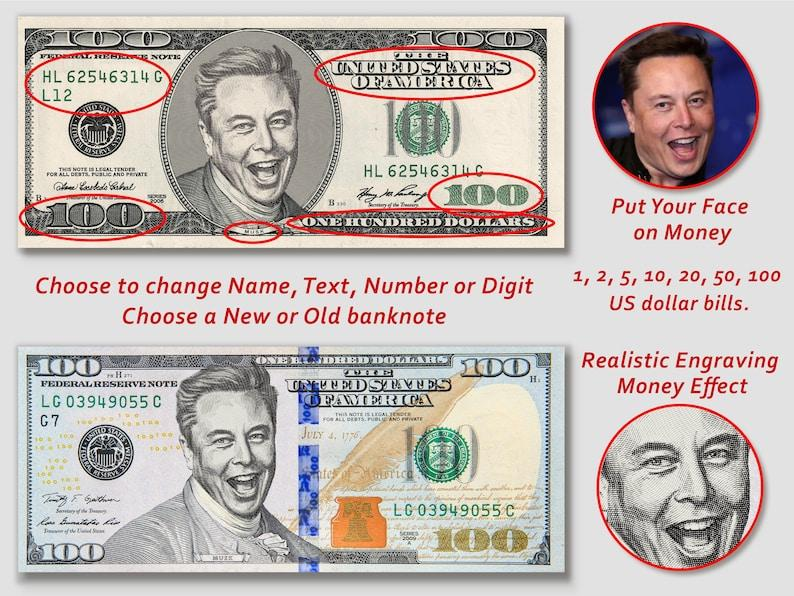
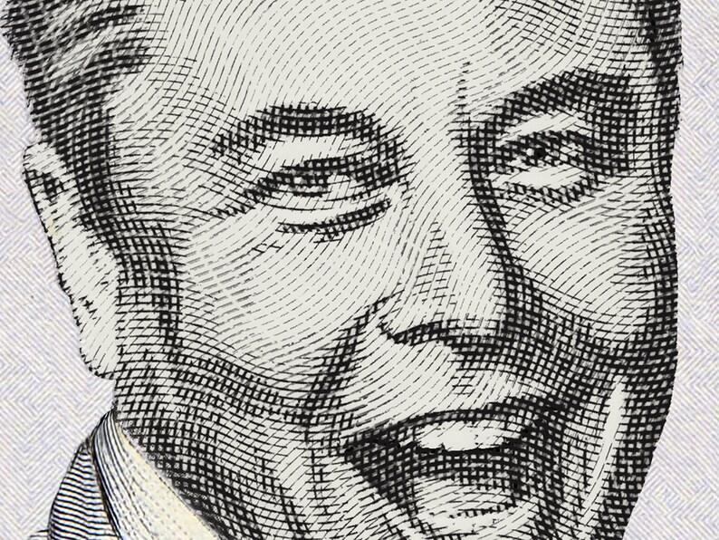

## Claim
Claim: " This image shows a screenshot of an authentic X post from Elon Musk on November 6, 2025 saying 'The last dollar for Zelenskiy'."

## Actions
```
web_search("Elon Musk X post Zelenskiy last dollar")
reverse_search()
```

## Evidence
### Evidence from `web_search`
The AOL article ([https://www.aol.com/fact-check-elon-musk-didn-164103080.html](https://www.aol.com/fact-check-elon-musk-didn-164103080.html)) fact-checks the claim that Elon Musk posted "The last dollar for Zelenskiy" and states that the claim is false. The article mentions that the image of the tweet is fake.

The Politico article discusses Elon Musk's meme mocking Ukrainian President Volodymyr Zelenskyy. The France 24 article ([https://www.france24.com/en/americas/20250430-elon-musk-twitter-x-pro-russian-ukraine-rhetoric](https://www.france24.com/en/americas/20250430-elon-musk-twitter-x-pro-russian-ukraine-rhetoric)) discusses Elon Musk's anti-Ukraine rhetoric on X and includes a graph showing Musk's pro-Russia or anti-Ukraine tweets. The image  is not mentioned in the article.


### Evidence from `reverse_search`
The image in question was found on a website with the title "Dollar Bill Frame Gold Glass Frame For Coin Display Wall Hanging ..." ([https://collegeofems.com/Coin-Display-Wall-Hanging-Coin-Collecting-Holders-Dollar-Bill/983708](https://collegeofems.com/Coin-Display-Wall-Hanging-Coin-Collecting-Holders-Dollar-Bill/983708)), which is not available. The same image was found on Etsy ([https://www.etsy.com/ie/listing/1407539034/custom-dollar-dollar-bill-art-100-dollar](https://www.etsy.com/ie/listing/1407539034/custom-dollar-dollar-bill-art-100-dollar)) as a custom dollar bill art. The image was also found on Redbubble ([https://www.redbubble.com/shop/one+dollar+stickers](https://www.redbubble.com/shop/one+dollar+stickers)) as a sticker. , , , , , , , , , , , , 


## Elaboration
The claim is false. The AOL article states that the image is fake. The reverse image search shows that the image is a custom dollar bill art and a sticker.


## Final Judgement
The image is a custom dollar bill art and a sticker, and the AOL article states that the image is fake. Therefore, the claim is not factually accurate. `false`

### Verdict: FALSE

### Justification
The claim is false. The image of the tweet is a custom dollar bill art and a sticker, and an article from AOL ([https://www.aol.com/fact-check-elon-musk-didn-164103080.html](https://www.aol.com/fact-check-elon-musk-didn-164103080.html)) states that the image is fake.
