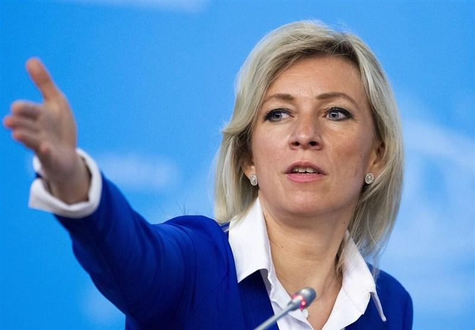
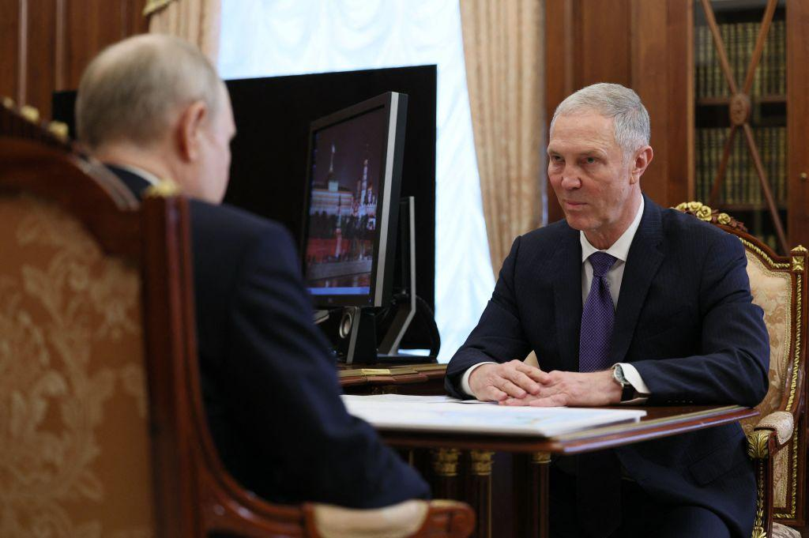

## Claim
Claim: "Russia offered assistance for the California wildfires from January 2025."

## Actions
```
web_search("Russia California wildfires assistance 2025")
```

## Evidence
### Evidence from `web_search`
Tasnim News Agency published an article on January 12, 2025, discussing Russia's comments on the California wildfires, including comments from Maria Zakharova () and the spread of wildfires in Los Angeles County (). The Dispatch published an article on January 15, 2025, stating that Vladimir Saldo offered sanctuary to California fire victims ().

NPR published an article on January 16, 2025, discussing how pro-Kremlin social media accounts spread a false narrative about the Los Angeles wildfires (, ).

*   [https://www.tasnimnews.com/en/news/2025/01/12/3236714/russia-notes-us-hypocrisy-in-california-fire-case](https://www.tasnimnews.com/en/news/2025/01/12/3236714/russia-notes-us-hypocrisy-in-california-fire-case)
*   [https://thedispatch.com/article/assessing-claims-that-russia-offered-sanctuary-to-california-fire-victims/](https://thedispatch.com/article/assessing-claims-that-russia-offered-sanctuary-to-california-fire-victims/)
*   [https://www.npr.org/2025/01/16/nx-s1-5259842/los-angeles-california-fires-russia-ukraine](https://www.npr.org/2025/01/16/nx-s1-5259842/los-angeles-california-fires-russia-ukraine)


## Elaboration
The evidence indicates that Russia commented on the California wildfires in January 2025. Maria Zakharova made comments, and Vladimir Saldo offered sanctuary to fire victims. However, the evidence does not explicitly state that Russia offered assistance for the wildfires. The NPR article mentions that pro-Kremlin social media accounts spread a false narrative about the wildfires.

Therefore, the claim is not directly supported by the evidence. The evidence suggests that Russia was involved in the discussion and offered sanctuary, but not assistance.

To verify the claim, information about any specific offers of assistance from Russia is missing.


## Actions
```
web_search("Russia assistance California wildfires")
```

## Evidence
### Evidence from `web_search`
The German Marshall Fund published an article on January 15, 2025, discussing how Russian state-affiliated accounts leveraged the California wildfires to sow division and undermine trust in relief efforts, and reduce public support for Ukraine (). NPR and OPB published articles on January 16, 2025, discussing how Russia used the California wildfires to advance anti-Ukraine propaganda, with pro-Kremlin social media accounts spreading false narratives. The OPB article mentions that the story was debunked by fact-checkers.

*   [https://www.gmfus.org/news/inflaming-divides-russian-narratives-california-wildfires](https://www.gmfus.org/news/inflaming-divides-russian-narratives-california-wildfires)
*   [https://www.npr.org/transcripts/nx-s1-5259842](https://www.npr.org/transcripts/nx-s1-5259842)
*   [https://www.opb.org/article/2025/01/16/russia-tries-to-use-california-fires-to-discredit-ukraine/](https://www.opb.org/article/2025/01/16/russia-tries-to-use-california-fires-to-discredit-ukraine/)


## Elaboration
The new evidence reinforces the previous findings. It highlights that Russia leveraged the California wildfires to sow division and spread anti-Ukraine propaganda. However, the evidence still does not mention any offers of assistance from Russia.

Therefore, the claim remains unverified. The evidence focuses on Russia's use of the wildfires for propaganda purposes, not on providing aid.


## Actions
```
web_search("Russia offer assistance California wildfires")
```

## Evidence
### Evidence from `web_search`
From [Source](https://www.voanews.com/a/russia-exploits-wildfires-in-los-angeles-to-push-anti-u-s-anti-ukraine-propaganda/7938909.html): 
Content: The Voice of America published an article on January 16, 2025, discussing how Russia exploited the California wildfires to push anti-US and anti-Ukraine propaganda. The article mentions Maria Zakharova's comments and a claim by Lavrov. The article also discusses how Russian state-controlled news sites spread disinformation about the wildfires. 


## Elaboration
The evidence consistently shows that Russia commented on the California wildfires and used them to spread propaganda. However, none of the provided sources mention Russia offering assistance for the wildfires.

Therefore, the claim is not supported by the evidence.


## Final Judgement
The fact-check reveals that Russia commented on the California wildfires in January 2025 and used them to spread propaganda. However, there is no evidence to support the claim that Russia offered assistance for the wildfires.

The claim is not supported by the evidence, as the search results focus on Russia's commentary and propaganda efforts related to the wildfires, not on any offers of assistance. `false`


### Verdict: FALSE

### Justification
The fact-check reveals that while Russia commented on the California wildfires in January 2025 and used them for propaganda, there is no evidence from sources like Tasnim News Agency, The Dispatch, NPR, and Voice of America to support the claim that Russia offered assistance for the wildfires.
