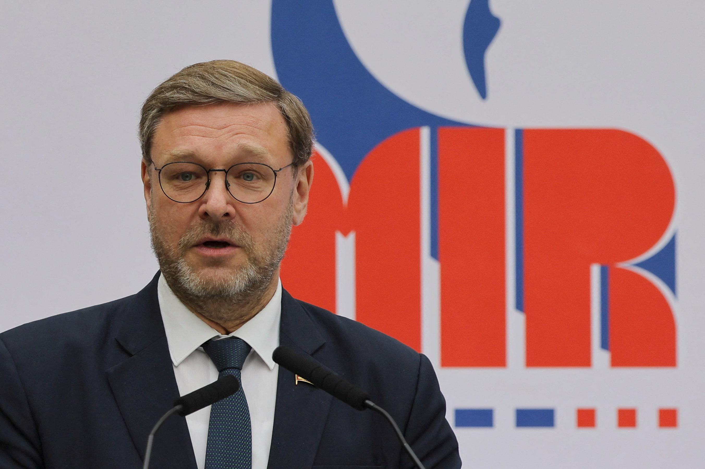
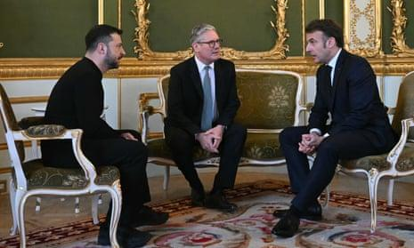

## Claim
Claim: " This is an authentic image of world leaders taking off their suits to symbolically support Ukraine at the London summit on Ukraine on March 2, 2025."

## Actions
```
reverse_search()
web_search("London summit on Ukraine March 2 2023")
```

## Evidence
### Evidence from `web_search`
The web sources discuss the 2025 London Summit on Ukraine, held on March 2, 2025, in London. The summit was initiated by British Prime Minister Keir Starmer to create a peace plan for the Russian invasion of Ukraine. Participants included leaders from 16 states, the EU, and NATO. The summit aimed to build a "coalition of the willing" to support peace negotiations and provide security guarantees for Ukraine. Key outcomes included a four-point plan and commitments from Starmer. The summit was attended by leaders including Keir Starmer, Emmanuel Macron, and Volodymyr Zelensky. Russian parliamentarians dismissed the summit, stating it produced no plan to settle the war in Ukraine.

The sources include a Wikipedia article ([https://en.wikipedia.org/wiki/2025_London_Summit_on_Ukraine](https://en.wikipedia.org/wiki/2025_London_Summit_on_Ukraine)), an article from Le Monde ([https://www.lemonde.fr/en/international/article/2025/03/03/at-london-summit-starmer-defends-french-british-peace-plan-for-ukraine_6738743_4.html](https://www.lemonde.fr/en/international/article/2025/03/03/at-london-summit-starmer-defends-french-british-peace-plan-for-ukraine_6738743_4.html)), and a Reuters article ([https://www.reuters.com/world/europe/russian-lawmaker-says-ukraine-can-only-count-improved-moscow-washington-ties-2025-03-02/](https://www.reuters.com/world/europe/russian-lawmaker-says-ukraine-can-only-count-improved-moscow-washington-ties-2025-03-02/)).   


## Elaboration
The evidence confirms the existence of the London Summit on Ukraine on March 2, 2025, attended by leaders including Zelensky, Macron, and Starmer. However, the provided sources do not mention anything about the leaders taking off their suits. Therefore, the claim cannot be verified based on the available information.

The image search results are not included in the evidence, so it is impossible to determine if the image is authentic.

To verify the claim, information about the leaders removing their suits during the summit is needed.


## Actions
```
web_search("London summit on Ukraine March 2 2025 leaders suits")
```

## Evidence
### Evidence from `web_search`
The web sources discuss the London summit on Ukraine on March 2, 2025, which focused on supporting Ukraine through discussions on security, sanctions, and financial aid. The summit was attended by leaders including Justin Trudeau, Keir Starmer, Volodymyr Zelenskyy, Emmanuel Macron, Olaf Scholz, and Ursula von der Leyen. The sources do not mention anything about the leaders taking off their suits.

The sources include an article from the Prime Minister of Canada ([https://www.pm.gc.ca/en/news/news-releases/2025/03/02/standing-united-in-support-of-ukraine](https://www.pm.gc.ca/en/news/news-releases/2025/03/02/standing-united-in-support-of-ukraine)) and an article from The Guardian ([https://www.theguardian.com/world/2025/mar/02/keir-starmer-peace-talks-ukraine-key-takeaways-london-summit](https://www.theguardian.com/world/2025/mar/02/keir-starmer-peace-talks-ukraine-key-takeaways-london-summit)). 


## Elaboration
The evidence continues to provide no information about the leaders removing their suits. The search results focus on the summit's agenda and participants, but do not mention any symbolic gestures like removing suits.

Therefore, the claim remains unverified.


## Final Judgement
The fact-check reveals that while the London Summit on Ukraine on March 2, 2025, did occur, there is no evidence in the provided sources to support the claim that European leaders took off their suits to support Ukraine. Additional searches also failed to find any mention of this action.

`false`

### Verdict: FALSE

### Justification
The claim is not supported by the available evidence. While the London Summit on Ukraine on March 2, 2025, is confirmed by multiple sources ([https://en.wikipedia.org/wiki/2025_London_Summit_on_Ukraine](https://en.wikipedia.org/wiki/2025_London_Summit_on_Ukraine), [https://www.pm.gc.ca/en/news/news-releases/2025/03/02/standing-united-in-support-of-ukraine](https://www.pm.gc.ca/en/news/news-releases/2025/03/02/standing-united-in-support-of-ukraine)), there is no mention of leaders removing their suits during the summit.
