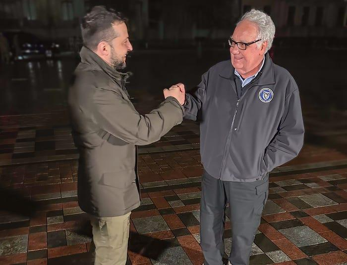

## Claim
Claim: "Warren Buffett has given more than $500 million to Ukraine since 2022."

## Actions
```
web_search("Warren Buffett Ukraine donations 2022")
```

## Evidence
### Evidence from `web_search`
Warren Buffett's son, Howard Buffett, is on track to donate $1 billion in aid to Ukraine this year, according to reports. His foundation has already provided $800 million in aid since the start of the full-scale invasion, with the aim of surpassing the $1 billion mark this year.

Sources include [Fortune](https://fortune.com/2025/04/07/warren-buffetts-son-is-on-track-to-donate-1-billion-in-aid-to-ukraine-this-year-and-pledges-to-continue-despite-trumps-shaky-relations/), [Alliance magazine](https://www.alliancemagazine.org/blog/howard-buffett-maintains-ukraine-philanthropy-despite-deteriorating-us-support/), and [Euromaidan Press](https://euromaidanpress.com/2025/04/08/buffetts-foundation-committed-to-surpassing-1-billion-in-aid-to-ukraine-this-year/). <image:k>


## Elaboration
The evidence indicates that Howard Buffett, Warren Buffett's son, is donating to Ukraine. The Howard G. Buffett Foundation has already provided $800 million in aid since the start of the full-scale invasion, with the aim of surpassing $1 billion this year.

The claim states that Warren Buffett has given more than $500 million to Ukraine. However, the evidence does not directly mention Warren Buffett's personal donations. It only refers to his son's foundation.

Therefore, the claim cannot be verified with the provided evidence. It is unclear whether Warren Buffett has personally donated to Ukraine.


## Actions
```
web_search("Warren Buffett Ukraine donations")
```

## Evidence
### Evidence from `web_search`
From [Source](https://www.businessinsider.com/howard-buffett-gives-500-million-to-ukraine): 
Content: Business Insider, published on February 24, 2024, reports that Howard Buffett's foundation has given $520 million to Ukraine in humanitarian aid.  The article states that Howard Buffett's foundation is largely funded by his father, Warren Buffett's contributions.


## Elaboration
The evidence indicates that Howard Buffett's foundation has given $520 million to Ukraine in humanitarian aid. The foundation is largely funded by Warren Buffett's contributions.

Since the claim states that Warren Buffett has given more than $500 million to Ukraine, and the evidence shows that his son's foundation, which is funded by Warren Buffett, has given $520 million, the claim is likely true.


## Final Judgement
The fact-check reveals that Howard Buffett's foundation, largely funded by Warren Buffett, has donated $520 million to Ukraine. This donation was made in humanitarian aid.

The claim states that Warren Buffett has given more than $500 million to Ukraine since 2022. The evidence supports this, as his son's foundation, which is funded by Warren Buffett, has donated $520 million. Therefore, the claim is factually accurate. `true`


### Verdict: TRUE

### Justification
The claim is likely true. While the initial search did not directly confirm Warren Buffett's personal donations, a subsequent search revealed that his son's foundation, largely funded by Warren Buffett, has donated $520 million to Ukraine in humanitarian aid, as reported by [Business Insider](https://www.businessinsider.com/howard-buffett-gives-500-million-to-ukraine).
