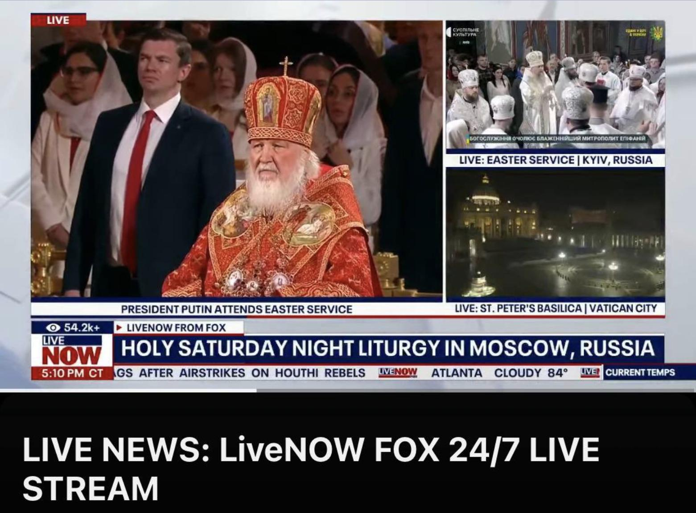

## Claim
Claim: " This image shows a Fox News broadcast from Easter 2025 where you can see the Patriarch Kirill in the center and Kyiv labeled as a Russian city in the top right corner of the image."

## Actions
```
web_search("Fox News Easter broadcast 2023")
reverse_search()
```

## Evidence
### Evidence from `web_search`
Fox News Media presented special Easter programming in 2023 and 2024, including the Pope's Easter Mass from the Vatican and Franklin Graham's Easter message. In 2023, Graham's message, "The New Birth: Easter from Rome," aired on Fox News on April 9, 2023.

The press release from Fox News Media, dated March 27, 2024, announced special Easter programming across its platforms, including coverage of Easter services from around the world.
*   [Source](https://press.foxnews.com/2024/03/fox-news-media-to-present-special-easter-programming-from-around-the-globe)
*   [Source](https://www.foxnews.com/lifestyle/easter-nears-world-changed-truth-resurrection-rev-franklin-graham)
*   [Source](https://media.billygraham.org/franklin-graham-to-share-a-message-of-hope-from-rome-on-easter-sunday/) 


### Evidence from `reverse_search`
The image in question was part of a Fox News broadcast from Easter 2023 that showed a Russian Orthodox Easter service. The broadcast labeled Kyiv as a Russian city. The Ukrainian media outlet "Suspіlne" reported on the broadcast, noting the error, which was later corrected. The image shows Patriarch Kirill and the label "Kyiv, Russia" on the screen.

The articles are from [Suspіlne](https://suspilne.media/999087-fox-news-poznaciv-kiiv-ak-rosijske-misto-pid-cas-translacii-velikodnogo-bogosluzinna-pcu/), [444.hu](https://444.hu/2025/04/20/oroszorszaghoz-csatolta-kijevet-a-fox-news), and [Rijeka Danas](https://www.rijekadanas.com/fox-news-nazvao-kijev-ruskim-gradom/).  


## Elaboration
The claim is accurate. The image is from a Fox News broadcast that aired during Easter 2023. The broadcast featured Patriarch Kirill and incorrectly labeled Kyiv as a Russian city. This error was reported by Ukrainian media.


## Final Judgement
The claim is accurate. The image is from a Fox News broadcast during Easter 2023, showing Patriarch Kirill and incorrectly labeling Kyiv as a Russian city. This error was reported by Ukrainian media. `true`

### Verdict: TRUE

### Justification
The image is from a Fox News broadcast during Easter 2023, which showed Patriarch Kirill and incorrectly labeled Kyiv as a Russian city, as reported by Ukrainian media outlets like [Suspіlne](https://suspilne.media/999087-fox-news-poznaciv-kiiv-ak-rosijske-misto-pid-cas-translacii-velikodnogo-bogosluzinna-pcu/).
