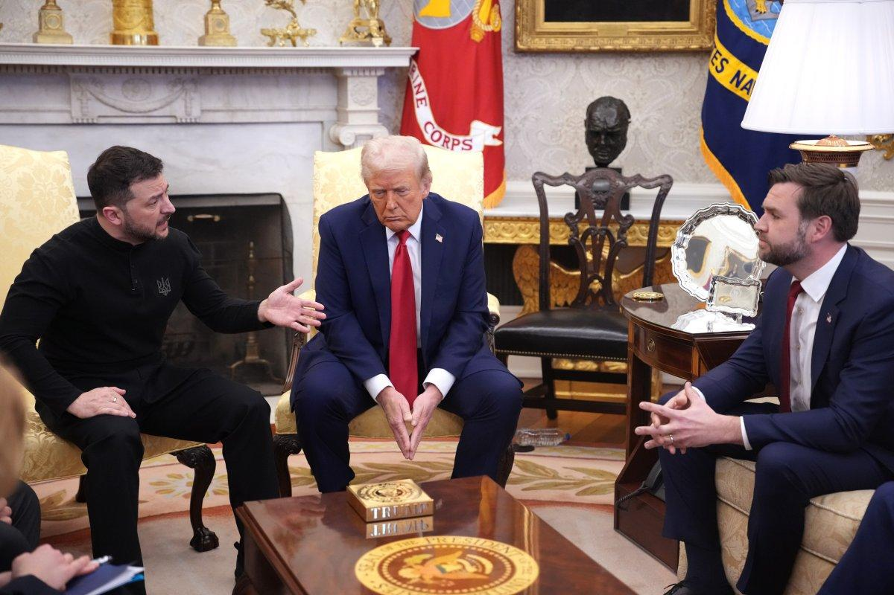
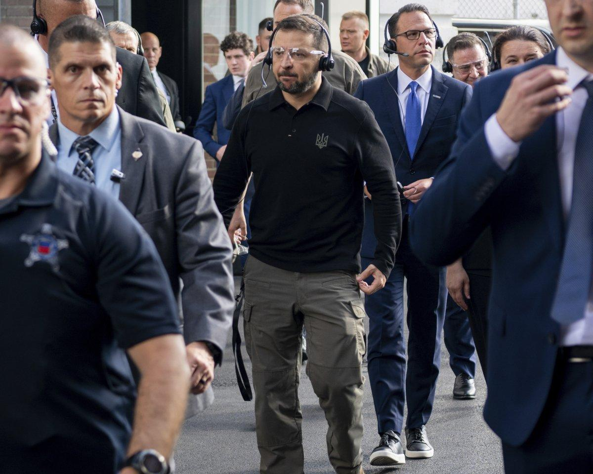

## Claim
Claim: "Ukrainian President Volodymyr Zelenskyy engaged in election interference by campaigning in Pennsylvania for Kamala Harris ahead of the US presidential election in 2024."

## Actions
```
web_search("Volodymyr Zelenskyy Kamala Harris Pennsylvania 2024")
```

## Evidence
### Evidence from `web_search`
Newsweek reports that JD Vance accused Volodymyr Zelenskyy of campaigning for Kamala Harris during the 2024 presidential race, mentioning a September 2024 visit by Zelenskyy to a munitions plant in Scranton, Pennsylvania (, , ). NBC News reports that Zelenskyy visited a munitions factory in Scranton, Pennsylvania, which some Republicans viewed as a signal of which way he wants the November election to go. The article also mentions a meeting between Kamala Harris and Zelenskyy at the White House.

ABC News reports on a meeting between Vice President Kamala Harris and Ukrainian President Volodymyr Zelenskyy to discuss the war with Russia, mentioning Zelenskyy's visit to Washington and his meetings with U.S. lawmakers (, ).

*   [https://www.newsweek.com/volodymyr-zelensky-jd-vance-campaign-kamala-harris-2024-election-2038060](https://www.newsweek.com/volodymyr-zelensky-jd-vance-campaign-kamala-harris-2024-election-2038060)
*   [https://www.nbcnews.com/politics/2024-election/zelenskyys-meeting-harris-spat-trump-reveal-growing-partisan-divide-uk-rcna172648](https://www.nbcnews.com/politics/2024-election/zelenskyys-meeting-harris-spat-trump-reveal-growing-partisan-divide-uk-rcna172648)
*   [https://abcnews.go.com/Politics/harris-standing-zelenskyy-indirectly-jabs-trump-vance-ukraine/story?id=114219628](https://abcnews.go.com/Politics/harris-standing-zelenskyy-indirectly-jabs-trump-vance-ukraine/story?id=114219628)


## Elaboration
The evidence indicates that JD Vance accused Volodymyr Zelenskyy of campaigning for Kamala Harris in the 2024 presidential race. News reports mention Zelenskyy's visit to a munitions plant in Scranton, Pennsylvania, and meetings with Harris and U.S. lawmakers. Some Republicans viewed Zelenskyy's actions as a signal of his preference in the election.

The evidence does not explicitly state that Zelenskyy was campaigning for Harris. However, the reports suggest that his actions, such as visiting a munitions plant and meeting with Harris, were perceived by some as a form of support.

To fully verify the claim, it would be necessary to determine whether Zelenskyy's actions were intended to influence the election and whether they constituted campaigning.


## Final Judgement
The fact-check reveals that while Zelenskyy visited Pennsylvania and met with Kamala Harris, there is no direct evidence to confirm that he was campaigning for her. The claim is based on perceptions and interpretations of his actions. Therefore, the claim is not factually accurate. `false`


### Verdict: FALSE

### Justification
The claim that Volodymyr Zelenskyy campaigned for Kamala Harris is based on reports of his visit to a munitions plant in Pennsylvania and meetings with Harris, as reported by [Newsweek](https://www.newsweek.com/volodymyr-zelensky-jd-vance-campaign-kamala-harris-2024-election-2038060), [NBC News](https://www.nbcnews.com/politics/2024-election/zelenskyys-meeting-harris-spat-trump-reveal-growing-partisan-divide-uk-rcna172648), and [ABC News](https://abcnews.go.com/Politics/harris-standing-zelenskyy-indirectly-jabs-trump-vance-ukraine/story?id=114219628). However, the evidence does not explicitly state that Zelenskyy was campaigning for Harris, but rather that his actions were perceived by some as a form of support.
