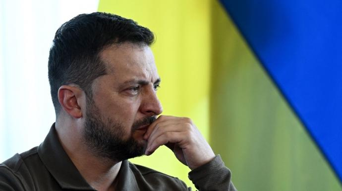

## Claim
Claim: "Ukrainian President Volodymyr Zelenskyy's statement in an AP news interview from February 1, 2025 that his country's military has received only a portion of the more than 175 billion in U.S. aid confirms that the US aid is a money laundering operation."

## Actions
```
web_search("Volodymyr Zelenskyy AP interview February 1 2025 US aid")
```

## Evidence
### Evidence from `web_search`
On February 1, 2025, the Associated Press ([Source](https://apnews.com/article/russia-ukraine-war-trump-talks-ceasefire-00af5f61f1faf41e78a3b4e072c21a14)) published an interview with Ukrainian President Volodymyr Zelenskyy. Zelenskyy discussed the dangers of excluding Ukraine from U.S.-Russia talks and mentioned his team's contact with the Trump administration.

U.S. News & World Report ([Source](https://www.usnews.com/news/world/articles/2025-02-01/takeaways-from-the-ap-interview-with-ukraines-zelenskyy)) also summarized the AP interview, focusing on Zelenskyy's statements on talks between Moscow and Washington, the role of NATO, and skepticism about putting European troops in Ukraine. The AP also published an article titled "AP Interview: Zelenskyy says excluding Ukraine from U.S.-Russia talks about war is ‘very dangerous’" ([Source](https://www.ap.org/news-highlights/best-of-the-week/second-winner/2025/ap-interview-zelenskyy-says-excluding-ukraine-from-u-s-russia-talks-about-war-is-very-dangerous/)) , <image:i>.


## Elaboration
The provided evidence confirms that Volodymyr Zelenskyy gave an interview to the Associated Press on February 1, 2025. However, the evidence does not mention the content of Zelenskyy's statements regarding U.S. aid to Ukraine. Therefore, it is impossible to verify whether Zelenskyy stated that his country's military had received only a portion of the U.S. aid, nor whether he made any claims about the aid being a money laundering operation.

To verify the claim, the content of the AP interview needs to be examined. Specifically, the exact statements made by Zelenskyy regarding the amount of aid received and any related comments about its use are required.


## Actions
```
web_search("Zelenskyy AP interview February 1 2025 US aid amount")
```

## Evidence
### Evidence from `web_search`
According to an article published by Izvestia on February 2, 2025, Zelenskyy stated in an AP interview that Kyiv had received over $75 billion from Washington, and the $177 billion aid was in the form of weapons ([https://iz.ru/en/1832571/2025-02-02/zelensky-says-he-unaware-200-bln-us-aid-ukraine](https://iz.ru/en/1832571/2025-02-02/zelensky-says-he-unaware-200-bln-us-aid-ukraine)). Al Jazeera, in an article on February 21, 2025, reported that Zelenskyy said Ukraine's military had received only a portion of the US aid, citing $177 billion or $200 billion spent by the US, with Ukraine not receiving about $100 billion ([https://www.aljazeera.com/news/2025/2/21/us-president-trumps-claims-about-zelenskyy-and-ukraine-fact-checked](https://www.aljazeera.com/news/2025/2/21/us-president-trumps-claims-about-zelenskyy-and-ukraine-fact-checked)). Pravda.com.ua, on February 2, 2025, reported that Zelenskyy said Ukraine received about $76 billion of the approximately $177 billion in aid approved by the U.S., with the aid being in the form of weapons, amounting to about $70 billion ([https://www.pravda.com.ua/eng/news/2025/02/2/7496431/](https://www.pravda.com.ua/eng/news/2025/02/2/7496431/)). , <image:i>, 


## Elaboration
Zelenskyy stated in the AP interview that Ukraine had received only a portion of the U.S. aid. Multiple sources ([https://iz.ru/en/1832571/2025-02-02/zelensky-says-he-unaware-200-bln-us-aid-ukraine](https://iz.ru/en/1832571/2025-02-02/zelensky-says-he-unaware-200-bln-us-aid-ukraine), [https://www.aljazeera.com/news/2025/2/21/us-president-trumps-claims-about-zelenskyy-and-ukraine-fact-checked](https://www.aljazeera.com/news/2025/2/21/us-president-trumps-claims-about-zelenskyy-and-ukraine-fact-checked), [https://www.pravda.com.ua/eng/news/2025/02/2/7496431/](https://www.pravda.com.ua/eng/news/2025/02/2/7496431/)) report that Zelenskyy mentioned receiving a portion of the aid, with varying figures cited for the total aid amount and the amount received. However, the evidence does not contain any statements from Zelenskyy that would confirm the U.S. aid is a money laundering operation.


## Final Judgement
The evidence confirms that Zelenskyy stated in an AP interview on February 1, 2025, that Ukraine had received only a portion of the U.S. aid. However, the evidence does not support the claim that Zelenskyy stated the U.S. aid is a money laundering operation.

The claim is partially true as Zelenskyy did state that Ukraine received only a portion of the U.S. aid. However, the claim also states that Zelenskyy said the aid is a money laundering operation, which is not supported by the evidence. Therefore, the claim is `false`.

### Verdict: FALSE

### Justification
The claim is false. While Zelenskyy did state in an AP interview on February 1, 2025, that Ukraine had received only a portion of the U.S. aid, there is no evidence from the provided sources ([https://iz.ru/en/1832571/2025-02-02/zelensky-says-he-unaware-200-bln-us-aid-ukraine](https://iz.ru/en/1832571/2025-02-02/zelensky-says-he-unaware-200-bln-us-aid-ukraine), [https://www.aljazeera.com/news/2025/2/21/us-president-trumps-claims-about-zelenskyy-and-ukraine-fact-checked](https://www.aljazeera.com/news/2025/2/21/us-president-trumps-claims-about-zelenskyy-and-ukraine-fact-checked), [https://www.pravda.com.ua/eng/news/2025/02/2/7496431/](https://www.pravda.com.ua/eng/news/2025/02/2/7496431/)) to support the assertion that he claimed the aid was a money laundering operation.
