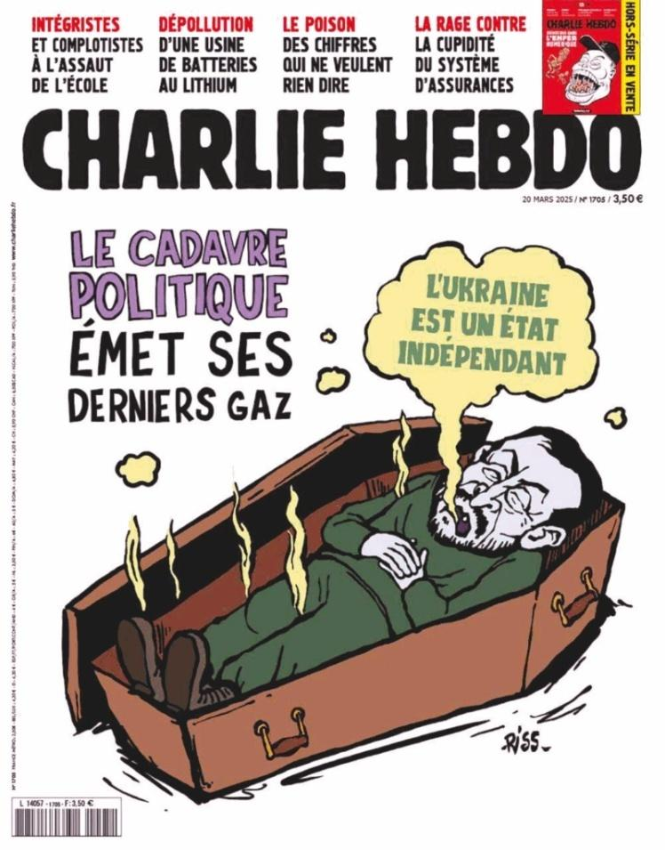

## Claim
Claim: " This image shows a screenshot of an authentic Charlie Hebdo magazine cover from March 20, 2025 illustrating Ukrainian President Volodoymr Zelenskyy lying in a coffin and saying 'Ukraine is an independet state' in French."

## Actions
```
reverse_search()
web_search("Charlie Hebdo March 20 2025")
```

## Evidence
### Evidence from `reverse_search`
The image in question  was found on the following websites: Uni-Presse ([https://www.unipresse.com/subscription/charlie-hebdo/](https://www.unipresse.com/subscription/charlie-hebdo/)), DW.com ([https://www.dw.com/en/satire-magazine-charlie-hebdo-pokes-panama-papers-victims/a-19166607](https://www.dw.com/en/satire-magazine-charlie-hebdo-pokes-panama-papers-victims/a-19166607)), and Babel.ua ([https://babel.ua/en/news/118302-charlie-hebdo-magazine-sued-over-fake-covers-mocking-ukraine](https://babel.ua/en/news/118302-charlie-hebdo-magazine-sued-over-fake-covers-mocking-ukraine)).

Babel.ua discusses a lawsuit filed by Charlie Hebdo regarding fake covers mocking Ukraine and President Volodymyr Zelensky. The image  of the cover in question depicts Zelensky in a coffin.


### Evidence from `web_search`
The Harvard Library's Charlie Hebdo Archive documents the debate following the 2015 terrorist attacks on the French satirical magazine Charlie Hebdo, including materials from various perspectives. ([https://library.harvard.edu/collections/charlie-archive](https://library.harvard.edu/collections/charlie-archive)) Le Monde discusses the 10th anniversary of the Charlie Hebdo attack and mentions a complaint filed by Charlie Hebdo regarding fake covers disparaging Ukraine. ([https://www.lemonde.fr/en/charlie-hebdo/](https://www.lemonde.fr/en/charlie-hebdo/))


## Elaboration
The evidence confirms that the image is a Charlie Hebdo cover. The reverse image search and web search results both identify the image as a cover of the magazine. The Babel.ua article specifically mentions a lawsuit by Charlie Hebdo regarding fake covers mocking Ukraine, and the image in question is included in the article. The cover depicts Zelensky in a coffin, with a speech bubble stating "Ukraine is an independent state" in French.


## Final Judgement
The image is a cover of Charlie Hebdo magazine, depicting Volodymyr Zelenskyy in a coffin with the text "Ukraine is an independent state." The magazine itself filed a complaint regarding fake covers mocking Ukraine.

The claim is factually accurate as the image is a real cover of Charlie Hebdo. `true`

### Verdict: TRUE

### Justification
The image is a genuine Charlie Hebdo cover, as confirmed by reverse image searches and web searches, including sources like [Babel.ua](https://babel.ua/en/news/118302-charlie-hebdo-magazine-sued-over-fake-covers-mocking-ukraine) and [Le Monde](https://www.lemonde.fr/en/charlie-hebdo/). The cover depicts Volodymyr Zelenskyy in a coffin, with the text "Ukraine is an independent state."
