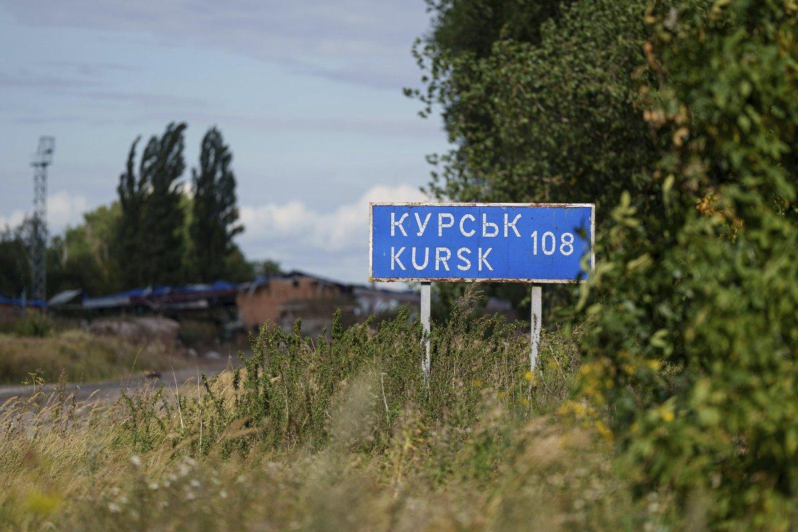
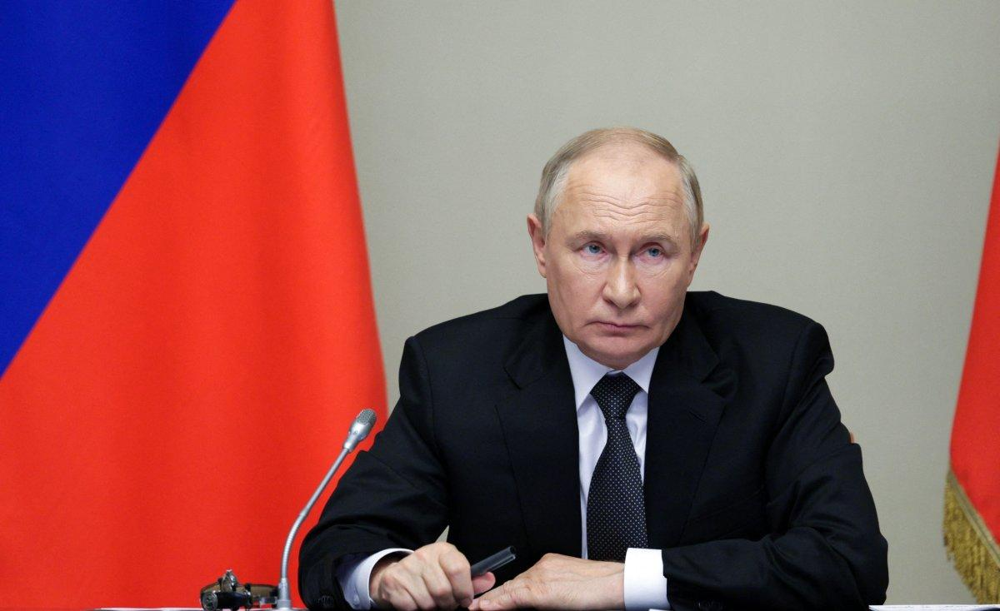

## Claim
Claim: " This image shows American mercenaries participating in Ukraine's incursion into Russia's Kursk Oblast in August 2024."

## Actions
```
reverse_search()
web_search("American mercenaries Ukraine Kursk Oblast August 2024")
```

## Evidence
### Evidence from `reverse_search`
The image in the claim () appears in articles discussing the Ukrainian army's actions in the Kharkiv region, specifically in Balakleya, during September 2022. The articles, published on Apostrophe.ua, Charter97.org, and Cripo.com.ua, do not mention American mercenaries or the Kursk Oblast. The image shows Ukrainian soldiers, one of whom is taking a selfie, with a dead soldier on the ground.


### Evidence from `web_search`
Newsweek reports that Russia claimed the presence of American mercenaries in the Kursk region during Ukraine's incursion in August 2024 (, , ). The Russian Foreign Ministry protested the alleged involvement, while the U.S. denied it. The Anadolu Agency also reported on August 20, 2024, that Russia protested the participation of US private military companies fighting alongside Ukraine in the Kursk region (<image:i>).

The incursion into the Kursk region began on the night of August 5-6.


## Elaboration
The claim is not supported by the evidence. The image in the claim was taken in the Kharkiv region in September 2022, not in the Kursk Oblast in August 2024. While Russia claimed the presence of American mercenaries in the Kursk region during the incursion in August 2024, the U.S. denied it.


## Final Judgement
The image in the claim is from September 2022 and shows Ukrainian soldiers in the Kharkiv region, not American mercenaries in the Kursk Oblast in August 2024. While Russia claimed the presence of American mercenaries in the Kursk region during the incursion, the U.S. denied it.

`false`

### Verdict: FALSE

### Justification
The image in the claim is from September 2022 and shows Ukrainian soldiers in the Kharkiv region, not American mercenaries in the Kursk Oblast in August 2024, as reported by Apostrophe.ua, Charter97.org, and Cripo.com.ua. While Russia claimed the presence of American mercenaries in the Kursk region during the incursion in August 2024, the U.S. denied it, as reported by Newsweek.
