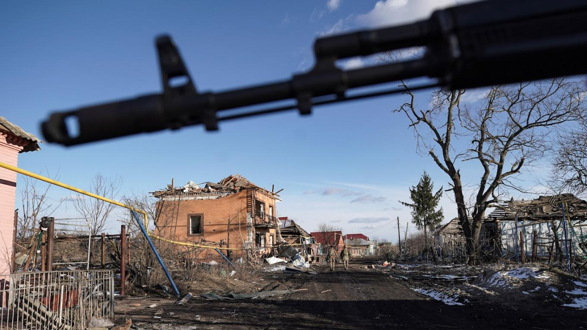
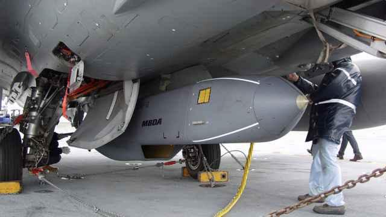

## Claim
Claim: " This image shows Ukrainian President Volodymyr Zelensky arriving in August 2024 in the Sudzha of Kursk region, Russia, which had just been occupied by Ukrainian troops in the Kursk Offensive, and meeting with representatives of the people there."

## Actions
```
reverse_search()
web_search("Volodymyr Zelensky Kursk Offensive")
```

## Evidence
### Evidence from `reverse_search`
The image in the claim () appears in multiple sources. According to the BBC, the image shows Volodymyr Zelensky visiting troops on the front line in the Kharkiv region, and the article was published on May 29, 2022. ([https://www.bbc.com/news/live/world-europe-61612803](https://www.bbc.com/news/live/world-europe-61612803)).

Telegrafi.com also features the image, titling the article "Zelensky, on a rare trip outside Kiev, visited the front line where he met Ukrainian troops" and mentioning a visit to the frontline positions in the Kharkiv region. ([https://telegrafi.com/en/zelensky-on-a-rare-trip-outside-kiev-visited-the-front-line-where-he-met-ukrainian-troops/](https://telegrafi.com/en/zelensky-on-a-rare-trip-outside-kiev-visited-the-front-line-where-he-met-ukrainian-troops/)).


### Evidence from `web_search`
The BBC News article from November 12, 2024, discusses the ongoing incursion into Russia's Kursk region by Ukraine, with Volodymyr Zelensky stating the operation is holding down 50,000 Russian troops. The Moscow Times reports on the ongoing conflict in the Kursk region, mentioning a shock offensive launched by Kyiv in August 2024, and that Zelensky said Ukraine's army was still fighting in Russia's Kursk. ABC News, published on January 7, 2025, reports that Zelensky stated Ukraine is bringing the war "back to Russia" and that Russia has lost over 38,000 troops in the area since August, with fighting reported near Sudzha, which Ukraine captured in August.

The sources are: [https://www.bbc.com/news/articles/c9vn1x23x88o](https://www.bbc.com/news/articles/c9vn1x23x88o), [https://www.themoscowtimes.com/2025/04/27/zelensky-says-ukraine-still-fighting-in-russias-kursk-a88884](https://www.themoscowtimes.com/2025/04/27/zelensky-says-ukraine-still-fighting-in-russias-kursk-a88884), and [https://abcnews.go.com/International/ukraine-bringing-war-back-russia-zelenskyy-after-new/story?id=117408954](https://abcnews.go.com/International/ukraine-bringing-war-back-russia-zelenskyy-after-new/story?id=117408954). The articles mention the Kursk Offensive, with Zelensky's involvement and the capture of Sudzha. , , , , , , 


## Elaboration
The claim is partially inaccurate. The image (

## Final Judgement
The image shows Volodymyr Zelensky visiting troops in the Kharkiv region in May 2022, not in the Kursk region in August 2024. While there is evidence of a Kursk Offensive and Zelensky's involvement, the image's context is misrepresented.

`false`

### Verdict: FALSE

### Justification
The image in the claim, which shows Volodymyr Zelensky, was taken in May 2022 in the Kharkiv region, not in August 2024 in the Kursk region as the claim states, as confirmed by the BBC ([https://www.bbc.com/news/live/world-europe-61612803](https://www.bbc.com/news/live/world-europe-61612803)). While there is evidence of a Kursk Offensive and Zelensky's involvement, the image's context is misrepresented.
