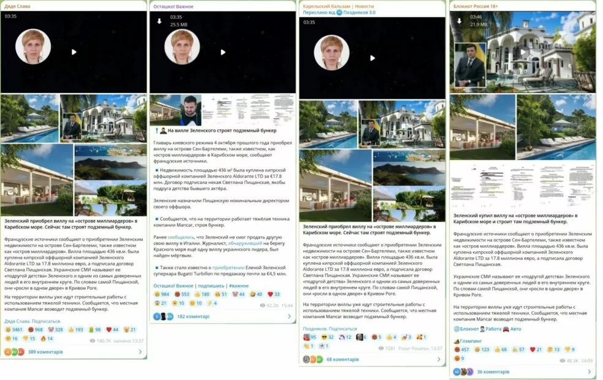
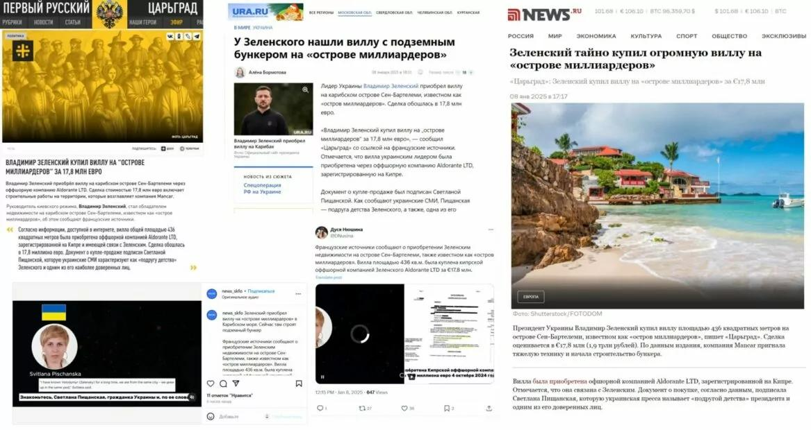
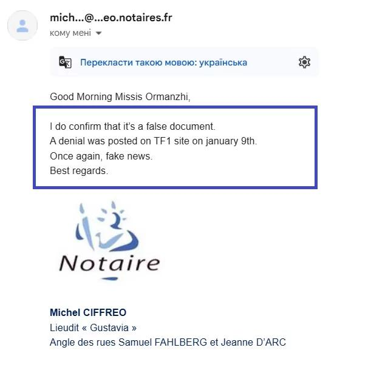

## Claim
Claim: "Ukrainian President Volodymyr Zelenskyy purchased the Eagle's Nest, or Kehlsteinhaus, in Berchtesgaden in the southern German state of Bavaria, for 14.2 million euros."

## Actions
```
web_search("Volodymyr Zelenskyy Eagle's Nest purchase")
```

## Evidence
### Evidence from `web_search`
The AOL article ([https://www.aol.com/fact-check-no-zelenskyy-didn-151251133.html](https://www.aol.com/fact-check-no-zelenskyy-didn-151251133.html)) fact-checks the claim and states it is false, with the Eagle's Nest still owned by the Free State of Bavaria.  An article from EADaily ([https://eadaily.com/en/news/2025/02/08/zelensky-bought-hitlers-eagles-nest-residence-in-the-bavarian-alps-mass-media](https://eadaily.com/en/news/2025/02/08/zelensky-bought-hitlers-eagles-nest-residence-in-the-bavarian-alps-mass-media)) claims Zelenskyy purchased the Eagle's Nest for €14.2 million. 

Another article ([https://gwaramedia.com/en/debunking-russian-fakes-no-zelenskyy-didnt-buy-villa-on-island-of-billionaires/](https://gwaramedia.com/en/debunking-russian-fakes-no-zelenskyy-didnt-buy-villa-on-island-of-billionaires/)) debunks a claim that Zelenskyy purchased a villa, stating the evidence is fake. , , , , 


## Elaboration
The claim that Volodymyr Zelenskyy purchased the Eagle's Nest is false. An AOL fact-check article states that the Eagle's Nest is still owned by the Free State of Bavaria ([https://www.aol.com/fact-check-no-zelenskyy-didn-151251133.html](https://www.aol.com/fact-check-no-zelenskyy-didn-151251133.html)).


## Final Judgement
The claim is demonstrably false. Multiple sources confirm that the Eagle's Nest is still owned by the Free State of Bavaria, and the claim is debunked by fact-check articles. `false`

### Verdict: FALSE

### Justification
The claim that Volodymyr Zelenskyy purchased the Eagle's Nest is false. A fact-check by AOL ([https://www.aol.com/fact-check-no-zelenskyy-didn-151251133.html](https://www.aol.com/fact-check-no-zelenskyy-didn-151251133.html)) confirms that the property is still owned by the Free State of Bavaria.
