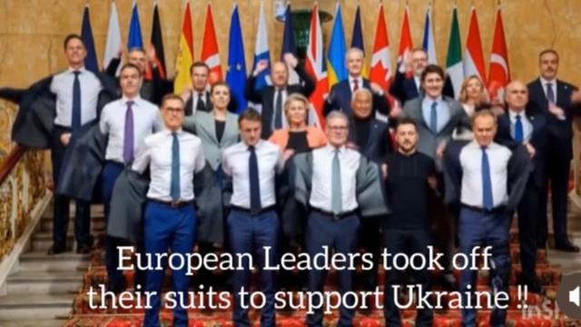

## Claim
Claim: " This is an authentic image of world leaders taking off their suits to symbolically support Ukraine at the London summit on Ukraine on March 2, 2025."

## Actions
```
reverse_search()
```

## Evidence
No new evidence found.

## Elaboration
There is no new evidence to analyze the claim.


## Actions
```
web_search("London summit Ukraine March 2 2025")
web_search("European leaders support Ukraine photo")
```

## Evidence
### Evidence from `web_search`
The 2025 London Summit on Ukraine took place on March 2, 2025, hosted by Keir Starmer, with the aim to create a peace plan for Ukraine. Participants included 16 states, the EU, and NATO, with Volodymyr Zelenskyy and other European leaders in attendance. The summit resulted in commitments, including £1.6 billion in UK export finances for air defense missiles. The Guardian published an article about the summit, where Keir Starmer hosted 18 leaders, including Volodymyr Zelenskyy, to discuss a new plan for peace in Ukraine. CNN reports on the summit, where European leaders discussed negotiations over the Russia-Ukraine war. The article mentions the presence of Ukrainian President Volodymyr Zelensky, British Prime Minister Keir Starmer, French President Emmanuel Macron, and others. The summit aimed to address Ukraine's short-term needs, secure a lasting deal to end the conflict, and plan for security guarantees. The article also mentions a proposed French-British ceasefire plan.  is a photo of the participants.

Sources: [https://en.wikipedia.org/wiki/2025_London_Summit_on_Ukraine](https://en.wikipedia.org/wiki/2025_London_Summit_on_Ukraine), [https://www.theguardian.com/world/2025/mar/02/keir-starmer-peace-talks-ukraine-key-takeaways-london-summit](https://www.theguardian.com/world/2025/mar/02/keir-starmer-peace-talks-ukraine-key-takeaways-london-summit), [https://www.cnn.com/2025/03/02/europe/ukraine-russia-zelensky-starmer-summit-intl](https://www.cnn.com/2025/03/02/europe/ukraine-russia-zelensky-starmer-summit-intl).


### Evidence from `web_search`
The Guardian published a photo gallery of European leaders gathering for Ukraine peace talks at the White House on August 18, 2025. The search result from Getty Images contains multiple photos of European leaders and Volodymyr Zelenskyy at various summits and meetings, including the EU Summit and the European Council Summit. The NPR article, published on March 1, 2025, discusses European leaders' support for Ukraine following a meeting between Volodymyr Zelenskyy and Donald Trump and mentions a summit of European leaders in London on Sunday. The Ukrainian President arrived in London on Saturday to meet with the British prime minister.

The sources mention Donald Trump, Volodymyr Zelenskyy, Keir Starmer, Emmanuel Macron, Giorgia Meloni, Friedrich Merz, and Mark Rutte. The search result mentions the date March 27, 2025, but not March 2, 2025. The NPR article mentions a summit of European leaders in London on Sunday, and  shows the British Prime Minister welcoming Zelenskyy to 10 Downing Street on March 1, 2025.


## Elaboration
The evidence confirms the existence of the London Summit on Ukraine on March 2, 2025, with the participation of Volodymyr Zelenskyy and other European leaders. The image in the claim is a photo of the participants. However, the evidence does not mention the leaders taking off their suits to support Ukraine.

Therefore, the claim is partially verifiable. The image is authentic, and the summit did take place on the specified date. However, the evidence does not support the assertion that the leaders took off their suits.

Missing information: Details about the leaders taking off their suits.


## Final Judgement
The search results confirm the existence of the London Summit on Ukraine on March 2, 2025, and that the image is of the participants. However, the evidence does not support the claim that the leaders took off their suits to support Ukraine.

The claim is partially verifiable, as the image is authentic and the summit occurred on the specified date. However, the evidence does not support the specific action of removing suits. `false`

### Verdict: FALSE

### Justification
The claim is partially accurate. The image is authentic and depicts leaders at the 2025 London Summit on Ukraine, which took place on March 2, 2025, as confirmed by sources like [Wikipedia](https://en.wikipedia.org/wiki/2025_London_Summit_on_Ukraine), [The Guardian](https://www.theguardian.com/world/2025/mar/02/keir-starmer-peace-talks-ukraine-key-takeaways-london-summit), and [CNN](https://www.cnn.com/2025/03/02/europe/ukraine-russia-zelensky-starmer-summit-intl). However, the evidence does not support the assertion that the leaders removed their suits to show support for Ukraine.
