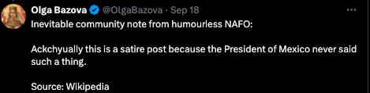
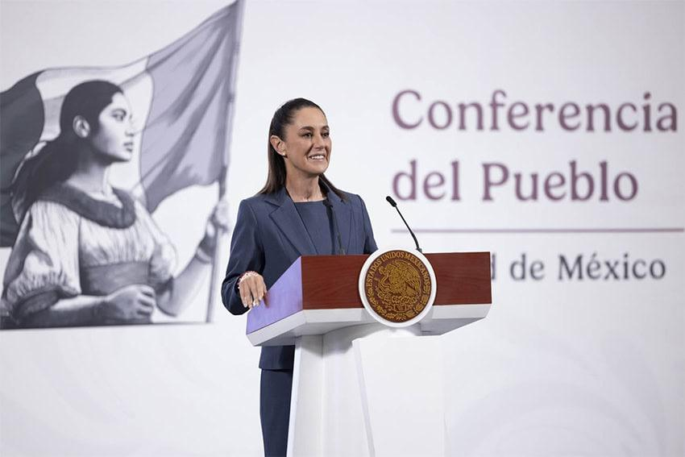

## Claim
Claim: "Mexican President-elect Claudia Sheinbaum rejected an invitation to Ukraine by Volodymr Zelenskyy and said towards him on September 17, 2024: 'If I wanted to see a drug addict, I'd just take a walk around Tijuana.'"

## Actions
```
web_search("Claudia Sheinbaum Volodymyr Zelenskyy invitation")
web_search("Claudia Sheinbaum Tijuana drug addict")
```

## Evidence
### Evidence from `web_search`
Claudia Sheinbaum, the Mexican President-elect, declined an invitation from Ukrainian President Volodymyr Zelenskyy to visit Ukraine, according to reports from [IntelliNews](https://www.intellinews.com/mexico-s-president-elect-sheinbaum-turns-down-zelensky-s-invitation-to-ukraine-344262/) (), [Euromaidan Press](https://euromaidanpress.com/2024/09/18/mexican-president-elect-declines-zelenskyys-invitation-to-visit-ukraine/) (), and [Ukrinform](https://www.ukrinform.net/rubric-polytics/3906832-mexico-presidentelect-rejects-zelenskys-invitation-to-visit-ukraine.html) (). Sheinbaum cited her focus on domestic responsibilities as the reason for declining the invitation.


### Evidence from `web_search`
The claim that Claudia Sheinbaum made the statement, "If I wanted to see a drug addict, I'd just take a walk around Tijuana," is false, according to [mimikama.org](https://www.mimikama.org/en/sheinbaum-fake-quote-zelenskyj-drugs/) and [StopFake.org](https://www.stopfake.org/en/fake-mexican-president-refuses-to-visit-ukraine-calling-zelensky-a-drug-addict/). Both sources state that the quote is part of a disinformation campaign and was never said by Sheinbaum. Sheinbaum did reject an invitation to visit Ukraine. <image:k>, 

An article from [Mexico News Daily](https://mexiconewsdaily.com/politics/sheinbaum-trump-mexico-petrified-of-cartels/) discusses Sheinbaum's response to Donald Trump's criticism of Mexico's handling of drug cartels. 


## Elaboration
The evidence confirms that Claudia Sheinbaum declined an invitation from Volodymyr Zelenskyy to visit Ukraine. However, the evidence explicitly states that the quote attributed to her, "If I wanted to see a drug addict, I'd just take a walk around Tijuana," is false and part of a disinformation campaign. Therefore, the claim is partially accurate, as Sheinbaum did decline the invitation, but the quoted statement is fabricated.


## Final Judgement
The claim is partially accurate as Claudia Sheinbaum did decline the invitation to visit Ukraine. However, the statement attributed to her is false and part of a disinformation campaign. Therefore, the claim is not factually accurate because it includes a fabricated quote. `false`

### Verdict: FALSE

### Justification
The claim is false. While Claudia Sheinbaum did decline an invitation to visit Ukraine, the statement attributed to her, "If I wanted to see a drug addict, I'd just take a walk around Tijuana," is a fabricated quote, according to [mimikama.org](https://www.mimikama.org/en/sheinbaum-fake-quote-zelenskyj-drugs/) and [StopFake.org](https://www.stopfake.org/en/fake-mexican-president-refuses-to-visit-ukraine-calling-zelensky-a-drug-addict/).
