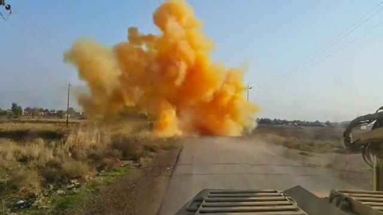

## Claim
Claim: " This image shows a chemical attack by the Armed Forces of Ukraine during the Kursk offensive in August 2024."

## Actions
```
reverse_search()
```

## Evidence
No new evidence found.

## Elaboration
There is no evidence to support the claim. The reverse image search did not yield any results. Therefore, the claim cannot be verified.


## Final Judgement
The fact-check involved a reverse image search, which did not yield any results. Therefore, there is no evidence to support the claim.

The claim is not supported by any evidence. `false`


### Verdict: FALSE

### Justification
The claim is unsubstantiated. A reverse image search of the provided image did not yield any results, indicating a lack of supporting evidence for the assertion of a chemical attack by the Armed Forces of Ukraine during the Kursk offensive in August 2024.
