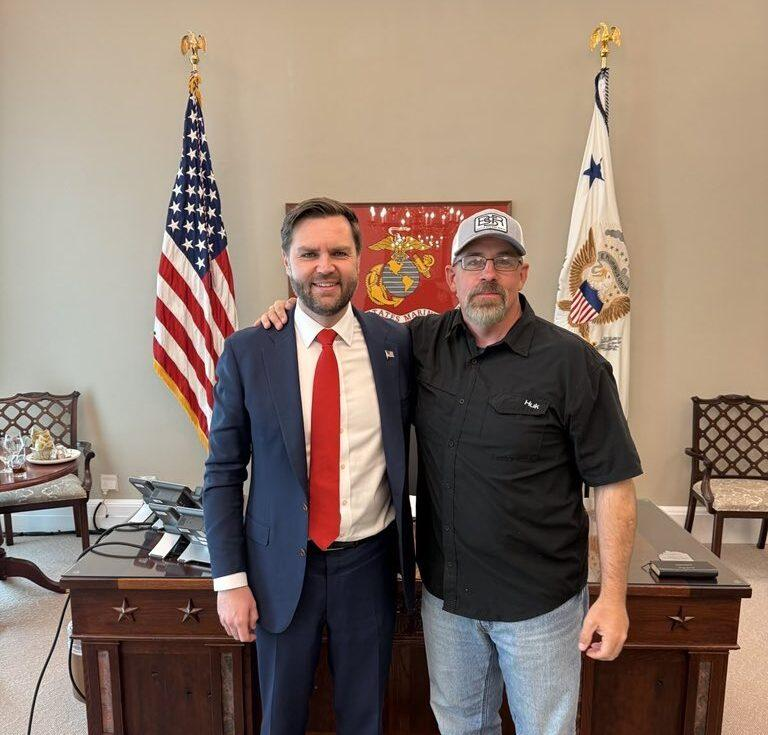

## Claim
Claim: "U.S. Vice President JD Vance's cousin Nate Vance fought in Ukraine for three years during its war with Russia."

## Actions
```
web_search("JD Vance Nate Vance Ukraine")
web_search("Nate Vance Ukraine war")
```

## Evidence
### Evidence from `web_search`
Nate Vance, the cousin of U.S. Vice President J.D. Vance, fought in the Russo-Ukrainian war. According to the South China Morning Post, he fought on the front line for three years (). The BBC reports that he spent three years volunteering with the Ukrainian military after Russia's full-scale invasion (). Wikipedia states that he fought in Ukraine from 2022 to 2025 and served in the Ukrainian Armed Forces.

Sources: [https://www.scmp.com/magazines/style/entertainment/article/3303271/who-us-vice-president-jd-vances-cousin-nate-former-us-marine-who-fought-ukraine-made-headlines-when](https://www.scmp.com/magazines/style/entertainment/article/3303271/who-us-vice-president-jd-vances-cousin-nate-former-us-marine-who-fought-ukraine-made-headlines-when), [https://en.wikipedia.org/wiki/Nate_Vance](https://en.wikipedia.org/wiki/Nate_Vance), [https://www.bbc.com/news/articles/cm2yl5kevrpo](https://www.bbc.com/news/articles/cm2yl5kevrpo).


### Evidence from `web_search`
An article from The Insider, published on July 25, 2025, discusses Nate Vance, identified as a cousin of U.S. Vice President J.D. Vance, and his experience in the war in Ukraine (). Euromaidan Press published an article on April 25, 2025, stating that Nate Vance fought in Ukraine for nearly three years with the Da Vinci Wolves battalion, participating in battles for Kupiansk, Bakhmut, Avdiivka, and Pokrovsk. The article also mentions a meeting between Nate Vance and his cousin, JD Vance, where Nate criticized US policy toward Ukraine (, ).

*   [Source](https://theins.ru/en/confession/283471)
*   [Source](https://euromaidanpress.com/2025/04/25/after-public-criticism-former-ukraine-volunteer-nate-vance-meets-with-cousin-vp-jd-vance-at-white-house/)


## Elaboration
The claim is supported by the evidence. Multiple sources confirm that Nate Vance, the cousin of U.S. Vice President J.D. Vance, fought in the Russo-Ukrainian war. The South China Morning Post and the BBC report that he fought for three years. Additional sources specify that he served in the Ukrainian Armed Forces and participated in battles.


## Final Judgement
The evidence confirms that Nate Vance, the cousin of U.S. Vice President J.D. Vance, fought in Ukraine for approximately three years. Multiple sources, including the South China Morning Post, BBC, and Euromaidan Press, support this claim.

`true`

### Verdict: TRUE

### Justification
The claim is supported by multiple sources, including the [South China Morning Post](https://www.scmp.com/magazines/style/entertainment/article/3303271/who-us-vice-president-jd-vances-cousin-nate-former-us-marine-who-fought-ukraine-made-headlines-when) and the [BBC](https://www.bbc.com/news/articles/cm2yl5kevrpo), which confirm that Nate Vance, the cousin of U.S. Vice President J.D. Vance, fought in the Russo-Ukrainian war for three years. Additional sources, such as [Euromaidan Press](https://euromaidanpress.com/2025/04/25/after-public-criticism-former-ukraine-volunteer-nate-vance-meets-with-cousin-vp-jd-vance-at-white-house/), provide further details about his service.
