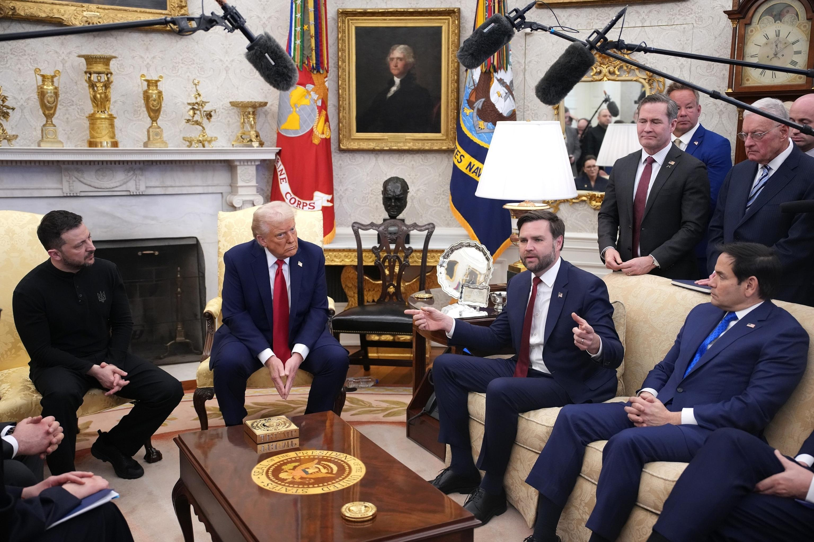
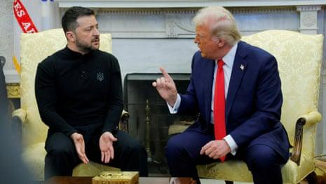

## Claim
Claim: "On Feb. 28, 2025, before a meeting with U.S. President Donald Trump, Ukraine President Volodymyr Zelenskyy met with Democrats."

## Actions
```
web_search("Volodymyr Zelenskyy Donald Trump meeting February 28 2025")
web_search("Volodymyr Zelenskyy meeting Democrats February 28 2025")
```

## Evidence
### Evidence from `web_search`
On February 28, 2025, Volodymyr Zelenskyy met with Donald Trump in the Oval Office at the White House. The meeting was contentious and devolved into a shouting match. Democratic lawmakers criticized Trump's actions.

Sources include: [https://en.wikipedia.org/wiki/2025_Trump%E2%80%93Zelenskyy_Oval_Office_meeting](https://en.wikipedia.org/wiki/2025_Trump%E2%80%93Zelenskyy_Oval_Office_meeting), [https://www.npr.org/2025/02/28/nx-s1-5313079/trump-zelenskyy-meeting](https://www.npr.org/2025/02/28/nx-s1-5313079/trump-zelenskyy-meeting), and [https://abcnews.go.com/Politics/key-takeaways-tempers-flare-trump-vance-confront-ukraines/story?id=119299758](https://abcnews.go.com/Politics/key-takeaways-tempers-flare-trump-vance-confront-ukraines/story?id=119299758). <image:i>, , , , , , , 


### Evidence from `web_search`
On February 28, 2025, Volodymyr Zelenskyy met with a bipartisan group of senators before meeting with Donald Trump, according to an ABC News article published on March 1, 2025. The article mentions Lindsey Graham, Chris Coons, and Amy Klobuchar were present at the meeting. ([https://abcnews.go.com/Politics/zelenskyy-meets-bipartisan-group-senators-ahead-tense-white/story?id=119305439](https://abcnews.go.com/Politics/zelenskyy-meets-bipartisan-group-senators-ahead-tense-white/story?id=119305439)) 

The Guardian published an article on February 28, 2025, discussing a meeting between Volodymyr Zelenskyy and Donald Trump, and mentions that Democratic senators met with Zelenskyy earlier in the morning before his meeting with Trump. ([https://www.theguardian.com/us-news/2025/feb/28/zelenksyy-trump-meeting-democrats-reactions](https://www.theguardian.com/us-news/2025/feb/28/zelenksyy-trump-meeting-democrats-reactions)) , 


## Elaboration
The evidence confirms that on February 28, 2025, Volodymyr Zelenskyy met with Donald Trump. Furthermore, Zelenskyy met with a bipartisan group of senators, including Democrats, before his meeting with Trump.

Therefore, the claim is accurate.


## Final Judgement
The claim is accurate as Zelenskyy met with Democrats before his meeting with Trump on February 28, 2025. This is supported by multiple sources. `true`

### Verdict: TRUE

### Justification
On February 28, 2025, Volodymyr Zelenskyy met with a bipartisan group of senators, including Democrats, before his meeting with Donald Trump, as reported by [ABC News](https://abcnews.go.com/Politics/zelenskyy-meets-bipartisan-group-senators-ahead-tense-white/story?id=119305439) and [The Guardian](https://www.theguardian.com/us-news/2025/feb/28/zelenksyy-trump-meeting-democrats-reactions).
