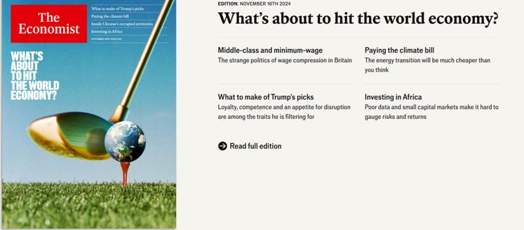
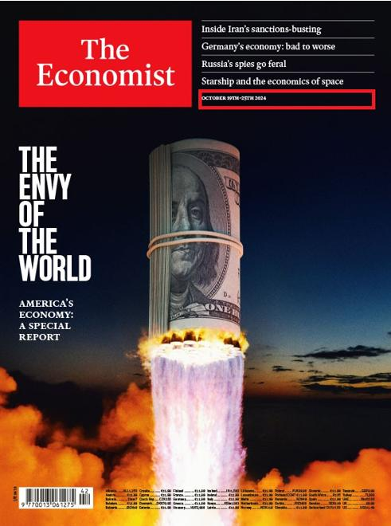

## Claim
Claim: " This image shows a screenshot of an authentic cover of the magazine The Economist from the end of 2024 illustrating Donald Trump and Vladimir Putin and warning of an apocalypse."

## Actions
```
web_search("The Economist Trump Putin apocalypse cover")
```

## Evidence
### Evidence from `web_search`
The image of The Economist cover featuring Donald Trump and Vladimir Putin with the word "Apocalypse" is fake, according to multiple sources. AAP FactCheck ([Source](https://www.aap.com.au/factcheck/fake-economist-apocalypse-cover-linked-to-pro-kremlin-propaganda/)) points out spelling and grammatical errors in the cover lines, and Ukrinform.net ([Source](https://www.ukrinform.net/rubric-factcheck/3930063-russian-propaganda-fabricates-the-economist-cover-about-beginning-of-world-war-iii.html)) states that the cover was created by Russian propagandists. Yahoo News ([Source](https://uk.news.yahoo.com/economist-not-published-apocalypse-cover-154559076.html)) also confirms the image's lack of authenticity. The actual cover of The Economist from November 16, 2024, shows a golf club hitting a globe. , , , , , , 


## Elaboration
The claim is false. Multiple sources, including AAP FactCheck ([Source](https://www.aap.com.au/factcheck/fake-economist-apocalypse-cover-linked-to-pro-kremlin-propaganda/)), Ukrinform.net ([Source](https://www.ukrinform.net/rubric-factcheck/3930063-russian-propaganda-fabricates-the-economist-cover-about-beginning-of-world-war-iii.html)), and Yahoo News ([Source](https://uk.news.yahoo.com/economist-not-published-apocalypse-cover-154559076.html)), confirm that the image is a fake. The actual cover of The Economist from November 16, 2024, features a golf club hitting a globe.


## Final Judgement
The claim is demonstrably false. The image is a fake cover of The Economist, as confirmed by multiple fact-checking sources. The actual cover from the relevant date is different. `false`

### Verdict: FALSE

### Justification
The image of The Economist cover depicting Trump and Putin with the word "Apocalypse" is a fabrication. Multiple fact-checking sources, including AAP FactCheck, Ukrinform.net, and Yahoo News, have confirmed its inauthenticity, pointing out grammatical errors and the cover's origin in Russian propaganda. The actual cover of The Economist from November 16, 2024, features a golf club hitting a globe.
