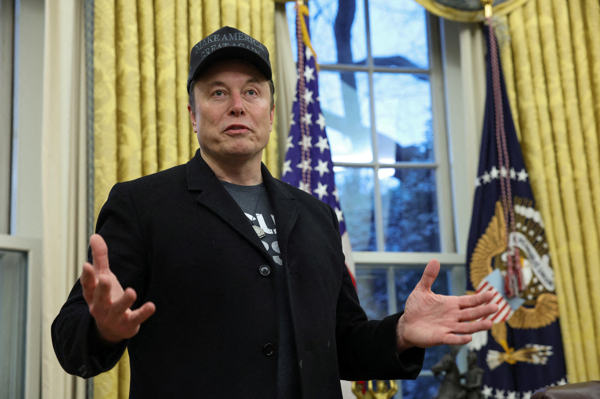

## Claim
Claim: "In February 2025 Elon Musk posted on X that he is planning to suspend Ukraine President Volodymyr Zelenskyy’s X account."

## Actions
```
web_search("Elon Musk Volodymyr Zelenskyy X account suspension")
```

## Evidence
### Evidence from `web_search`
Al Jazeera published an article on February 21, 2025, discussing Elon Musk's statements on X regarding Ukrainian President Volodymyr Zelenskyy, including claims about Zelenskyy's approval rating and Musk's alignment with Donald Trump's views on Zelenskyy (). The Independent reported that Elon Musk accused Volodymyr Zelenskyy of "feeding off the dead bodies of Ukrainian soldiers" on X, but did not mention any plans to suspend Zelenskyy's X account ().

A fact-check from AOL, published on November 13, 2024, debunks a claim that Elon Musk posted a "last dollar" for Ukrainian President Volodymyr Zelenskyy, stating there is no evidence of such a post ().


## Elaboration
The evidence does not support the claim. While there are reports about Elon Musk's statements regarding Volodymyr Zelenskyy on X, none of the provided sources mention Musk planning to suspend Zelenskyy's account. The Independent reported Musk's accusations against Zelenskyy, but not about account suspension.


## Final Judgement
The search results indicate that while Elon Musk has made statements about Volodymyr Zelenskyy on X, there is no evidence to support the claim that he planned to suspend Zelenskyy's account. The provided sources discuss Musk's views and accusations but do not mention any such plans.

`false`


### Verdict: FALSE

### Justification
The search results from Al Jazeera and The Independent reveal Elon Musk's statements and accusations against Volodymyr Zelenskyy on X, but they do not mention any plans to suspend Zelenskyy's account. Therefore, the claim is not supported by the available evidence.
