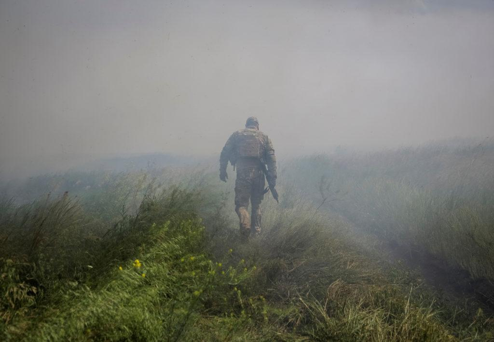

## Claim
Claim: "Ukrainian President Volodymyr Zelenskyy started the 2022 war in Ukraine with Russia."

## Actions
```
web_search("Volodymyr Zelenskyy Russia war 2022 timeline")
web_search("causes of Russia Ukraine war 2022")
```

## Evidence
### Evidence from `web_search`
The search results include timelines of the Russia-Ukraine war. One timeline, from Wikipedia, details the Russian invasion of Ukraine starting on February 24, 2022, and mentions Volodymyr Zelenskyy (<image:i>, <image:j>). Another timeline, from PBS News, indicates that the invasion began on February 24, 2022, when Russian President Vladimir Putin launched an invasion of Ukraine ().

A U.S. News & World Report timeline includes Volodymyr Zelenskyy's call for a meeting with Putin in January 2022, Putin's demands for security guarantees in December 2021, and the start of the invasion on February 24, 2022 (<image:k>). The timeline also mentions Zelenskyy's election in April 2019 and the Euromaidan protests from November 2013 to February 2014 (<image:k>).


### Evidence from `web_search`
The Russian invasion of Ukraine began on February 24, 2022, as stated in articles from [CIRSD](https://www.cirsd.org/en/horizons/horizons-summer-2022-issue-no.21/the-causes-and-consequences-of-the-ukraine-war), [Wikipedia](https://en.wikipedia.org/wiki/Russian_invasion_of_Ukraine), and [Britannica](https://www.britannica.com/event/2022-Russian-invasion-of-Ukraine). The conflict escalated from the Russo-Ukrainian War, which began in 2014. The sources mention that Russia massed troops near Ukraine's borders in late 2021 and issued demands, including a ban on Ukraine joining NATO.

Britannica states that on February 21, 2022, Putin recognized the independence of Donetsk and Luhansk. On February 24, 2022, Zelensky addressed the Russian people, pleading for peace but vowing to defend Ukraine , , , .


## Elaboration
The evidence indicates that the 2022 war began with a Russian invasion of Ukraine on February 24, 2022. Multiple sources, including Wikipedia, PBS News, and Britannica, confirm this timeline. The evidence also shows that Zelenskyy was the President of Ukraine at the time of the invasion.

The evidence does not support the claim that Zelenskyy started the war. Instead, the evidence suggests that Russia initiated the invasion. Zelenskyy's actions, as described in the evidence, include calling for a meeting with Putin and vowing to defend Ukraine.

To verify the claim, more information is needed about the events leading up to the invasion and any actions taken by Zelenskyy that might have provoked Russia.


## Final Judgement
The evidence indicates that the 2022 war in Ukraine was initiated by Russia's invasion on February 24, 2022. While Volodymyr Zelenskyy was the President of Ukraine at the time, the provided information does not support the claim that he started the war. The timelines and reports consistently identify Russia's actions as the starting point of the conflict.

`false`


### Verdict: FALSE

### Justification
The claim is false. Multiple sources, including [Wikipedia](https://en.wikipedia.org/wiki/Russian_invasion_of_Ukraine) and [Britannica](https://www.britannica.com/event/2022-Russian-invasion-of-Ukraine), indicate that the 2022 war began with a Russian invasion of Ukraine on February 24, 2022. The evidence does not support the assertion that Ukrainian President Volodymyr Zelenskyy initiated the war.
