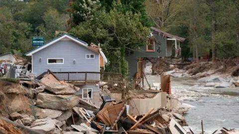

## Claim
Claim: "In remarks to reporters on September 29, 2024 US President Joe Biden announced that no more aid would be provided for the areas affected by Hurrican Helene, but 2.4 billion US-$ more for Ukraine."

## Actions
```
web_search("Joe Biden remarks Hurricane Helene Ukraine aid September 29 2024")
```

## Evidence
### Evidence from `web_search`
The BBC published an article on October 9, 2024, discussing misinformation about the government's response to Hurricane Helene, mentioning claims by Donald Trump and his allies. The North Carolina National Guard completed 146 flight missions, rescuing 538 people and 150 pets. ([https://www.bbc.com/news/articles/czd1q9q9gl9o](https://www.bbc.com/news/articles/czd1q9q9gl9o)) , , 

Le Monde reported on September 30, 2024, on remarks by US President Joe Biden regarding the response to Hurricane Helene, including his travel to North Carolina to monitor rescue efforts. ([https://www.lemonde.fr/en/united-states/article/2024/09/30/biden-pledges-to-aid-victims-of-hurrican-helene-as-long-as-it-takes_6727795_133.html](https://www.lemonde.fr/en/united-states/article/2024/09/30/biden-pledges-to-aid-victims-of-hurrican-helene-as-long-as-it-takes_6727795_133.html))  France 24 reported on October 1, 2024, on Biden's response, including his visit to North Carolina, the death toll reaching 130, and his refutation of criticism. ([https://www.france24.com/en/americas/20241001-biden-defends-government-response-as-hurricane-helene-death-toll-reaches-118](https://www.france24.com/en/americas/20241001-biden-defends-government-response-as-hurricane-helene-death-toll-reaches-118)) <image:k>


## Elaboration
The evidence indicates that Joe Biden responded to Hurricane Helene. Le Monde reported that Biden pledged to aid victims. France 24 reported on Biden's defense of the government's response. The BBC article mentions misinformation about the government's response.

The evidence does not contain information about Biden announcing that no more aid would be provided for the areas affected by Hurricane Helene, nor does it mention any aid for Ukraine.

Therefore, the claim cannot be verified with the provided evidence.


## Final Judgement
The search results show that Joe Biden responded to Hurricane Helene, including visiting North Carolina and pledging aid. However, the search results do not contain any information about Biden announcing that no more aid would be provided for the areas affected by Hurricane Helene, nor do they mention any aid for Ukraine.

`false`

### Verdict: FALSE

### Justification
The available evidence, including reports from the BBC, Le Monde, and France 24, indicates that President Biden responded to Hurricane Helene by visiting affected areas and pledging aid. However, none of the sources support the claim that Biden announced a cessation of aid for hurricane relief or the allocation of funds to Ukraine. Therefore, the claim is not supported by the provided evidence.
