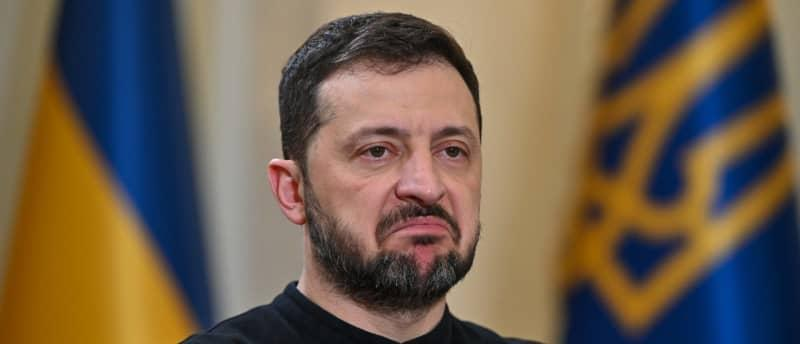

## Claim
Claim: " This image shows a screenshot of an authentic Charlie Hebdo magazine cover from March 20, 2025 illustrating Ukrainian President Volodoymr Zelenskyy lying in a coffin and saying 'Ukraine is an independet state' in French."

## Actions
```
web_search("Charlie Hebdo Zelenskyy coffin")
```

## Evidence
### Evidence from `web_search`
The image of the Charlie Hebdo cover featuring Zelenskyy in a coffin is fabricated and not published by Charlie Hebdo, according to a fact-check from mythdetector.com ([https://mythdetector.com/en/coffin-was-not-published-by-charlie-hebdo/](https://mythdetector.com/en/coffin-was-not-published-by-charlie-hebdo/)) and aol.com ([https://www.aol.com/fact-check-charlie-hebdo-magazine-151901596.html](https://www.aol.com/fact-check-charlie-hebdo-magazine-151901596.html)). A Charlie Hebdo journalist confirmed the image's inauthenticity.

Euronews ([https://www.euronews.com/my-europe/2025/05/06/fake-charlie-hebdo-cover-shows-zelenskyy-exploiting-popes-death-for-cash](https://www.euronews.com/my-europe/2025/05/06/fake-charlie-hebdo-cover-shows-zelenskyy-exploiting-popes-death-for-cash)) also reports on fake Charlie Hebdo covers, suggesting that pro-Russian actors are spreading them to discredit Ukraine. , 


## Elaboration
The claim is false. The evidence indicates that the Charlie Hebdo cover featuring Zelenskyy in a coffin is fabricated and not published by Charlie Hebdo. A journalist from Charlie Hebdo confirmed the image's inauthenticity.


## Final Judgement
The image of the Charlie Hebdo cover is fabricated. Multiple sources confirm that the image was not published by Charlie Hebdo, and a journalist from the publication verified its inauthenticity.

`false`

### Verdict: FALSE

### Justification
The image of the Charlie Hebdo cover depicting Zelenskyy in a coffin is fabricated. Fact-checks from mythdetector.com ([https://mythdetector.com/en/coffin-was-not-published-by-charlie-hebdo/](https://mythdetector.com/en/coffin-was-not-published-by-charlie-hebdo/)) and aol.com ([https://www.aol.com/fact-check-charlie-hebdo-magazine-151901596.html](https://www.aol.com/fact-check-charlie-hebdo-magazine-151901596.html)) confirm the image's inauthenticity, and a Charlie Hebdo journalist verified it.
