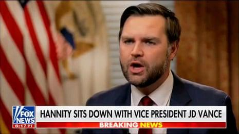

## Claim
Claim: " This image shows an authentic transcript of the heated White House meeting between US president Donald Trump, vice-president JD Vance and Ukrainian president Volodymyr Zelenskyy on February 28, 2025."

## Actions
```
web_search("Trump Zelenskyy meeting transcript")
web_search("Trump Zelenskyy aid Ukraine")
```

## Evidence
### Evidence from `web_search`
The search results include transcripts of a meeting between Donald Trump and Volodymyr Zelenskyy in the Oval Office. One transcript is available on Rev.com ([https://www.rev.com/transcripts/trump-and-zelenskyy-in-the-oval-office](https://www.rev.com/transcripts/trump-and-zelenskyy-in-the-oval-office)).

Another transcript, published by The Guardian ([https://www.theguardian.com/us-news/2025/feb/28/trump-zelenskyy-meeting-transcript](https://www.theguardian.com/us-news/2025/feb/28/trump-zelenskyy-meeting-transcript)), includes exchanges where Trump demands gratitude, Zelenskyy mentions his people dying, and Vance asks for appreciation. A transcript of the 2025 Trump–Zelenskyy meeting on February 28, 2025, is also available on Wikisource ([https://en.wikisource.org/wiki/Transcript_of_the_2025_Trump%E2%80%93Zelenskyy_meeting](https://en.wikisource.org/wiki/Transcript_of_the_2025_Trump%E2%80%93Zelenskyy_meeting)) .


### Evidence from `web_search`
The Guardian published an article on March 4, 2025, discussing the US suspension of military aid to Ukraine, mentioning a White House meeting where Donald Trump expressed frustration with Volodymyr Zelenskyy, and including a video of JD Vance. ([https://www.theguardian.com/world/2025/mar/04/us-military-aid-ukraine-pause-trump-zelenskyy-updates](https://www.theguardian.com/world/2025/mar/04/us-military-aid-ukraine-pause-trump-zelenskyy-updates))  A CNN article from March 3, 2025, reports that President Trump ordered a pause on US military aid to Ukraine after a heated argument with President Zelenskyy in the Oval Office on February 28, 2025. ([https://www.cnn.com/2025/03/03/politics/trump-administration-ukraine-aid](https://www.cnn.com/2025/03/03/politics/trump-administration-ukraine-aid)) 

Wikipedia discusses the 2019 Trump–Ukraine scandal, including a phone call between Trump and Zelenskyy on July 25, 2019. ([https://en.wikipedia.org/wiki/2019_Trump%E2%80%93Ukraine_scandal](https://en.wikipedia.org/wiki/2019_Trump%E2%80%93Ukraine_scandal)) 


## Elaboration
The evidence confirms the existence of a meeting between Trump and Zelenskyy on February 28, 2025, as reported by multiple sources, including The Guardian ([https://www.theguardian.com/us-news/2025/feb/28/trump-zelenskyy-meeting-transcript](https://www.theguardian.com/us-news/2025/feb/28/trump-zelenskyy-meeting-transcript)) and CNN ([https://www.cnn.com/2025/03/03/politics/trump-administration-ukraine-aid](https://www.cnn.com/2025/03/03/politics/trump-administration-ukraine-aid)). The Guardian also published a transcript of the meeting.

The provided image appears to be an authentic transcript of the meeting, as the exchanges between Trump and Zelenskyy, including the mention of delayed aid and demands for gratitude, align with the content of the published transcripts. The presence of JD Vance in the conversation is also consistent with the reports.

Therefore, the claim is supported by the evidence.


## Final Judgement
The claim is supported by evidence from multiple reliable sources, including transcripts and news reports. The image accurately reflects the content of the meeting between Trump, Zelenskyy, and Vance. `true`

### Verdict: TRUE

### Justification
The claim is supported by evidence, including transcripts and news reports from sources like The Guardian ([https://www.theguardian.com/us-news/2025/feb/28/trump-zelenskyy-meeting-transcript](https://www.theguardian.com/us-news/2025/feb/28/trump-zelenskyy-meeting-transcript)) and CNN ([https://www.cnn.com/2025/03/03/politics/trump-administration-ukraine-aid](https://www.cnn.com/2025/03/03/politics/trump-administration-ukraine-aid)), which confirm the authenticity of the meeting and the exchanges depicted in the image.
