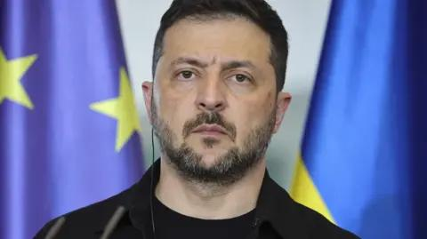

## Claim
Claim: "After a call with Russia's President Vladimir Putin on February 12, 2025, US President Donald Trump announced that he had reached an agreement to end the war in Ukraine."

## Actions
```
web_search("Donald Trump Vladimir Putin call February 12 2025")
web_search("Donald Trump Ukraine war agreement")
```

## Evidence
### Evidence from `web_search`
On February 12, 2025, Donald Trump and Vladimir Putin had a phone call, as reported by the Kremlin ([http://en.kremlin.ru/events/president/news/76259](http://en.kremlin.ru/events/president/news/76259)) and CNN ([https://www.cnn.com/2025/02/12/politics/putin-trump-phone-call](https://www.cnn.com/2025/02/12/politics/putin-trump-phone-call)). The call involved discussions about prisoner exchanges, the Ukraine conflict, and potential peaceful resolutions.

Following the call, Trump stated that negotiations to end the Ukraine war would begin immediately, according to CNN. The Wikipedia article ([https://en.wikipedia.org/wiki/February_2025_Putin%E2%80%93Trump_phone_call](https://en.wikipedia.org/wiki/February_2025_Putin%E2%80%93Trump_phone_call)) also mentions the phone call.


### Evidence from `web_search`
The NBC News article from July 19, 2025, reports that Donald Trump planned a meeting with Zelenskyy and Putin to end the war between Russia and Ukraine, and mentions a call between Trump and Putin, aiming for a "peace agreement" ([https://www.nbcnews.com/politics/white-house/trump-pressures-ukraine-end-war-ahead-zelenskyy-meeting-rcna225476](https://www.nbcnews.com/politics/white-house/trump-pressures-ukraine-end-war-ahead-zelenskyy-meeting-rcna225476)). The Associated Press reports that Vladimir Putin agreed with Donald Trump that the U.S. and Europe could offer Ukraine a security guarantee as part of an eventual deal to end the war ([https://apnews.com/article/trump-witkoff-ukraine-russia-putin-war-048aa829a69b4020ca368577bfe18aee](https://apnews.com/article/trump-witkoff-ukraine-russia-putin-war-048aa829a69b4020ca368577bfe18aee)).

The BBC reports that on August 17, 2025, Donald Trump said he wants to bypass a ceasefire in Ukraine and move directly to a permanent peace agreement after his meeting with Russian President Vladimir Putin, mentioning a summit between Trump and Putin in Alaska and a phone call between Trump and Zelensky after the summit (, , , ) ([https://www.bbc.com/news/articles/c04rv2p3936o](https://www.bbc.com/news/articles/c04rv2p3936o)).


## Elaboration
The evidence indicates that Donald Trump and Vladimir Putin had a phone call on February 12, 2025, during which they discussed the Ukraine conflict. Following the call, Trump stated that negotiations to end the war would begin immediately ([https://www.cnn.com/2025/02/12/politics/putin-trump-phone-call](https://www.cnn.com/2025/02/12/politics/putin-trump-phone-call)). However, the evidence does not state that an agreement was reached on that date.

Later reports suggest that Trump aimed for a "peace agreement" ([https://www.nbcnews.com/politics/white-house/trump-pressures-ukraine-end-war-ahead-zelenskyy-meeting-rcna225476](https://www.nbcnews.com/politics/white-house/trump-pressures-ukraine-end-war-ahead-zelenskyy-meeting-rcna225476)) and planned meetings with both Putin and Zelenskyy to achieve this.

Therefore, the claim is partially accurate. While the call did take place, and negotiations were planned, the evidence does not support the assertion that an agreement to end the war was reached on February 12, 2025.


## Final Judgement
The evidence confirms that a call between Trump and Putin occurred on February 12, 2025, and that negotiations were planned to end the war in Ukraine. However, the evidence does not support the claim that an agreement was reached on that specific date.

`false`


### Verdict: FALSE

### Justification
The claim is false. While a phone call between Donald Trump and Vladimir Putin did occur on February 12, 2025, as reported by the Kremlin ([http://en.kremlin.ru/events/president/news/76259](http://en.kremlin.ru/events/president/news/76259)) and CNN ([https://www.cnn.com/2025/02/12/politics/putin-trump-phone-call](https://www.cnn.com/2025/02/12/politics/putin-trump-phone-call)), and negotiations were planned, there is no evidence to support the assertion that an agreement to end the war in Ukraine was reached on that date.
