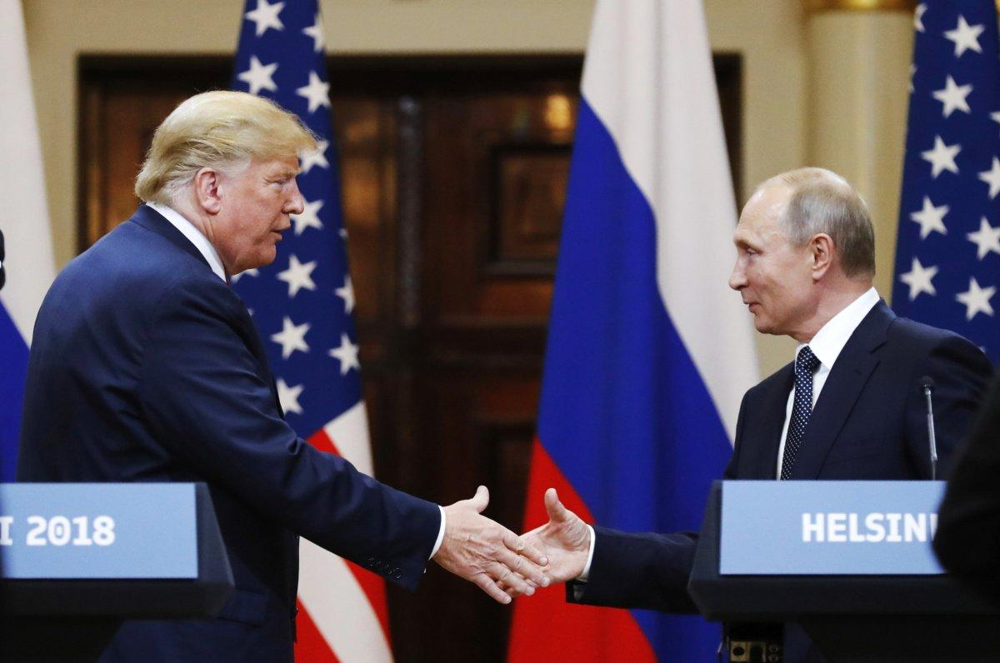

## Claim
Claim: "In an interview with NDTV on March 17, 2025 Director of US National Intelligence Tulsi Gabbard said that President Donald Trump and Russian President Vladimir Putin were good friends."

## Actions
```
web_search("Tulsi Gabbard NDTV interview March 17 2025 Trump Putin")
```

## Evidence
### Evidence from `web_search`
NDTV interviewed Tulsi Gabbard, where she discussed Donald Trump's focus on peace and progress in negotiations between Russia and Ukraine, as reported by [NDTV](https://www.ndtv.com/world-news/trump-focused-on-peace-tulsi-gabbard-on-russia-ukraine-war-7941806). Newsweek also reported on the interview, stating that Gabbard said Trump was "looking forward to success" before a phone call with Putin and criticized the Biden administration's handling of the Russia-Ukraine war .

U.S. News & World Report also covered the interview, quoting Gabbard as saying that Trump and Putin "are very good friends" <image:i>.


## Elaboration
The evidence confirms that Tulsi Gabbard was interviewed by NDTV. The evidence also indicates that Gabbard discussed Trump's focus on peace and progress in negotiations between Russia and Ukraine. Furthermore, U.S. News & World Report quoted Gabbard as saying that Trump and Putin "are very good friends."

Based on the evidence, the claim is likely true.


## Final Judgement
The evidence confirms that Tulsi Gabbard was interviewed by NDTV and that she discussed Trump's focus on peace and progress in negotiations between Russia and Ukraine. U.S. News & World Report quoted Gabbard as saying that Trump and Putin "are very good friends." Therefore, the claim is factually accurate. `true`


### Verdict: TRUE

### Justification
In an interview with NDTV, as reported by [NDTV](https://www.ndtv.com/world-news/trump-focused-on-peace-tulsi-gabbard-on-russia-ukraine-war-7941806), Tulsi Gabbard discussed Donald Trump's approach to negotiations between Russia and Ukraine. U.S. News & World Report quoted Gabbard as saying that Trump and Putin "are very good friends," supporting the claim.
