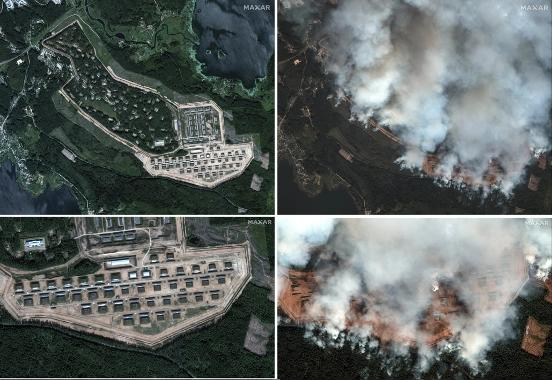
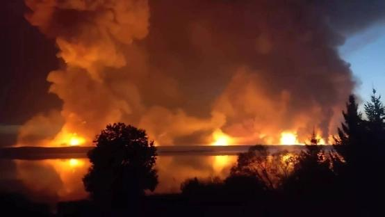
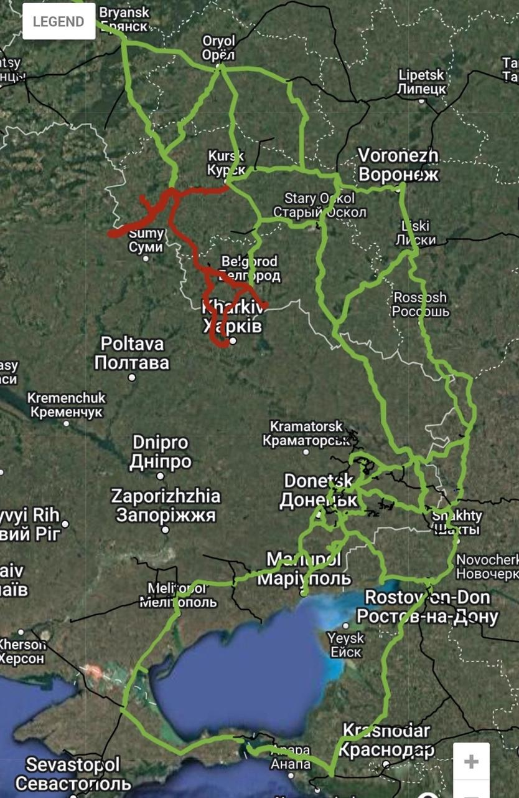

## Claim
Claim: " This image shows a Russian ammunition depot in Toropets, Tver Oblast, before and after it was hit by a, possible nuclear, strike from the North Atlantic Treaty Organization (NATO)."

## Actions
```
web_search("Russian ammunition depot Toropets Tver Oblast")
web_search("Toropets Tver Oblast NATO strike")
reverse_search()
```

## Evidence
### Evidence from `web_search`
The provided sources discuss a Ukrainian drone attack on a Russian ammunition depot in Toropets, Tver Oblast, Russia, on September 17-18, 2024. The depot, which was renovated in 2018, stored a large amount of military munitions, including fuel tanks, missiles (Iskander and Tochka-U), guided aerial bombs, artillery ammunition, and potentially North Korean munitions. The attack caused a large fire, multiple explosions, and seismic activity.

The sources include articles from Wikipedia ([https://en.wikipedia.org/wiki/Toropets_depot_explosions](https://en.wikipedia.org/wiki/Toropets_depot_explosions)), CNN ([https://edition.cnn.com/2024/09/18/europe/ukraine-russian-weapons-depot-drone-attack-intl](https://edition.cnn.com/2024/09/18/europe/ukraine-russian-weapons-depot-drone-attack-intl)), and Euronews ([https://www.euronews.com/my-europe/2024/09/18/what-was-stored-at-the-russian-arms-depot-in-tver-region-struck-by-ukraines-drones](https://www.euronews.com/my-europe/2024/09/18/what-was-stored-at-the-russian-arms-depot-in-tver-region-struck-by-ukraines-drones)). The image 

### Evidence from `web_search`
The Associated Press reports that Ukrainian drones struck a military depot in Toropets, Russia, causing a large fire. The depot housed Iskander and Tochka-U missiles, as well as glide bombs and artillery shells. The image 

### Evidence from `reverse_search`
The image () appears in articles from Reuters ([Source](https://www.reuters.com/world/europe/ukraine-targets-western-russian-regions-with-drones-russian-officials-says-2024-09-18/)), The Washington Post ([Source](https://www.washingtonpost.com/world/2024/09/18/ukraine-russia-blast-drones-missiles-tver/)), and The Kyiv Post ([Source](https://www.kyivpost.com/post/39247)). These articles, published in September 2024, report on a Ukrainian drone attack on a Russian ammunition depot in Toropets, Tver Oblast. The Reuters article mentions a massive explosion, while The Kyiv Post article includes satellite images () and an image of the fire ().

The Kyiv Post article also notes that the depot was considered the most modern and attack-resistant munitions storage facility in Russia. The article also includes a map () and an image of Dmitry Bulgakov ().


## Elaboration
The claim that the image shows a NATO strike is false. The evidence indicates that the image depicts a Ukrainian drone attack on a Russian ammunition depot in Toropets, Tver Oblast. The attack caused a fire and explosions.


## Final Judgement
The claim is demonstrably false. The evidence shows that the image depicts a Ukrainian drone attack, not a NATO strike. The claim misrepresents the cause of the damage to the ammunition depot. `false`

### Verdict: FALSE

### Justification
The claim is false. The image depicts a Ukrainian drone attack on a Russian ammunition depot in Toropets, Tver Oblast, as reported by sources like [Reuters](https://www.reuters.com/world/europe/ukraine-targets-western-russian-regions-with-drones-russian-officials-says-2024-09-18/), [The Washington Post](https://www.washingtonpost.com/world/2024/09/18/ukraine-russia-blast-drones-missiles-tver/), and [The Kyiv Post](https://www.kyivpost.com/post/39247). These sources confirm the attack and the resulting fire and explosions, contradicting the claim of a NATO strike.
