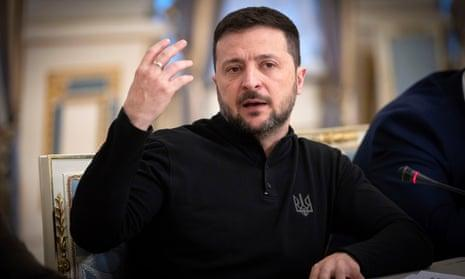
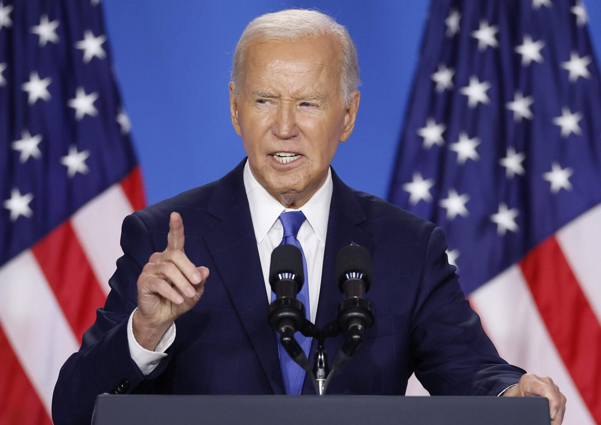
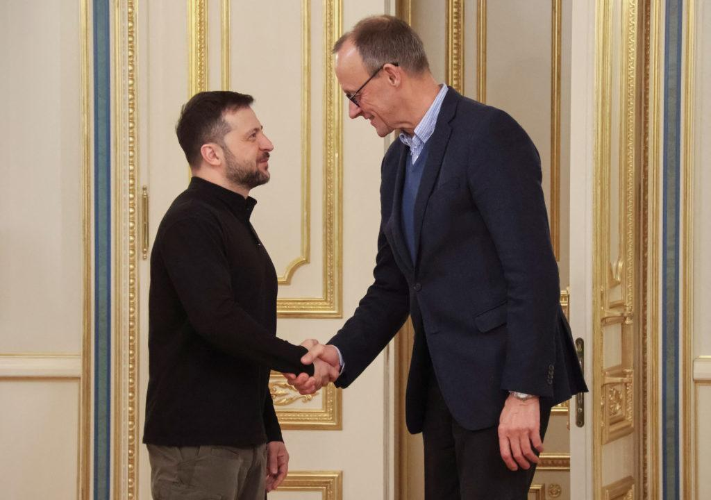

## Claim
Claim: "In a press conference on December 9, 2024 Ukrainian President Volodymyr Zelenskyy said: 'I will ask Biden to invite me to NATO ... there's no point in talking to Trump.'"

## Actions
```
web_search("Volodymyr Zelenskyy Biden NATO Trump December 9 2024 press conference")
```

## Evidence
### Evidence from `web_search`
On December 9, 2024, The Guardian reported that Volodymyr Zelenskyy said he would discuss NATO membership with Joe Biden in the coming days, and floated the idea of foreign troops being deployed to Ukraine until the country joins NATO (, ). The article can be found here: [The Guardian](https://www.theguardian.com/world/live/2024/dec/09/russia-ukraine-war-live-donald-trump-ceasefire-call-volodymyr-zelenskyy).

SourceNM.com published an article on July 12, 2024, discussing a press conference held by President Joe Biden following the NATO summit, which mentioned a meeting between Biden and Ukrainian President Volodymyr Zelenskyy (). The article also mentions a separate article published on December 4, 2024, which discusses Trump's record on NATO. The article can be found here: [SourceNM.com](https://sourcenm.com/2024/07/12/biden-at-nato-press-conference-rebuts-doubters-im-the-best-qualified-to-govern/).


## Elaboration
The evidence confirms that on December 9, 2024, Zelenskyy discussed NATO membership with Biden. However, the provided evidence does not include the exact quote from the claim. The evidence does not mention Zelenskyy's statement about not talking to Trump.

Insufficient information to verify the claim.


## Actions
```
web_search("Zelenskyy press conference December 9 2024 Trump NATO")
```

## Evidence
### Evidence from `web_search`
On December 9, 2024, Reuters reported that Volodymyr Zelenskyy said he would discuss NATO membership with Joe Biden and stated, "And there is no point in discussing with President Trump something that is not up to him today - while he is not yet in the White House." [Reuters](https://www.reuters.com/world/europe/zelenskiy-floats-idea-deploying-foreign-troops-ukraine-before-nato-membership-2024-12-09/).

PBS News also reported on December 9, 2024, that Zelenskyy would approach Biden about Ukraine’s possible NATO membership. [PBS News](https://www.pbs.org/newshour/world/zelenskyy-open-to-western-troops-providing-security-in-effort-to-end-war-in-ukraine) ().


## Elaboration
The Reuters article confirms that Zelenskyy stated on December 9, 2024, "And there is no point in discussing with President Trump something that is not up to him today - while he is not yet in the White House." This statement aligns with the claim.


## Final Judgement
The initial search provided evidence of Zelenskyy discussing NATO membership with Biden on December 9, 2024, but did not include the specific quote from the claim. A subsequent search revealed a Reuters article confirming that Zelenskyy did indeed state, "And there is no point in discussing with President Trump something that is not up to him today - while he is not yet in the White House," on the same date.

The claim is factually accurate as it is supported by evidence from a reliable source. `true`


### Verdict: TRUE

### Justification
On December 9, 2024, Ukrainian President Volodymyr Zelenskyy stated he would discuss NATO membership with Joe Biden. Furthermore, according to a Reuters report, Zelenskyy said, "And there is no point in discussing with President Trump something that is not up to him today - while he is not yet in the White House," confirming the claim's accuracy. ([Reuters](https://www.reuters.com/world/europe/zelenskiy-floats-idea-deploying-foreign-troops-ukraine-before-nato-membership-2024-12-09/)).
