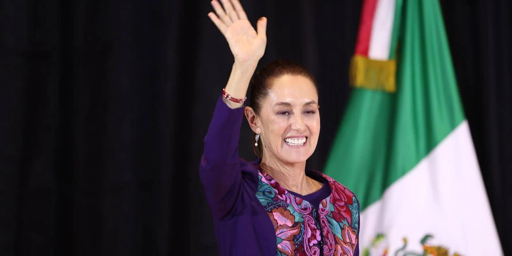

## Claim
Claim: "Mexican President-elect Claudia Sheinbaum rejected an invitation to Ukraine by Volodymr Zelenskyy and said towards him on September 17, 2024: 'If I wanted to see a drug addict, I'd just take a walk around Tijuana.'"

## Actions
```
web_search("Claudia Sheinbaum Volodymyr Zelenskyy invitation")
web_search("Claudia Sheinbaum Tijuana drug addict")
```

## Evidence
### Evidence from `web_search`
Claudia Sheinbaum, the Mexican President-elect, declined an invitation from Ukrainian President Volodymyr Zelenskyy to visit Ukraine, citing her focus on domestic responsibilities. This was reported by IntelliNews ([https://www.intellinews.com/mexico-s-president-elect-sheinbaum-turns-down-zelensky-s-invitation-to-ukraine-344262/](https://www.intellinews.com/mexico-s-president-elect-sheinbaum-turns-down-zelensky-s-invitation-to-ukraine-344262/)) on September 19, 2024, Euromaidan Press ([https://euromaidanpress.com/2024/09/18/mexican-president-elect-declines-zelenskyys-invitation-to-visit-ukraine/](https://euromaidanpress.com/2024/09/18/mexican-president-elect-declines-zelenskyys-invitation-to-visit-ukraine/)) on September 18, 2024, and Ukrinform ([https://www.ukrinform.net/rubric-polytics/3906832-mexico-presidentelect-rejects-zelenskys-invitation-to-visit-ukraine.html](https://www.ukrinform.net/rubric-polytics/3906832-mexico-presidentelect-rejects-zelenskys-invitation-to-visit-ukraine.html)). Sheinbaum stated that her main task is to rule in Mexico and that she would not travel much. , , 


### Evidence from `web_search`
The claim that Claudia Sheinbaum made the statement about Volodymyr Zelenskyy is false, according to [mimikama.org](https://www.mimikama.org/en/sheinbaum-fake-quote-zelenskyj-drugs/) and [StopFake.org](https://www.stopfake.org/en/fake-mexican-president-refuses-to-visit-ukraine-calling-zelensky-a-drug-addict/). Both sources state that the quote is part of a disinformation campaign and a fabrication. Sheinbaum did reject an invitation to visit Ukraine. <image:k>, 

An article from [Mexico News Daily](https://mexiconewsdaily.com/politics/sheinbaum-trump-mexico-petrified-of-cartels/) discusses Sheinbaum's response to Donald Trump's criticism of Mexico's handling of drug cartels. 


## Elaboration
The claim is false. Claudia Sheinbaum did decline an invitation to visit Ukraine. However, the statement attributed to her about Volodymyr Zelenskyy is a fabrication, according to fact-checkers at [mimikama.org](https://www.mimikama.org/en/sheinbaum-fake-quote-zelenskyj-drugs/) and [StopFake.org](https://www.stopfake.org/en/fake-mexican-president-refuses-to-visit-ukraine-calling-zelensky-a-drug-addict/).


## Final Judgement
The claim is demonstrably false. While Claudia Sheinbaum did decline an invitation to visit Ukraine, the statement attributed to her about Volodymyr Zelenskyy is a fabrication, as confirmed by multiple fact-checking sources.

`false`

### Verdict: FALSE

### Justification
The claim is false. While Claudia Sheinbaum declined an invitation to visit Ukraine, the statement attributed to her about Volodymyr Zelenskyy is a fabrication, according to fact-checkers at [mimikama.org](https://www.mimikama.org/en/sheinbaum-fake-quote-zelenskyj-drugs/) and [StopFake.org](https://www.stopfake.org/en/fake-mexican-president-refuses-to-visit-ukraine-calling-zelensky-a-drug-addict/).
