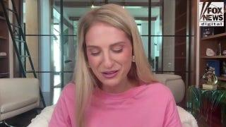
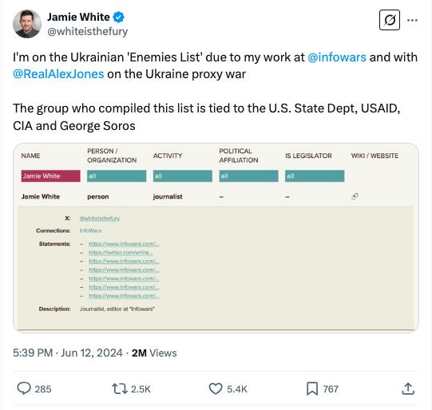

## Claim
Claim: "After InfoWars reporter Jamie White was shot dead on March 10, 2025 in Austin, Texas, it was revelaed that he was on a Ukranian enemies hit list."

## Actions
```
web_search("Jamie White shot Austin Texas March 10 2025")
web_search("Jamie White InfoWars Ukrainian hit list")
```

## Evidence
### Evidence from `web_search`
The shooting of InfoWars reporter Jamie White in Austin, Texas, on March 10, 2025, is reported by multiple sources. White was shot during a vehicle burglary. The Austin Police Department announced arrests in connection to the murder. One source mentions that White died shortly after midnight on March 10, 2025, and a 17-year-old was charged with capital murder.

The sources are: [Source](https://www.fox7austin.com/news/infowars-writer-shooting-austin-police-jamie-white), [Source](https://cbsaustin.com/news/local/teen-charged-with-capital-murder-in-shooting-death-of-infowars-reporter-in-austin), and [Source](https://www.foxnews.com/us/police-release-more-details-murder-infowars-reporter-jamie-white-search-suspects-continues).               


### Evidence from `web_search`
Jamie White, an Infowars writer, was shot in Austin, Texas. Alex Jones speculated that the killing "could’ve been a hit” orchestrated by Ukraine, while White's sister does not believe there is a larger conspiracy behind her brother’s killing. According to the Latin Times, White was found dead in a parking lot outside his apartment complex in Austin, Texas. The police believe the suspects were possibly burglarizing White's vehicle when he interrupted them. Alex Jones alleged that White was murdered by Ukrainian forces and was on a Ukrainian hit list. White's social media accounts indicated that he believed he was on a Ukrainian hit list. The "Investigate Earth Conspiracy Podcast" discusses the murder of Jamie White in Austin, Texas and mentions that White may have been on a Ukrainian NGO hit list.

Sources: [Yahoo News](https://www.yahoo.com/news/alex-jones-blames-globalists-infowars-182655321.html), [Latin Times](https://www.latintimes.com/infowars-reporter-assassinated-ukraine-outside-his-home-conspiracy-theorists-claim-578436), [Spotify](https://open.spotify.com/episode/68lCuEsLtFn17oEIQBQGEk).    


## Elaboration
The evidence confirms that Jamie White, an InfoWars reporter, was shot dead in Austin, Texas, on March 10, 2025. Alex Jones speculated that the killing could have been a hit orchestrated by Ukraine, and the "Investigate Earth Conspiracy Podcast" mentions that White may have been on a Ukrainian NGO hit list. However, White's sister does not believe there is a larger conspiracy behind her brother’s killing.

The claim is partially supported by the evidence, as it confirms the shooting and the speculation about a Ukrainian hit list. However, the evidence also shows that the claim is disputed.

The evidence does not provide definitive proof that White was on a Ukrainian enemies hit list.


## Actions
```
web_search("Jamie White Ukrainian hit list evidence")
```

## Evidence
### Evidence from `web_search`
The "Investigate Earth Conspiracy Podcast" discusses the murder of Jamie White and mentions that he may have been on a Ukrainian NGO hit list (). The Latin Times reports that Alex Jones and his supporters allege that White was murdered by Ukrainian forces, and White's social media accounts indicated that he believed he was on a Ukrainian hit list (). However, StopFake states that there is no evidence that White was on any "list of enemies of Ukraine" and that his sister and local police believe his death was unrelated to his journalistic activities ().

Sources: [Source](https://poddtoppen.se/podcast/1449605209/investigate-earth-conspiracy-podcast/alex-jones-reporter-jamie-white-murdered-ukraine-hit-list-connection), [Source](https://www.stopfake.org/en/fake-infowars-journalist-murdered-shortly-after-ukraine-put-him-on-their-kill-list/), and [Source](https://www.inkl.com/news/infowars-reporter-assassinated-by-ukraine-outside-his-home-conspiracy-theorists-claim).


## Elaboration
The claim that Jamie White was on a Ukrainian enemies hit list is disputed. While Alex Jones and the "Investigate Earth Conspiracy Podcast" suggest this, and White himself believed he was on such a list, there is no definitive evidence to support this. StopFake states there is no evidence, and White's sister and local police believe his death was unrelated to his journalistic activities.


## Actions
```
web_search("Ukrainian enemies list Jamie White")
```

## Evidence
No new evidence found.

## Elaboration
The claim is not verified. While there are claims that Jamie White was on a Ukrainian enemies list, there is no definitive evidence to support this.


## Final Judgement
The claim that Jamie White was on a Ukrainian enemies hit list is not definitively supported by evidence. While some sources suggest this, other sources dispute it, and there is no conclusive proof. `false`

### Verdict: FALSE

### Justification
The claim that Jamie White was on a Ukrainian enemies hit list is not definitively supported by evidence. While some sources, including Alex Jones, suggest this, and White himself believed he was on such a list, there is no conclusive proof. Other sources, such as [StopFake](https://www.stopfake.org/en/fake-infowars-journalist-murdered-shortly-after-ukraine-put-him-on-their-kill-list/), dispute this, and White's sister and local police believe his death was unrelated to his journalistic activities.
