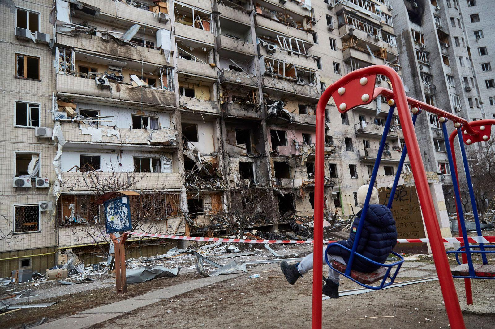
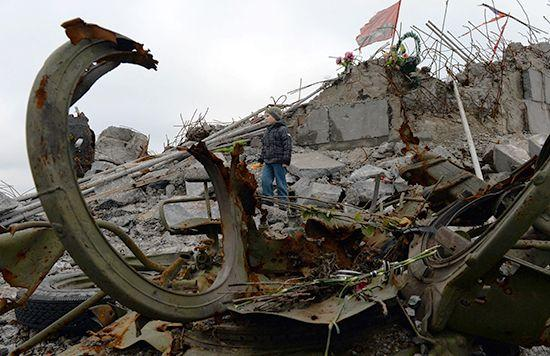

## Claim
Claim: "Ukrainian President Volodymyr Zelenskyy started the 2022 war in Ukraine with Russia."

## Actions
```
web_search("Volodymyr Zelenskyy Russia war 2022 timeline")
web_search("causes of Russia Ukraine war 2022")
```

## Evidence
### Evidence from `web_search`
The search results include a Wikipedia article providing a timeline of the Russian invasion of Ukraine, starting from February 24, 2022, and covering various battles and events, including the actions of Volodymyr Zelenskyy (<image:i>, <image:j>). Another source, PBS News, indicates that the invasion began on February 24, 2022 ().

U.S. News & World Report also published a timeline of the Russia-Ukraine conflict, which includes Volodymyr Zelenskyy's call for a meeting with Putin in January 2022, Putin's demands for security guarantees in December 2021, and the start of the invasion on February 24, 2022 (<image:k>). The timeline also mentions Zelenskyy's election in April 2019 and the Euromaidan protests (<image:k>).


### Evidence from `web_search`
The Russian invasion of Ukraine began on February 24, 2022, as stated in [cirsd.org](https://www.cirsd.org/en/horizons/horizons-summer-2022-issue-no.21/the-causes-and-consequences-of-the-ukraine-war), [Wikipedia](https://en.wikipedia.org/wiki/Russian_invasion_of_Ukraine), and [Britannica](https://www.britannica.com/event/2022-Russian-invasion-of-Ukraine). The conflict escalated from the Russo-Ukrainian War, which began in 2014. The sources mention that Russia massed troops near Ukraine's borders in late 2021 and issued demands to the West, including a ban on Ukraine joining NATO. On February 21, 2022, Putin recognized the independence of Donetsk and Luhansk. On February 24, 2022, Zelensky addressed the Russian people, pleading for peace but vowing to defend Ukraine. , , , 

The sources also discuss the causes of the war, including the US and its allies' efforts to bring Ukraine into NATO, which Russia saw as a threat. Economic interests were also a motive for Russia's attack on Ukraine.


## Elaboration
The evidence indicates that the 2022 war began on February 24, 2022, with Russia's invasion of Ukraine. The provided timelines show that Zelenskyy was in office during this time and made attempts to negotiate with Putin. However, the evidence does not support the claim that Zelenskyy initiated the war. Instead, the evidence suggests that Russia initiated the war by invading Ukraine.

The evidence also points to underlying causes of the conflict, such as Russia's opposition to Ukraine's potential NATO membership and economic interests. These factors predate Zelenskyy's actions in 2022.

Therefore, based on the provided evidence, the claim is not supported.


## Final Judgement
The evidence from multiple sources, including timelines and historical analyses, indicates that the 2022 war in Ukraine was initiated by Russia's invasion. While Volodymyr Zelenskyy was the President of Ukraine at the time and responded to the invasion, the evidence does not support the claim that he started the war.

`false`

### Verdict: FALSE

### Justification
The claim that Volodymyr Zelenskyy started the 2022 war in Ukraine is not supported by the evidence. Multiple sources, including timelines from [Wikipedia](https://en.wikipedia.org/wiki/Russian_invasion_of_Ukraine) and [PBS News](https://www.pbs.org/newshour/world/russia-ukraine-war-timeline), indicate that the war began with Russia's invasion on February 24, 2022. While Zelenskyy was in office and responded to the invasion, the evidence does not suggest he initiated the conflict.
