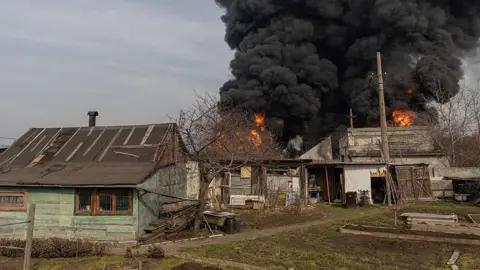

## Claim
Claim: "After a call with Russia's President Vladimir Putin on February 12, 2025, US President Donald Trump announced that he had reached an agreement to end the war in Ukraine."

## Actions
```
web_search("Donald Trump Vladimir Putin call February 12 2025")
web_search("Donald Trump Ukraine war agreement")
```

## Evidence
### Evidence from `web_search`
On February 12, 2025, Donald Trump and Vladimir Putin had a phone call, as reported by the Kremlin's website ([http://en.kremlin.ru/events/president/news/76259](http://en.kremlin.ru/events/president/news/76259)) and CNN ([https://www.cnn.com/2025/02/12/politics/putin-trump-phone-call](https://www.cnn.com/2025/02/12/politics/putin-trump-phone-call)). The conversation included discussions about prisoner exchange, the root causes of the conflict, and a sustainable settlement via peaceful negotiations.

CNN reported that Trump said negotiations to end the Ukraine war would start "immediately" after the call. The Wikipedia article ([https://en.wikipedia.org/wiki/February_2025_Putin%E2%80%93Trump_phone_call](https://en.wikipedia.org/wiki/February_2025_Putin%E2%80%93Trump_phone_call)) also mentions the phone call.


### Evidence from `web_search`
According to an NBC News article from July 19, 2025, Donald Trump planned meetings with Zelenskyy and Putin to end the war between Russia and Ukraine, and he wanted to extricate the United States from foreign wars. The Associated Press reported that Vladimir Putin agreed that the U.S. and Europe could offer Ukraine security guarantees. The BBC reported on August 17, 2025, that Trump wanted to bypass a ceasefire and move directly to a permanent peace agreement after his meeting with Putin, which was to take place in Alaska. The BBC article also mentions a call between Trump and Zelensky after the summit. , , , 

The articles can be found here: [https://www.nbcnews.com/politics/white-house/trump-pressures-ukraine-end-war-ahead-zelenskyy-meeting-rcna225476](https://www.nbcnews.com/politics/white-house/trump-pressures-ukraine-end-war-ahead-zelenskyy-meeting-rcna225476), [https://apnews.com/article/trump-witkoff-ukraine-russia-putin-war-048aa829a69b4020ca368577bfe18aee](https://apnews.com/article/trump-witkoff-ukraine-russia-putin-war-048aa829a69b4020ca368577bfe18aee), and [https://www.bbc.com/news/articles/c04rv2p3936o](https://www.bbc.com/news/articles/c04rv2p3936o).


## Elaboration
The evidence indicates that after the February 12, 2025, call, Trump stated that negotiations to end the war would start "immediately" ([https://www.cnn.com/2025/02/12/politics/putin-trump-phone-call](https://www.cnn.com/2025/02/12/politics/putin-trump-phone-call)). However, the evidence does not support the claim that Trump announced an agreement to end the war on that date.

Later reports from July and August 2025 suggest that Trump was planning meetings with both Putin and Zelenskyy to end the war ([https://www.nbcnews.com/politics/white-house/trump-pressures-ukraine-end-war-ahead-zelenskyy-meeting-rcna225476](https://www.nbcnews.com/politics/white-house/trump-pressures-ukraine-end-war-ahead-zelenskyy-meeting-rcna225476), [https://www.bbc.com/news/articles/c04rv2p3936o](https://www.bbc.com/news/articles/c04rv2p3936o)). These later reports do not confirm that an agreement was reached after the initial call.

Therefore, the claim is not supported by the evidence.


## Final Judgement
The evidence confirms that a call between Trump and Putin took place on February 12, 2025, and that Trump mentioned starting negotiations. However, the evidence does not support the claim that Trump announced an agreement to end the war on that specific date.

`false`

### Verdict: FALSE

### Justification
The claim is false. While a phone call between Trump and Putin occurred on February 12, 2025, and Trump mentioned starting negotiations to end the war ([https://www.cnn.com/2025/02/12/politics/putin-trump-phone-call](https://www.cnn.com/2025/02/12/politics/putin-trump-phone-call)), there is no evidence to support the assertion that an agreement to end the war was announced on that date.
